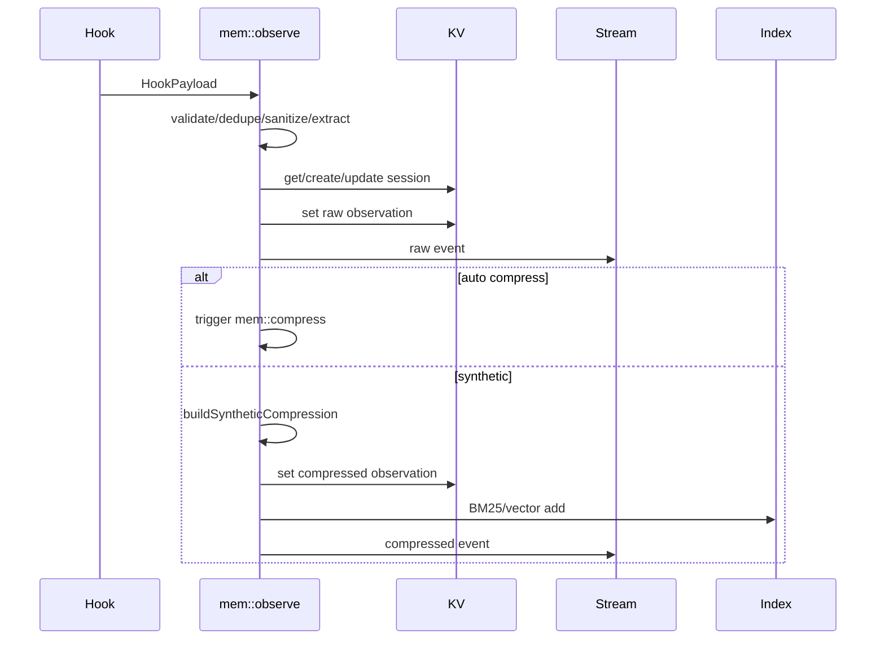
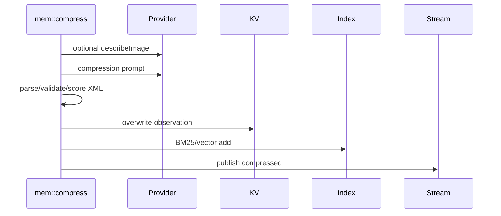
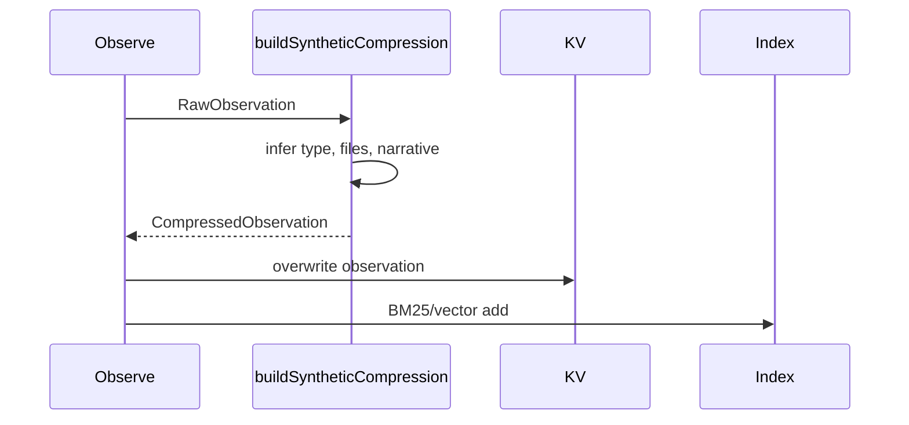
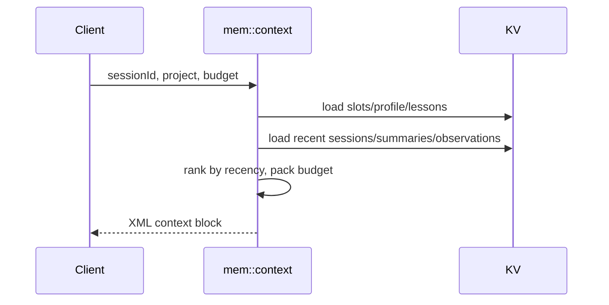
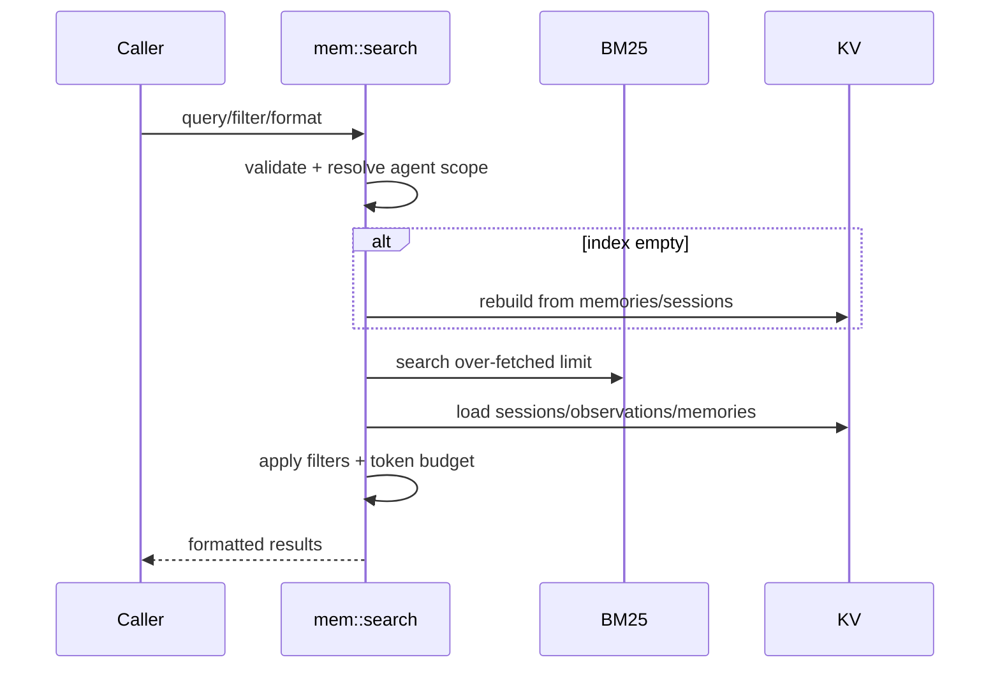
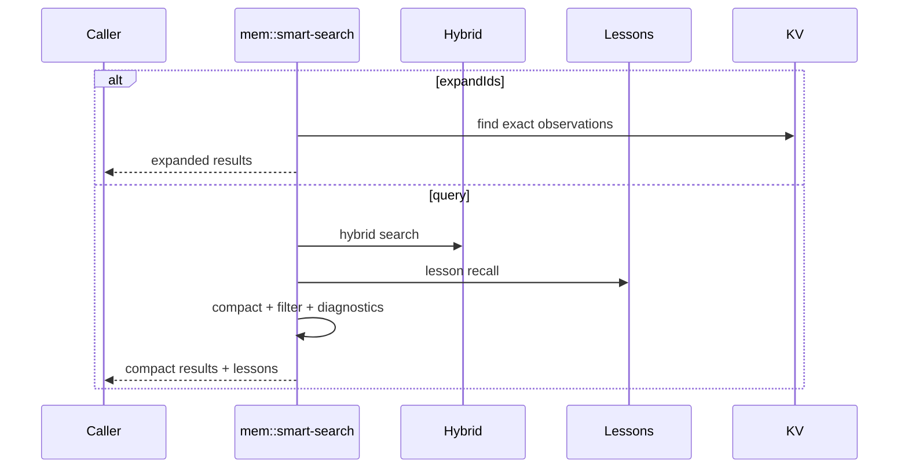
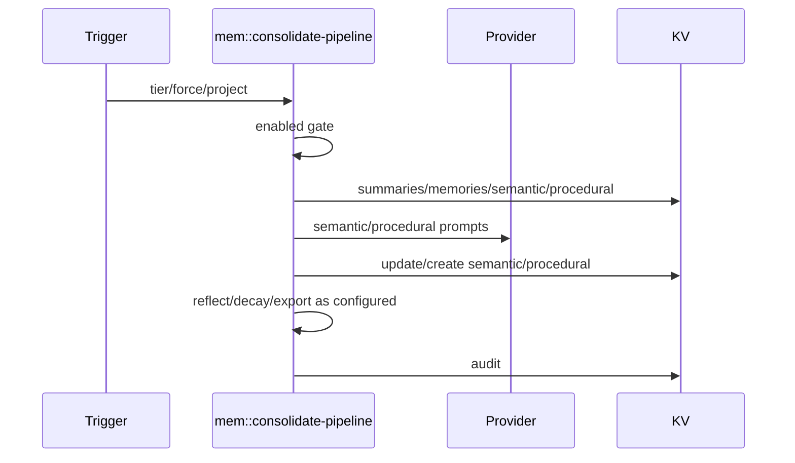
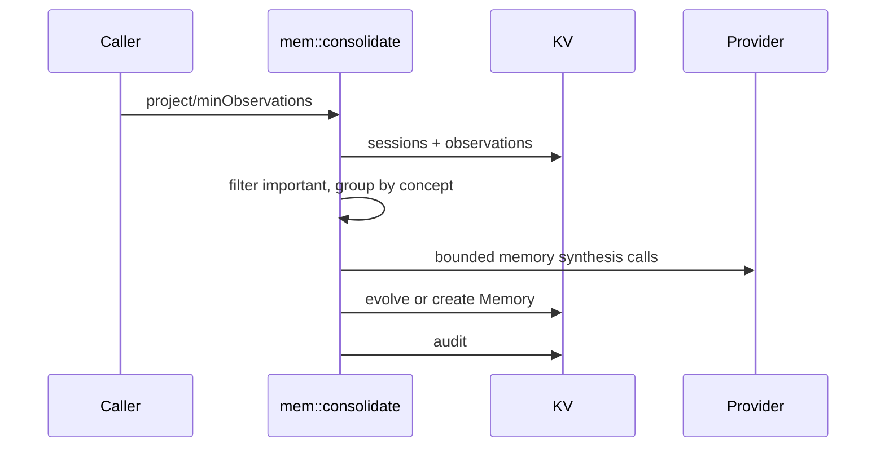
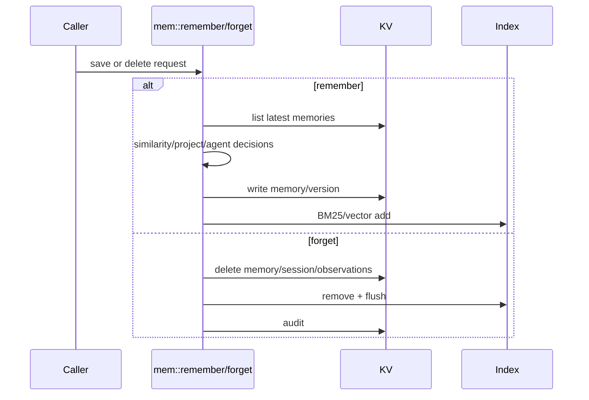

# Business Logic Reverse Engineering

This document explains the current implementation of the priority AgentMemory functions. It is descriptive only: no improvements are proposed here.

## 1. `src/functions/observe.ts`

### Purpose
Ingest hook events as observations, sanitize them, attach session/agent metadata, store them, stream them, then route to synthetic or LLM compression.

### Inputs
`HookPayload`:

- `sessionId`
- `hookType`
- `timestamp`
- `project`
- `cwd`
- `data`

### Outputs
- `{ observationId }`
- `{ deduplicated: true, sessionId }`
- validation/limit errors

### Execution Flow
1. Validate required payload fields: `sessionId`, `hookType`, `timestamp`.
2. Generate an `obs_*` id.
3. If a `DedupMap` exists, compute a duplicate hash from session, tool name, and tool input.
4. Privacy-strip payload data.
5. Build a `RawObservation`.
6. Extract tool name/input/output for post-tool hooks.
7. Extract prompt text for prompt-submit hooks.
8. Recursively detect image data/path fields.
9. Enter a keyed lock for `obs:{sessionId}`.
10. Enforce optional max observations per session.
11. Load existing session and inherit `agentId`; if no session exists, fall back to env `AGENT_ID`.
12. Persist image data to managed storage if inline image data is present.
13. Increment image reference count and optionally trigger image embedding.
14. Store the raw observation in KV.
15. Record dedupe hash after successful write.
16. Publish raw stream events.
17. Update existing session or implicitly create one.
18. If auto-compress is enabled, trigger `mem::compress` asynchronously.
19. Otherwise build synthetic compression, overwrite the observation row, index it, and stream compressed output.
20. Return the observation id.

### Internal Decision Points
- Invalid payload returns an error.
- Duplicate payload returns early.
- Object vs string payload changes extraction path.
- Image presence sets modality to `image` or `mixed`.
- Existing session controls agent inheritance.
- Missing session with `project` and `cwd` triggers implicit session creation.
- `AGENTMEMORY_AUTO_COMPRESS` selects LLM vs synthetic compression.
- `AGENTMEMORY_IMAGE_EMBEDDINGS` controls vision embedding trigger.

### Why The Author Implemented It This Way
Hooks are noisy and runtime-specific. This function normalizes all agent events into a single observation model. The default synthetic path keeps memory/retrieval useful without LLM calls or provider keys.

### Performance Optimizations
- Dedupe before writes.
- Per-session keyed lock instead of global locking.
- Optional max observation cap.
- Fire-and-forget disk-size, vision embedding, and stream sends.
- Synthetic compression default avoids network and LLM latency.

### Compatibility Layers
- Implicit session creation for OpenCode and clients that skip `/session/start`.
- Generic `HookPayload` accepts runtime-specific data.
- Multiple image field names are supported.
- Session row is source of truth for `agentId`, preserving legacy unscoped sessions.

### Parts That Should Not Be Modified Lightly
- Payload validation contract.
- Privacy stripping.
- Per-session lock.
- Image ref rollback on KV write failure.
- Implicit session creation behavior.
- Raw-to-compressed KV overwrite.
- BM25/vector indexing after compression.

### Good Extension Points
- After sanitization and field extraction, before KV persistence.
- After synthetic/LLM compression, before indexing.
- Sidecar audit/decision storage.
- Additional modality extraction.

## 2. `src/functions/compress.ts`

### Purpose
Convert a `RawObservation` into a richer `CompressedObservation` using an LLM and optional vision description.

### Inputs
`{ observationId, sessionId, raw }`

### Outputs
- `{ success: true, compressed, qualityScore }`
- `{ success: false, error }`

### Execution Flow
1. Start latency timer.
2. Determine whether the observation has image/mixed modality.
3. If image data and `provider.describeImage` exist, prepare image data.
4. If image data is a managed path, read it from disk after validating managed-store location.
5. Infer MIME type from extension.
6. Call vision model to describe image.
7. If vision fails, log warning and continue text-only.
8. Build compression prompt from hook/tool/prompt/timestamp fields.
9. Define validator that parses XML and validates schema.
10. Call `compressWithRetry` with one retry.
11. Parse final XML response.
12. Score compression quality.
13. Build `CompressedObservation`.
14. Store compressed observation in KV.
15. Add to BM25 index.
16. Add to vector index with guarded embedding.
17. Publish compressed stream events.
18. Record metrics.
19. Return compressed result.

### Internal Decision Points
- Image/mixed modality controls vision path.
- `provider.describeImage` controls whether image description can happen.
- Non-managed image paths are refused.
- Vision failure falls back to text compression.
- Invalid XML/schema causes retry and then failure.
- Unknown observation type becomes `other`.
- BM25/vector/stream failures are non-fatal where possible.

### Why The Author Implemented It This Way
Compression turns verbose tool output into compact, searchable memory. Vision enrichment is optional and isolated. Capture should survive provider, index, or stream failures.

### Performance Optimizations
- Vision only runs for image/mixed observations.
- Vector indexing is guarded and soft-failing.
- Stream publishes run with `Promise.allSettled`.
- LLM retry count is limited.

### Compatibility Layers
- Supports inline base64-like image data and managed image paths.
- Falls back when vision fails.
- Clamps invalid LLM observation types to `other`.
- Preserves `agentId`, image refs, and modality metadata only when present.

### Parts That Should Not Be Modified Lightly
- Managed image path guard.
- XML output contract.
- Schema validation.
- KV overwrite behavior.
- BM25/vector index writes.
- Non-fatal failure behavior for indexing/streams.

### Good Extension Points
- Prompt construction.
- Parsed metadata enrichment.
- Quality scoring.
- Post-compression decision/classification.

## 3. `src/functions/compress-synthetic.ts`

### Purpose
Produce a no-LLM `CompressedObservation` from a `RawObservation`.

### Inputs
`RawObservation`

### Outputs
`CompressedObservation`

### Execution Flow
1. Pick `toolName` from raw tool name or hook type.
2. Stringify input, output, and prompt.
3. Infer observation type using hook type and normalized tool name.
4. Extract likely file paths from known input keys.
5. Join prompt/input/output into a short narrative.
6. Truncate title, subtitle, and narrative.
7. Set default importance and confidence.
8. Carry modality, image data, and agent id when present.

### Internal Decision Points
- Hook type overrides tool-name inference for failures/prompts/subagents/notifications.
- Tool names are normalized from camelCase/kebab-case into word chunks.
- File extraction only works on object input.
- Long strings are truncated.

### Why The Author Implemented It This Way
Default memory capture must work without LLM cost. This gives BM25 and context enough structure to operate immediately.

### Performance Optimizations
- Pure synchronous heuristics.
- No provider/network calls.
- Bounded string output.

### Compatibility Layers
- Handles different tool naming conventions.
- Supports common file key variants.
- Accepts non-JSON-stringifiable values by falling back to `String`.

### Parts That Should Not Be Modified Lightly
- Observation type mapping.
- Default `importance=5` and `confidence=0.3`.
- Truncation bounds.
- File key extraction.

### Good Extension Points
- Additional type inference heuristics.
- Additional file path keys.
- Lightweight concept extraction.

## 4. `src/functions/context.ts`

### Purpose
Build injectable project context for a session under a token budget.

### Inputs
`{ sessionId, project, budget? }`

### Outputs
`{ context, blocks, tokens }`

### Execution Flow
1. Resolve effective budget from request or config.
2. Load pinned slots, project profile, and lessons in parallel.
3. Render pinned slots into a memory block.
4. Render project profile details if present.
5. Filter lessons to global or same-project lessons.
6. Sort lessons by project relevance and confidence.
7. Render up to 10 lessons.
8. List sessions for same project excluding current session.
9. Sort recent sessions by start time and keep top 10.
10. Load summaries for those sessions.
11. Use summaries when available.
12. For sessions without summaries, load observations.
13. Select observations with title and importance >= 5.
14. Render top 5 important observations per session.
15. Sort all context blocks by recency.
16. Pack blocks into token budget.
17. Record access for source ids.
18. Wrap selected content in `<agentmemory-context project="...">`.

### Internal Decision Points
- Slots are only loaded when enabled.
- Missing profile/lessons/summaries are tolerated.
- Summaries are preferred over raw observations.
- Blocks that exceed the remaining budget are skipped.
- Empty selected context returns empty context.

### Why The Author Implemented It This Way
The function gives agents useful prior context automatically while bounding token cost. It prefers dense summaries but can fall back to important observations.

### Performance Optimizations
- Parallel initial reads.
- Only 10 recent sessions.
- Only top 5 observations per unsummarized session.
- Approximate token count by character length.

### Compatibility Layers
- Context can be empty.
- Optional slots/profile/lessons are safely ignored when absent.
- XML attribute escaping protects project name.

### Parts That Should Not Be Modified Lightly
- Token budget packing.
- Project/session filtering.
- XML wrapper format.
- Summary-first fallback behavior.
- Access tracking.

### Good Extension Points
- New context block sources.
- Alternate ranking.
- Decision-engine selected context blocks.

## 5. `src/functions/search.ts`

### Purpose
Maintain BM25/vector indexes and implement direct recall through `mem::search`.

### Inputs
`{ query, limit?, project?, cwd?, format?, token_budget?, agentId? }`

### Outputs
Search response in `full`, `compact`, or `narrative` format with token metadata.

### Execution Flow
1. Keep module-scope singleton BM25 index, vector index, and embedding provider.
2. Provide setters used by `src/index.ts` during boot.
3. Provide guarded vector add/remove helpers.
4. Rebuild indexes from KV when needed.
5. `mem::search` validates query, limit, format, and token budget.
6. Resolve project/cwd filters.
7. Resolve agent isolation mode.
8. Fail closed if isolated mode lacks an agent id.
9. Rebuild index if BM25 index is empty.
10. Search BM25 with over-fetch when filters are active.
11. Cache session lookups.
12. Cache memory project lookups.
13. First pass filters by session/project/cwd where possible.
14. Second pass loads observations in parallel.
15. Fall back to `KV.memories` when observation lookup misses.
16. Apply agent filter after loading row metadata.
17. Record access for returned ids.
18. Apply optional token budget.
19. Format result.

### Internal Decision Points
- Empty index triggers rebuild.
- Isolated agent scope may fail closed.
- Wildcard `agentId="*"` bypasses isolation filter.
- Filtering causes over-fetch.
- Missing session may indicate memory pseudo-entry or deleted session.
- Format changes output shape.

### Why The Author Implemented It This Way
BM25 is fast but does not contain all authoritative metadata. KV rows remain the source of truth for project, cwd, and agent filtering. Memories are searchable by adapting them to observation shape.

### Performance Optimizations
- Singleton in-memory indexes.
- Batched vector embedding during rebuild.
- Batch session observation loads.
- Session and memory project caches.
- Over-fetch only when filters exist.
- Parallel second-pass row loads.

### Compatibility Layers
- Memories indexed as pseudo-observations.
- Unscoped legacy memories are preserved.
- Deleted sessions do not automatically block results.
- BM25-only mode works without embeddings.

### Parts That Should Not Be Modified Lightly
- Agent isolation fail-closed logic.
- Memory fallback path.
- Index rebuild behavior.
- Vector dimension guards.
- Delete persistence flush semantics.

### Good Extension Points
- Additional post-load filters.
- Reranking after enrichment.
- Additional result formats.
- Decision-engine metadata filtering.

## 6. `src/functions/smart-search.ts`

### Purpose
Expose compact hybrid retrieval and progressive disclosure around a provided hybrid search function.

### Inputs
`{ query?, expandIds?, limit?, project?, includeLessons?, agentId?, sessionId?, source? }`

### Outputs
- `{ mode: "compact", results, lessons? }`
- `{ mode: "expanded", results, truncated }`
- compact error payload for missing query

### Execution Flow
1. Resolve agent isolation filter.
2. Fail closed in isolated mode when no agent id is available.
3. If `expandIds` exist, enter expanded mode.
4. Cap expanded ids at 20.
5. Normalize expand ids from strings or `{ obsId, sessionId }` objects.
6. Load observations, using session hint when present.
7. Apply agent filter.
8. Record access and return expanded payload.
9. If no query exists, return compact error.
10. Cap limit between 1 and 100.
11. Determine lesson limit and whether lessons are included.
12. Over-fetch hybrid results when agent filter is active.
13. Run hybrid search and lesson recall in parallel.
14. Apply agent filter after hybrid result loading.
15. Map results to compact shape.
16. Record access.
17. Optionally queue follow-up diagnostic detection.
18. Return compact results and optional lessons.

### Internal Decision Points
- Expand mode vs query mode.
- `includeLessons !== false` means lessons are included by default.
- Agent isolation wildcard behavior.
- Viewer-originated searches do not count for follow-up diagnostics.
- Empty result sets skip follow-up detection.

### Why The Author Implemented It This Way
Smart search returns lightweight handles first, allowing progressive disclosure through `expandIds`. Lessons are included because they are dense and relevant to decision-making.

### Performance Optimizations
- Compact result shape.
- Parallel hybrid search and lesson recall.
- Agent-filter over-fetch capped at 300.
- Follow-up diagnostics run off the critical response path.
- Expanded lookup batches sessions by 5 when no hint exists.

### Compatibility Layers
- Accepts old/simple string expand ids and richer object expand ids.
- Lesson recall failure returns empty lessons.
- Wildcard agent id support.
- Source marker skips viewer diagnostics.

### Parts That Should Not Be Modified Lightly
- Compact output schema.
- Expand id cap.
- Agent isolation filter.
- Follow-up diagnostic persistence.
- Lesson inclusion default.

### Good Extension Points
- Additional compact result groups.
- Decision-ranked hybrid result filtering.
- Diagnostic side channels.

## 7. `src/functions/consolidation-pipeline.ts`

### Purpose
Convert accumulated summaries and memories into semantic facts, procedural memories, reflected insights, and decayed long-term memory strengths.

### Inputs
Optional `{ tier?, force?, project? }`

### Outputs
- `{ success: true, results }`
- skipped response when disabled and not forced

### Execution Flow
1. If not forced and consolidation disabled, return skipped.
2. Resolve tier, defaulting to `all`.
3. Load decay configuration.
4. If semantic tier runs, load session summaries and existing semantic memories.
5. Require at least 5 summaries.
6. Keep 20 most recent summaries.
7. Build semantic merge prompt.
8. Parse `<fact confidence="...">...</fact>` results.
9. Update matching semantic facts or create new ones.
10. If reflect tier runs, trigger `mem::reflect`.
11. If procedural tier runs, load pattern memories.
12. Require at least 2 recurring patterns.
13. Build procedural extraction prompt.
14. Parse `<procedure>` blocks and `<step>` children.
15. Update existing procedures or create new ones.
16. If decay tier runs, load semantic/procedural memories and apply decay.
17. Optionally trigger Obsidian export.
18. Audit consolidation.
19. Return results.

### Internal Decision Points
- Enabled vs forced.
- Tier selection.
- Summary count threshold.
- Recurring pattern threshold.
- Existing semantic fact/procedure vs new record.
- Optional Obsidian export.

### Why The Author Implemented It This Way
Semantic/procedural memory is formed in batches from accumulated evidence. This avoids promoting every single observation into durable generalized knowledge.

### Performance Optimizations
- Uses only 20 recent summaries for semantic merge.
- Skips tiers below evidence thresholds.
- Regex parsing instead of heavy parsing.
- Per-tier errors are captured, allowing other tiers to continue.

### Compatibility Layers
- `force` allows hooks/API to run even when normal feature flag is off.
- `tier` allows partial execution.
- Reflection and Obsidian export are optional.

### Parts That Should Not Be Modified Lightly
- Enabled/force gate.
- KV scopes `KV.semantic` and `KV.procedural`.
- Decay behavior.
- Audit call.
- Existing fact/procedure matching semantics.

### Good Extension Points
- Additional tiers.
- Candidate queues consumed by the pipeline.
- Extra metadata on semantic/procedural records.

## 8. `src/functions/consolidate.ts`

### Purpose
Synthesize episodic `Memory` rows from related high-importance observations.

### Inputs
`{ project?, minObservations? }`

### Outputs
- `{ consolidated, totalObservations }`
- `{ consolidated: 0, reason: "insufficient_observations" }`

### Execution Flow
1. Resolve `minObservations`, defaulting to 10.
2. List sessions.
3. Optionally filter sessions by project.
4. Load observations in batches of 10 sessions.
5. Keep observations with title and importance >= 5.
6. If not enough observations, return insufficient.
7. Group observations by lowercased concept.
8. Load existing memories.
9. Sort concept groups by size, requiring at least 3 observations.
10. Process up to 10 LLM calls.
11. Select top 8 observations by importance per concept.
12. Build prompt from observation summaries.
13. Call provider with a 30-second timeout.
14. Parse memory XML.
15. Determine scoped project.
16. Find same-title existing memory, respecting project guard.
17. If found, mark old memory non-latest and create evolved version.
18. Otherwise create new memory.
19. Audit writes.
20. Return consolidation count.

### Internal Decision Points
- Project filter present or not.
- Minimum observation count met or not.
- Concept group size at least 3.
- LLM call cap reached.
- Provider timeout or parse failure.
- Existing matching memory vs new memory.
- Scoped project guard vs legacy unscoped behavior.

### Why The Author Implemented It This Way
It turns recurring important concepts into episodic long-term memories while bounding LLM cost and avoiding cross-project corruption for scoped runs.

### Performance Optimizations
- Session observation loads are batched by 10.
- Max 10 LLM calls.
- Top 8 observations per concept.
- 30-second provider timeout.

### Compatibility Layers
- Unscoped consolidation keeps legacy behavior.
- Scoped consolidation avoids cross-project evolution.
- Invalid parsed memory type falls back to `fact`.

### Parts That Should Not Be Modified Lightly
- Project guard on existing memory evolution.
- Version/parent/supersedes semantics.
- Source observation tracking.
- LLM call cap.
- Audit behavior.

### Good Extension Points
- Observation eligibility.
- Concept grouping.
- Memory classification before write.
- Post-memory metadata enrichment.

## 9. `src/functions/remember.ts`

### Purpose
Explicitly save or forget long-term memories.

### Inputs
For `mem::remember`:

- `content`
- `type?`
- `concepts?`
- `files?`
- `ttlDays?`
- `sourceObservationIds?`
- `agentId?`
- `project?`

For `mem::forget`:

- `sessionId?`
- `observationIds?`
- `memoryId?`

### Outputs
For remember: `{ success: true, memory }` or validation error.

For forget: `{ success: true, deleted }`.

### Execution Flow: Remember
1. Validate content.
2. Validate `files`, `concepts`, and `sourceObservationIds` arrays.
3. Normalize memory type, defaulting to `fact`.
4. Normalize project.
5. Enter global `mem:remember` lock.
6. List existing memories.
7. Compare new content against latest memories by Jaccard similarity.
8. Skip superseding memories from another explicit project.
9. If similarity > 0.7, mark existing memory as superseded candidate.
10. Resolve agent id from request or env.
11. Construct new `Memory` row.
12. Add TTL if requested.
13. Mark superseded memory `isLatest=false` if found.
14. Store new memory.
15. Index memory into BM25 as observation-like record.
16. Add vector embedding.
17. Trigger cascade update if superseding.
18. Return memory.

### Execution Flow: Forget
1. Dynamically import image ref decrement helper.
2. If `memoryId`, delete memory, image refs, access log, BM25/vector entries.
3. If `sessionId` plus `observationIds`, delete selected observations and image refs.
4. If `sessionId` without observation ids and no memory id, delete all observations, session, and summary.
5. If anything was deleted, flush index persistence.
6. Record audit.
7. Return deletion count.

### Internal Decision Points
- Invalid fields return validation errors.
- Type fallback to `fact`.
- Project guard controls superseding.
- Request `agentId` overrides env `AGENT_ID`.
- TTL only set for positive number.
- Forget mode depends on `memoryId`, selected observations, or whole session.

### Why The Author Implemented It This Way
Manual memory saves should become immediately durable, searchable, versioned, and scoped. Forget must remove durable state and search indexes together.

### Performance Optimizations
- Global keyed lock prevents concurrent version races.
- Immediate indexing avoids waiting for rebuild.
- Vector indexing soft-fails.
- Delete flush is synchronous because deletes are infrequent and correctness matters.

### Compatibility Layers
- Unscoped legacy memories act as wildcard for superseding.
- Env agent id supports single-agent deployment.
- Request agent id supports multi-agent routers.
- Memory-to-observation adapter keeps memories searchable through existing search path.

### Parts That Should Not Be Modified Lightly
- Global remember lock.
- Supersede/version semantics.
- Project guard.
- Immediate BM25/vector indexing.
- Cascade trigger.
- Forget index removal and flush.

### Good Extension Points
- Pre-save classification.
- Additional metadata extraction.
- Decision-engine route before storing.
- Additional audit sidecar.

## Sequence Diagrams

### Observe Pipeline

### LLM Compression Pipeline

### Synthetic Compression Pipeline

### Context Pipeline

### Search Pipeline

### Smart Search Pipeline

### Consolidation Pipeline

### Episodic Consolidate Pipeline

### Remember / Forget Pipeline

