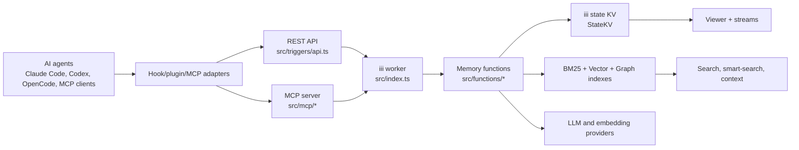
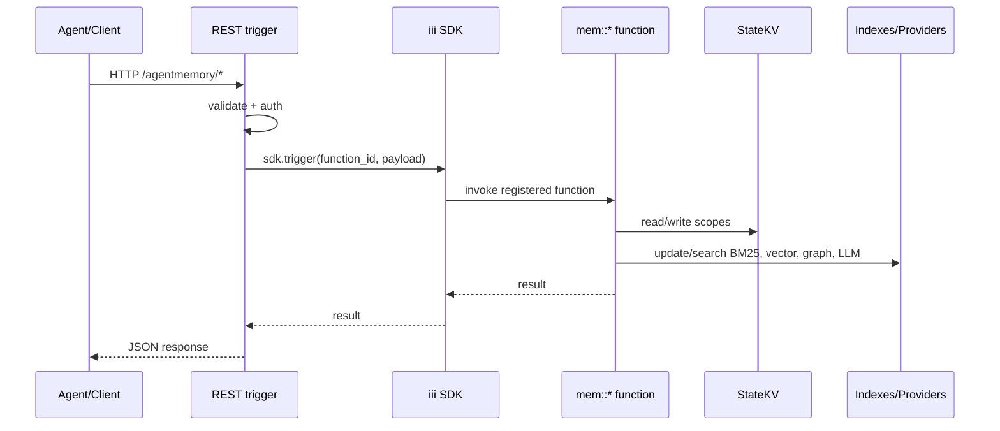
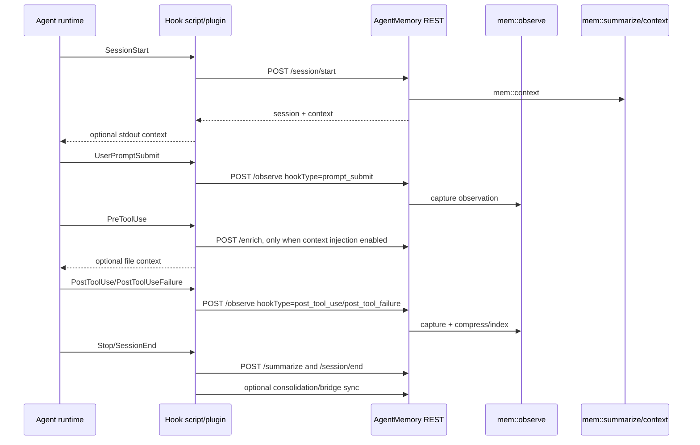
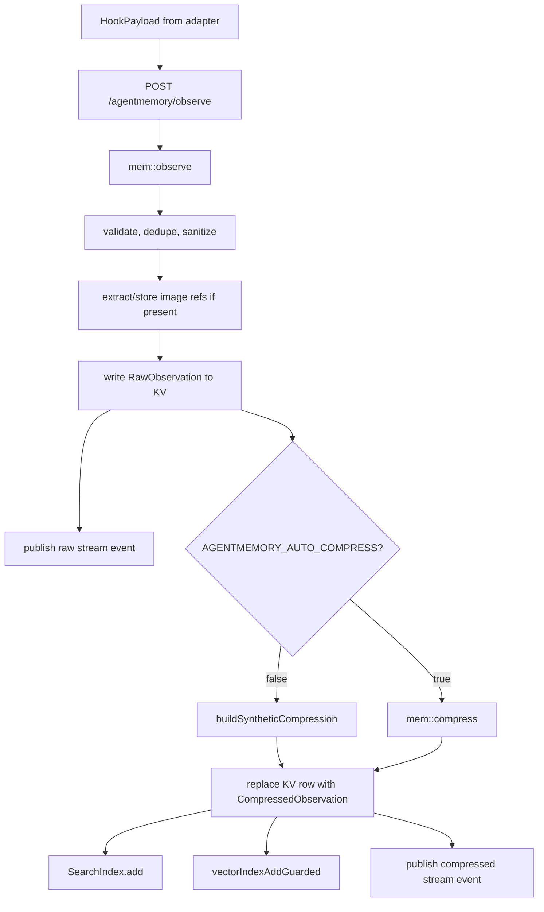
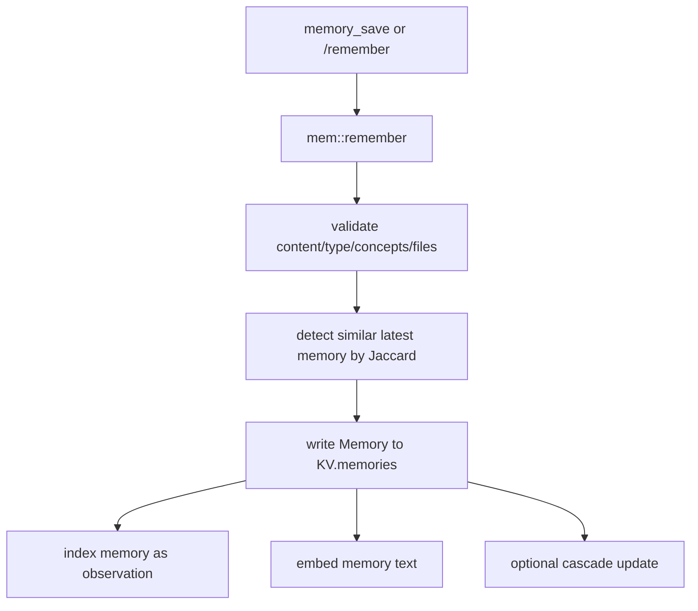
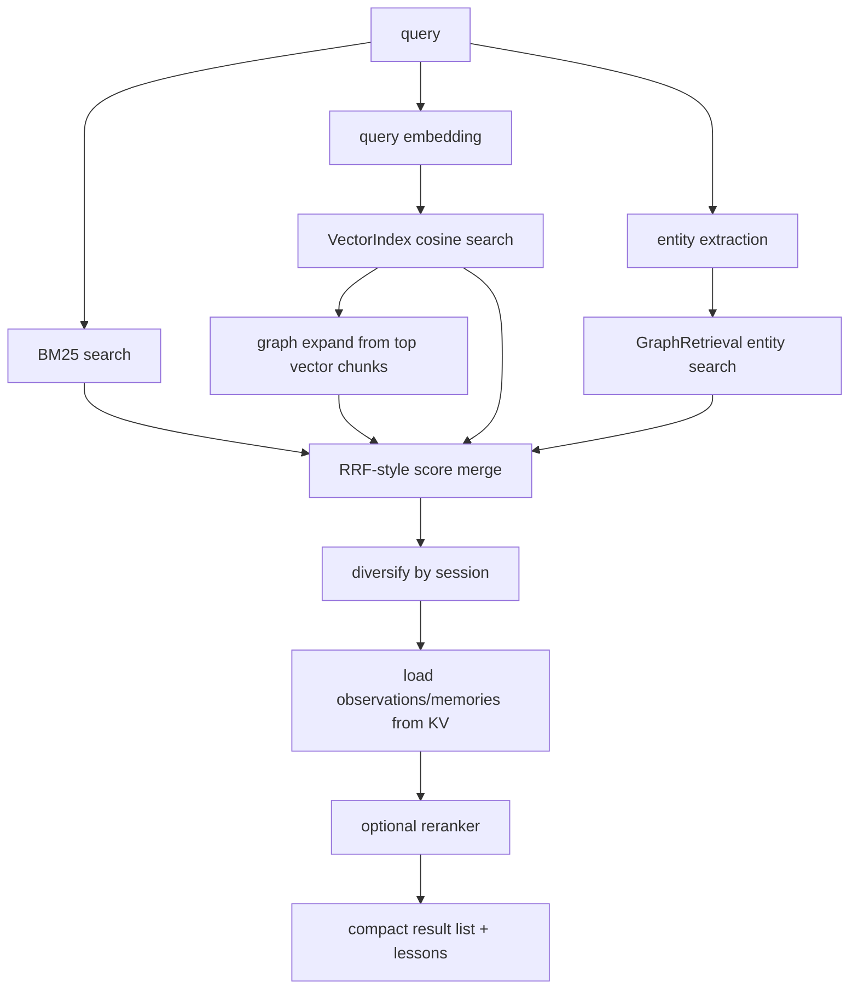
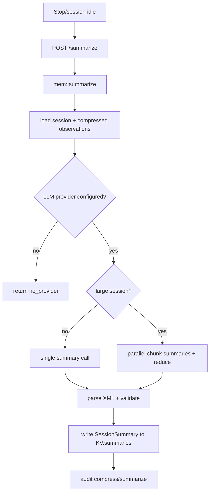
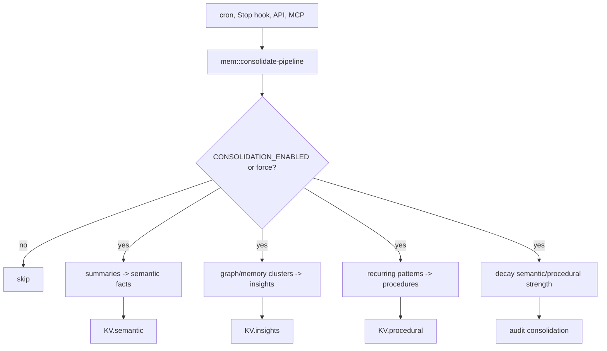
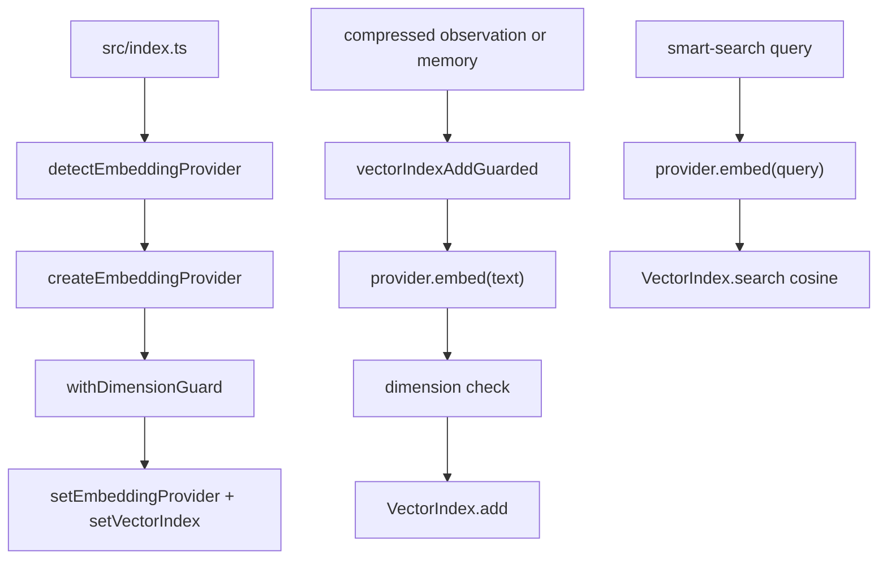
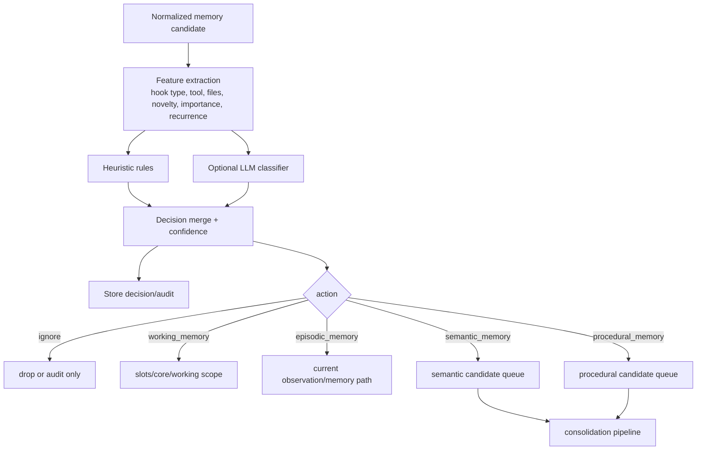

# AgentMemory Development Guide

This document describes the current AgentMemory architecture and the safest extension points for evolving it into an intelligent long-term memory system for AI agents. It is based on the repository state at version `0.9.27`.

## Architectural Summary

AgentMemory is a local memory server for coding agents. It runs as a TypeScript worker on the iii engine, exposes REST and MCP surfaces, captures agent lifecycle events through hooks/plugins, stores state in iii's key-value primitives, and builds in-memory BM25/vector/graph indexes for retrieval.

The core design rule is: agent-specific integrations stay thin. Claude/Codex hooks, OpenCode plugins, and MCP clients normalize their events into the same REST and `mem::*` function contracts. Most new behavior should therefore be added as new `mem::*` functions, REST/MCP adapters, or pipeline stages behind existing APIs rather than inside every integration.

## High-Level Architecture



## Main Runtime Modules

- `src/index.ts` is the worker bootstrap. It loads config, creates providers, initializes KV and indexes, registers every `mem::*` function, registers REST/MCP endpoints, starts the viewer, loads persisted indexes, and schedules background sweeps.
- `src/triggers/api.ts` is the REST facade. It validates request bodies, applies optional bearer auth, and delegates to `mem::*` functions.
- `src/mcp/server.ts` exposes server-backed MCP tools/resources/prompts over REST-compatible endpoints.
- `src/mcp/standalone.ts` is the stdio MCP shim. It proxies to the running AgentMemory server when reachable and falls back to reduced local memory otherwise.
- `src/functions/*` contains memory capabilities: capture, compression, recall, context, summarization, consolidation, graph, lessons, slots, actions, retention, governance, and more.
- `src/state/*` contains storage wrappers and retrieval indexes: `StateKV`, BM25 `SearchIndex`, `VectorIndex`, `HybridSearch`, persistence, stemming, synonyms, reranking, and keyed locks.
- `src/providers/*` contains LLM providers for compression/summarization and embedding providers for vector search.
- `src/hooks/*` contains Node hook entrypoints compiled into plugin scripts.
- `plugin/hooks/*.json` and `plugin/opencode/*` wire agent runtimes into REST endpoints.

## Request Lifecycle



Important examples:

- `/agentmemory/observe` validates a `HookPayload` and triggers `mem::observe`.
- `/agentmemory/session/start` creates a session row, triggers `mem::context`, and returns optional startup context.
- `/agentmemory/search` triggers `mem::search`.
- `/agentmemory/smart-search` triggers `mem::smart-search`, which uses the `HybridSearch` instance registered at boot.
- `/agentmemory/remember` triggers `mem::remember`.
- `/agentmemory/summarize` triggers `mem::summarize`.
- `/agentmemory/consolidate-pipeline` triggers `mem::consolidate-pipeline`.

## Hook Lifecycle

Claude/Codex hook scripts and the OpenCode plugin capture agent events and send normalized payloads to REST.



Claude/Codex manifests:

- `plugin/hooks/hooks.json` wires the full Claude-style hook set.
- `plugin/hooks/hooks.codex.json` wires the Codex-compatible subset: `SessionStart`, `UserPromptSubmit`, `PreToolUse`, `PostToolUse`, `PreCompact`, and `Stop`.

OpenCode:

- `plugin/opencode/agentmemory-capture.ts` maps OpenCode events such as `session.created`, `message.part.updated`, `tool.execute.before`, `experimental.chat.system.transform`, and `session.deleted` into the same REST APIs.
- The OpenCode adapter also injects AgentMemory instructions and cached/startup context through `experimental.chat.system.transform`.

## Storage Layer

AgentMemory uses iii engine state functions through `StateKV` in `src/state/kv.ts`:

- `state::get`
- `state::set`
- `state::update`
- `state::delete`
- `state::list`

Logical scopes are defined in `src/state/schema.ts` under `KV`.

Key scopes:

- `mem:sessions` stores `Session` records.
- `mem:obs:{sessionId}` stores raw and compressed observations for a session.
- `mem:memories` stores explicit/consolidated episodic memories.
- `mem:summaries` stores session summaries.
- `mem:semantic` stores semantic facts from consolidation.
- `mem:procedural` stores procedures/routines from consolidation.
- `mem:graph:*` stores graph nodes, edges, indexes, and graph snapshots.
- `mem:lessons`, `mem:insights`, `mem:slots`, `mem:actions`, `mem:crystals`, and related scopes support higher-level memory/orchestration features.
- `mem:index:bm25` and sharded children store persisted BM25/vector index snapshots.

`IndexPersistence` in `src/state/index-persistence.ts` serializes BM25 and vector indexes into sharded KV rows. Runtime search indexes are in memory and rebuilt/loaded at startup.

## Observation Capture

Primary files:

- `src/hooks/*.ts` and `plugin/opencode/agentmemory-capture.ts` capture runtime events.
- `src/triggers/api.ts` exposes `/agentmemory/observe`.
- `src/functions/observe.ts` implements `mem::observe`.
- `src/functions/privacy.ts` sanitizes private data.
- `src/functions/compress-synthetic.ts` creates zero-LLM compressed observations.
- `src/functions/compress.ts` creates LLM-compressed observations when enabled.

Capture flow:



Important compatibility point: adapters only need to send `HookPayload`. They do not need to know whether observations are ignored, stored as working context, compressed, indexed, or consolidated later.

## Memory Persistence

Primary files:

- `src/functions/remember.ts` implements explicit memory save/forget.
- `src/functions/consolidate.ts` synthesizes long-term memories from related observations.
- `src/functions/consolidation-pipeline.ts` writes semantic and procedural memory tiers.
- `src/functions/lessons.ts`, `src/functions/working-memory.ts`, and `src/functions/slots.ts` handle adjacent memory stores.
- `src/state/memory-utils.ts` adapts `Memory` rows into search-index-compatible observations.

Explicit save flow:



Current memory type taxonomy for `Memory` is limited to `pattern`, `preference`, `architecture`, `bug`, `workflow`, and `fact`. The four-tier consolidation model is represented separately by working/episodic/semantic/procedural mechanisms rather than by the `Memory.type` union alone.

## Retrieval Pipeline

There are two main retrieval paths.

### `mem::search`

`src/functions/search.ts` implements direct recall:

1. Validate query, limit, filters, format, token budget, and agent scope.
2. Ensure BM25 index exists; rebuild from KV if empty.
3. Search the BM25 `SearchIndex`.
4. Over-fetch when project/cwd/agent filters are active.
5. Load matching observations from `KV.observations(sessionId)` or fallback memories from `KV.memories`.
6. Filter by agent/project/cwd where possible.
7. Record access events.
8. Return `full`, `compact`, or `narrative` format, optionally token-budgeted.

### `mem::smart-search`

`src/functions/smart-search.ts` delegates core ranking to `HybridSearch` from `src/state/hybrid-search.ts`:



`memory_smart_search` can also expand specific IDs for progressive disclosure. It includes optional lesson recall and records follow-up diagnostic data.

## Context Injection

Primary files:

- `src/functions/context.ts` implements `mem::context`.
- `src/functions/enrich.ts` implements file/tool-specific enrichment.
- `src/hooks/session-start.ts` and `src/hooks/pre-tool-use.ts` print context to stdout only when configured.
- `plugin/opencode/agentmemory-capture.ts` injects instructions/context into OpenCode system transforms.

Context sources:

- pinned memory slots, if enabled
- project profile
- lessons relevant to the project
- recent session summaries for the same project
- important observations from recent sessions when summaries are missing

Context is wrapped in `<agentmemory-context project="...">...</agentmemory-context>` and selected under a token budget.

Context injection is off by default for Claude/Codex `PreToolUse` unless `AGENTMEMORY_INJECT_CONTEXT=true`, preserving token-budget compatibility.

## Summarization Pipeline

Primary files:

- `src/hooks/stop.ts` and `src/hooks/session-end.ts` trigger summarization.
- `plugin/opencode/agentmemory-capture.ts` triggers summarization on idle/compaction/session deletion.
- `src/functions/summarize.ts` implements `mem::summarize`.
- `src/prompts/summary.ts` defines summary prompts.

Flow:



## Memory Consolidation Pipeline

There are two related consolidation implementations:

- `src/functions/consolidate.ts` groups high-importance observations by concept and synthesizes `Memory` rows.
- `src/functions/consolidation-pipeline.ts` implements tiered consolidation for semantic facts, procedural memories, reflection insights, and decay.

Tiered flow:



## Embedding Pipeline

Primary files:

- `src/providers/embedding/index.ts` chooses embedding providers and wraps them with dimension guards.
- Provider implementations live in `src/providers/embedding/*.ts`.
- `src/functions/search.ts` owns `setEmbeddingProvider`, `setVectorIndex`, and guarded vector writes.
- `src/state/vector-index.ts` stores vectors and performs cosine search.
- `src/state/index-persistence.ts` persists vector index snapshots.
- `src/functions/vision-search.ts` handles image embeddings/search when enabled.

Flow:



If no embedding provider is configured, AgentMemory runs in BM25+graph mode. Local embeddings can be used through optional dependencies. Image embeddings require `AGENTMEMORY_IMAGE_EMBEDDINGS=true` and use the CLIP provider.

## Files By Responsibility

Observation capture:

- `src/hooks/session-start.ts`
- `src/hooks/prompt-submit.ts`
- `src/hooks/pre-tool-use.ts`
- `src/hooks/post-tool-use.ts`
- `src/hooks/post-tool-failure.ts`
- `src/hooks/stop.ts`
- `src/hooks/session-end.ts`
- `plugin/scripts/*.mjs` generated hook scripts
- `plugin/hooks/hooks.json`
- `plugin/hooks/hooks.codex.json`
- `plugin/opencode/agentmemory-capture.ts`
- `src/triggers/api.ts` (`api::observe`)
- `src/functions/observe.ts`

Memory persistence:

- `src/state/kv.ts`
- `src/state/schema.ts`
- `src/functions/remember.ts`
- `src/functions/consolidate.ts`
- `src/functions/consolidation-pipeline.ts`
- `src/functions/lessons.ts`
- `src/functions/working-memory.ts`
- `src/functions/slots.ts`
- `src/functions/export-import.ts`
- `src/state/index-persistence.ts`

Retrieval:

- `src/functions/search.ts`
- `src/functions/smart-search.ts`
- `src/functions/file-index.ts`
- `src/functions/enrich.ts`
- `src/functions/timeline.ts`
- `src/functions/graph-retrieval.ts`
- `src/functions/query-expansion.ts`
- `src/functions/lessons.ts`
- `src/state/search-index.ts`
- `src/state/vector-index.ts`
- `src/state/hybrid-search.ts`
- `src/state/reranker.ts`

Context injection:

- `src/functions/context.ts`
- `src/functions/enrich.ts`
- `src/hooks/session-start.ts`
- `src/hooks/pre-tool-use.ts`
- `src/hooks/pre-compact.ts`
- `plugin/opencode/agentmemory-capture.ts`
- `src/mcp/server.ts` MCP prompt `recall_context`

Summarization:

- `src/functions/summarize.ts`
- `src/prompts/summary.ts`
- `src/hooks/stop.ts`
- `src/hooks/session-end.ts`
- `plugin/opencode/agentmemory-capture.ts`
- `src/functions/skill-extract.ts` for skill extraction from summaries

Embedding:

- `src/providers/embedding/index.ts`
- `src/providers/embedding/local.ts`
- `src/providers/embedding/openai.ts`
- `src/providers/embedding/gemini.ts`
- `src/providers/embedding/voyage.ts`
- `src/providers/embedding/cohere.ts`
- `src/providers/embedding/openrouter.ts`
- `src/providers/embedding/clip.ts`
- `src/functions/search.ts`
- `src/state/vector-index.ts`
- `src/state/index-persistence.ts`
- `src/functions/vision-search.ts`

## Decision Engine Design Goal

The proposed Memory Decision Engine should decide how to route incoming information into one of these outcomes:

- `ignore`
- `working_memory`
- `episodic_memory`
- `semantic_memory`
- `procedural_memory`

A compatibility-preserving implementation should not require changes to hook payloads, MCP clients, or existing REST endpoints.

## Recommended Extension Points

### 1. Add a new `mem::decide` function

Create a new function such as `src/functions/decision-engine.ts` and register it in `src/index.ts`.

Input should accept normalized candidates, not raw agent-specific events:

```ts
type DecisionInput = {
  source: "observe" | "remember" | "summarize" | "consolidate";
  sessionId?: string;
  project?: string;
  raw?: RawObservation;
  compressed?: CompressedObservation;
  memory?: Memory;
  context?: Record<string, unknown>;
};
```

Output should be explicit and auditable:

```ts
type MemoryDecision = {
  action: "ignore" | "working_memory" | "episodic_memory" | "semantic_memory" | "procedural_memory";
  confidence: number;
  rationale: string;
  ttlDays?: number;
  importance?: number;
  concepts?: string[];
  targetScope?: string;
};
```

Store decisions in a new KV scope such as `mem:decisions` for debugging, governance, and evaluation.

### 2. Insert after normalization in `mem::observe`

Best first insertion point: after privacy stripping and raw field extraction, before writing the raw observation or before compression/indexing.

Compatibility options:

- For `ignore`, either skip persistence entirely or write a tiny decision audit row only. Prefer audit-only when debugging is enabled.
- For `working_memory`, write to existing working memory primitives (`mem::core-add`, slots, or a new working scope) and avoid long-term indexing.
- For `episodic_memory`, continue the current observation/compression/indexing path.
- For `semantic_memory` and `procedural_memory`, enqueue or trigger specialized consolidation functions rather than writing directly from raw hook data.

This preserves `/observe` and hook contracts.

### 3. Insert before explicit `mem::remember`

Manual `memory_save` calls are high-signal but can still benefit from routing:

- user preferences may map to semantic facts or slots
- repeated workflows may map to procedural memory
- transient notes may map to working memory

Keep `mem::remember` behavior as the default fallback when the decision engine is disabled or returns low confidence.

### 4. Use consolidation as the semantic/procedural writer

Do not bypass `src/functions/consolidation-pipeline.ts` for semantic/procedural memory unless necessary. The existing scopes and decay/access patterns already live there.

Recommended path:

- Decision Engine marks candidates as semantic/procedural candidates.
- Store candidate rows in a new scope such as `mem:decision:candidates`.
- `mem::consolidate-pipeline` consumes those candidates in addition to summaries/patterns.

This keeps long-term memory formation batched, explainable, and less noisy.

### 5. Add REST/MCP visibility without changing existing tools

Add optional diagnostic endpoints/tools rather than altering existing tool semantics:

- REST: `GET /agentmemory/decisions`, `POST /agentmemory/decide` for debugging/manual evaluation.
- MCP: `memory_decision_explain` or `memory_decision_stats` as additive tools.

Do not change `memory_save`, `memory_recall`, or `memory_smart_search` return shapes unless versioned.

### 6. Feature flag the engine

Use config flags to keep compatibility:

- `AGENTMEMORY_DECISION_ENGINE=true|false`
- `AGENTMEMORY_DECISION_MODE=shadow|enforce`
- `AGENTMEMORY_DECISION_PROVIDER=heuristic|llm|hybrid`

Recommended rollout:

1. `shadow`: compute and store decisions, but keep current behavior.
2. `advisory`: affect metadata/importance only.
3. `enforce`: actually ignore/route memory writes.

### 7. Reuse existing evaluation and audit systems

- Use `src/functions/audit.ts` for decision audit entries.
- Add decision quality metrics to the existing metrics/eval path.
- Add tests similar to `test/consolidation-pipeline.test.ts`, `test/working-memory.test.ts`, `test/search.test.ts`, and `test/context-injection.test.ts`.

## Proposed Decision Engine Architecture



## Compatibility Rules For Future Changes

- Keep hook payload contracts stable. Add server-side behavior behind `/observe`.
- Keep MCP tool names and schemas stable. Add new tools instead of changing old ones.
- Keep existing storage scopes readable. Add new scopes for decisions/candidates rather than mutating existing record shapes first.
- Preserve no-LLM defaults. Heuristic decision mode should work without provider keys.
- Preserve BM25-only operation. Decision routing should not require embeddings.
- Preserve agent and project isolation filters in `mem::search` and `mem::smart-search`.
- Keep context injection opt-in for high-frequency hooks.

## Suggested Implementation Sequence

1. Add decision types and config flags.
2. Add `mem::decide` in shadow mode with heuristic-only classifier.
3. Call `mem::decide` from `mem::observe` after sanitization but before persistence, storing decision audit rows without changing behavior.
4. Add tests proving shadow mode is behaviorally identical to current capture/search.
5. Add advisory mode to adjust `importance`, TTL, or candidate metadata.
6. Add enforced routing for `ignore` and `working_memory` only.
7. Add semantic/procedural candidate queues consumed by `mem::consolidate-pipeline`.
8. Add REST/MCP decision diagnostics.

## Important Existing Invariants

- `mem::observe` may implicitly create sessions for integrations that skip `/session/start`.
- `mem::remember` indexes saved memories immediately into BM25/vector indexes.
- Search indexes are runtime structures; KV is the durable source of truth.
- Vector writes must use guarded helpers to avoid dimension corruption.
- Deletions must update both KV and indexes, and flush index persistence where needed.
- Agent isolation is enforced after loading observations/memories because indexes do not carry all filter metadata.
- LLM-dependent features must degrade gracefully when the provider is `noop`.
