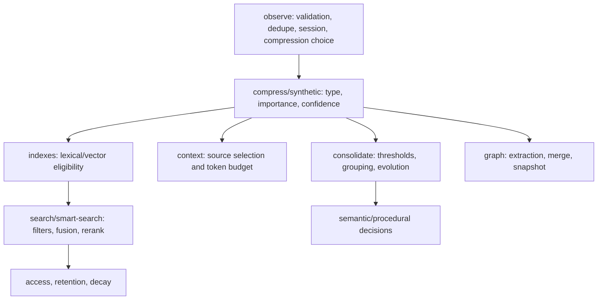
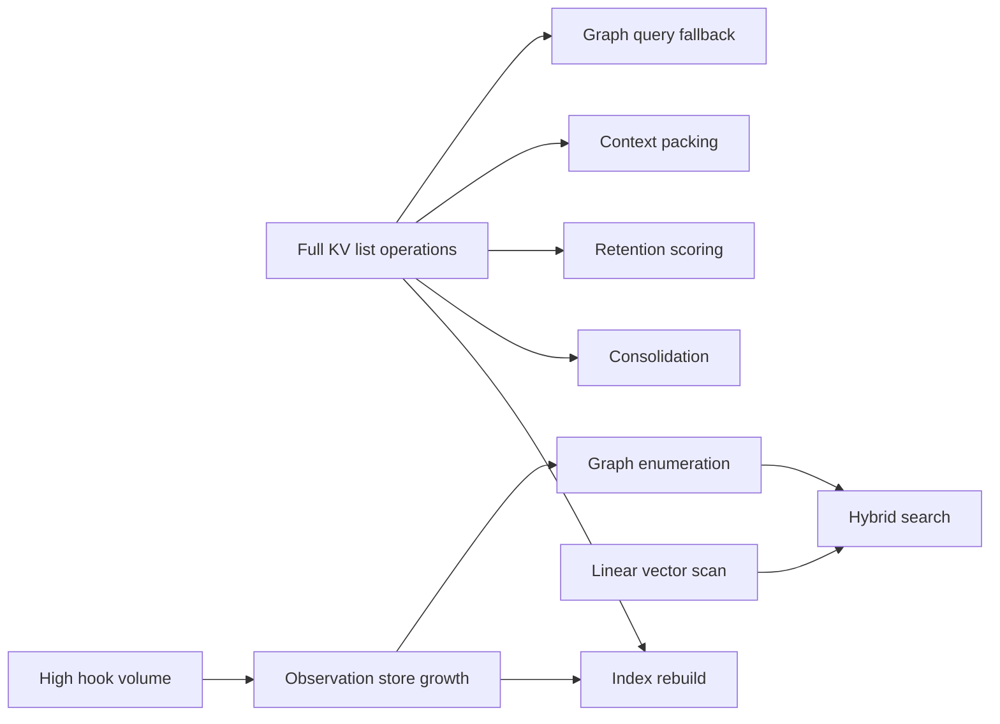

# AgentMemory Architecture Gaps

This document evaluates the current architecture as implemented. It documents coupling, duplication, technical debt, extension limitations, and scalability bottlenecks. It does not propose fixes.

## Current Decision Distribution

## Scalability Pressure Points

## Gaps Relevant to AgentMemory v2

The first v2 milestone should focus only on:

- a central Memory Decision Engine,
- decision audit,
- shadow, advisory, and enforce modes,
- semantic and procedural candidate queues.

It should not refactor unrelated modules, optimize vector search, change hook payloads, change MCP schemas, or change existing KV record shapes.

### A. Must Address for Decision Engine

- Decision logic is currently distributed across observe, compression, remember, context, search filtering, consolidation, lessons, graph extraction, and retention. A v2 engine needs a central place to record the decision outcome while leaving those existing flows intact.
- There is no first-class decision audit trail for “ignored”, “working-only”, “episodic candidate”, “semantic candidate”, or “procedural candidate” choices. Current audit records focus on state-changing operations, not advisory classification.
- Observe writes raw rows before compression and may overwrite the same observation id with compressed shape. A Decision Engine must understand raw and compressed observation states without requiring a new observation record shape.
- Semantic and procedural memory writes are currently batch-consolidation outcomes. v2 needs candidate queues so raw hook events can be classified without immediately writing durable semantic/procedural memory.
- Current behavior has no mode boundary between “observe only”, “recommend”, and “enforce”. Shadow/advisory/enforce modes are needed so the engine can be evaluated without changing production memory persistence at first.
- Memory creation is split between `mem::remember`, import, old consolidation, and consolidation pipeline outputs. A Decision Engine needs to classify candidate intent consistently while preserving each existing entry point.

### B. Should Not Address Yet

- Do not refactor REST, MCP, or hook registration mechanics as part of the first v2 milestone.
- Do not redesign the full type hierarchy for `Memory`, `SemanticMemory`, `ProceduralMemory`, `Lesson`, `Insight`, or `Crystal` yet.
- Do not optimize vector search yet.
- Do not replace graph extraction, graph snapshots, or graph retrieval in the first Decision Engine milestone.
- Do not rework context packing broadly beyond recording or honoring engine decisions where needed.
- Do not consolidate provider selection or environment parsing as part of v2 Decision Engine work.

### C. Do-Not-Touch Compatibility Constraints

- Do not change hook payload shapes or hook stdout/stderr semantics.
- Do not change MCP tool schemas, tool names, or the existing core/all tool visibility contract.
- Do not change REST endpoint payload shapes.
- Do not change existing KV record shapes for observations, memories, summaries, semantic memories, procedural memories, graph nodes, graph edges, lessons, or audit rows.
- Do not assume `RawObservation` and `CompressedObservation` are separate durable records. Preserve mixed raw/compressed rows in `KV.observations(sessionId)`.
- Do not bypass iii-engine/iii-sdk StateKV with standalone SQLite or in-process storage.
- Do not alter default behavior of `AGENTMEMORY_AUTO_COMPRESS=false`, `AGENTMEMORY_INJECT_CONTEXT=false`, or shared agent recall.

### D. Future Scalability Work

- Full KV-scope listing in consolidation, context, retention, and some graph paths remains a scaling concern.
- BM25 rebuild and persisted index loading can become expensive as sessions and memories grow.
- Vector search remains linear over stored embeddings.
- Graph query paths still have enumeration pressure outside snapshot fast paths.
- Image storage and image embeddings add disk/vector growth beyond text-only assumptions.
- Filesystem watcher integrations can generate high observation volume.

These are future scalability concerns, not first-milestone Decision Engine requirements.

## Coupling

- `src/index.ts` is the central composition root and registers providers, indexes, functions, REST endpoints, MCP server, viewer, sweeps, and boot-time recovery. Feature behavior depends on global bootstrap order.
- Domain functions access `StateKV` scopes directly. Storage ownership, indexing, audit, and lifecycle cleanup are distributed across functions rather than hidden behind a single repository layer.
- Hook scripts are standalone Node entrypoints coupled to REST endpoint paths and payload shapes. They intentionally avoid `iii-sdk`, preserving hook compatibility while duplicating boundary behavior.
- MCP tools and REST endpoints both map external arguments into `mem::*` payloads. Function ids and payload shapes are repeated across registries, server handlers, triggers, tests, plugin manifests, and docs.
- Search functions are coupled to module-scope BM25/vector singletons. Boot, rebuild, flush, and stale-index behavior share mutable module state.
- Graph extraction combines provider prompting, XML parsing, node/edge merge logic, name/edge indexing, degree updates, snapshot maintenance, audit, and logging in one pipeline.
- Multimodal image storage, image references, image embeddings, observation storage, and forget cascades interact across several functions.

## Duplicated Logic

- Auth/header behavior appears in REST, hook scripts, MCP proxy, viewer, and integrations.
- Project/session/agent attribution is normalized in hooks, REST handlers, observe, filesystem watcher, and post-commit capture.
- Agent scope filtering appears in search, smart-search, and MCP handler paths.
- Tool-count and endpoint-count metadata is duplicated across tool registry, MCP server, index startup logs, README, tests, and plugin manifests.
- Environment parsing is split across `src/config.ts`, CLI, MCP proxy, hook scripts, integrations, and deployment docs.
- Search fallback logic appears in standard search, smart search, hybrid search enrichment, and standalone MCP local fallback.
- Delete/forget cascades manually touch memories, observations, indexes, image refs, retention scores, access logs, and sometimes graph/image projections.

## Technical Debt

- `src/types.ts` is a large monolithic domain declaration file containing stable memory objects, experimental orchestration objects, export types, graph types, and operational types.
- Several objects are parallel memory tiers rather than one unified hierarchy: `Memory`, `SemanticMemory`, `ProceduralMemory`, `Lesson`, `Insight`, and `Crystal` overlap in lifecycle fields but live in separate scopes and APIs.
- Raw and compressed observations share session observation storage, so callers must know whether a row is pre-compression or post-compression.
- Hook `raw` payloads are intentionally loose. This preserves compatibility with many agents but pushes interpretation into heuristics.
- Many compatibility comments reference prior issues and special cases, showing behavior shaped by accumulated bug fixes.
- Graph snapshot state is a materialized operational cache with reset and dirty semantics that query callers must understand.
- Some `AGENTMEMORY_*` variables are runtime flags, some are install-template placeholders, and some are generated internal variables, all sharing the same namespace.
- Audit writes are often best-effort and swallowed on failure, preserving primary workflows but making audit completeness non-strict.

## Extension Limitations

- There is no central memory decision object that classifies events into ignore, working memory, episodic memory, semantic memory, and procedural memory. Decisions are spread across observe, compression, context, remember, consolidation, lessons, retention, and graph modules.
- Adding a new MCP tool or REST endpoint requires coordinated edits across many files by repository convention.
- Adding a new memory tier requires new types, KV scopes, endpoints/tools, retrieval integration, export/import support, retention behavior, and context packing rules.
- Ranking streams are fused in hybrid search, but metadata filtering often happens after candidate retrieval because indexes primarily store ids and text/vector payloads.
- Graph extraction is LLM XML based; alternative graph extractors must coexist with parser, index, and snapshot assumptions.
- Context packing is source-specific. New sources require explicit block construction and budget handling.
- Provider selection is environment-driven and boot-time oriented; per-request provider policy is limited.
- Compatibility with hooks constrains stdout/stderr behavior, timeout choices, and whether network calls can be awaited.

## Scalability Bottlenecks

- Several functions list full KV scopes: memories, summaries, lessons, semantic memories, procedural memories, sessions, graph nodes/edges in some paths, and access logs.
- Vector search is a linear scan over stored embeddings.
- BM25 is an in-memory projection with persisted state; rebuild paths can traverse all sessions, observations, and memories.
- `mem::remember` checks similarity against existing memories, which grows with memory count.
- Consolidation reads summaries and memory collections, then performs heuristic grouping or LLM work.
- Graph retrieval can require full node/edge enumeration for query/start paths. Snapshot support exists because unbounded graph listing exceeded engine response budgets.
- Context generation sorts and filters candidate blocks in memory, then packs by an approximate token budget.
- Retention scoring lists memories, semantic memories, and access logs, then writes scores for all entries.
- Filesystem watcher integrations can create high observation volume when broad roots are watched.
- Image storage and image embedding features introduce disk and vector growth outside text-only retention assumptions.
