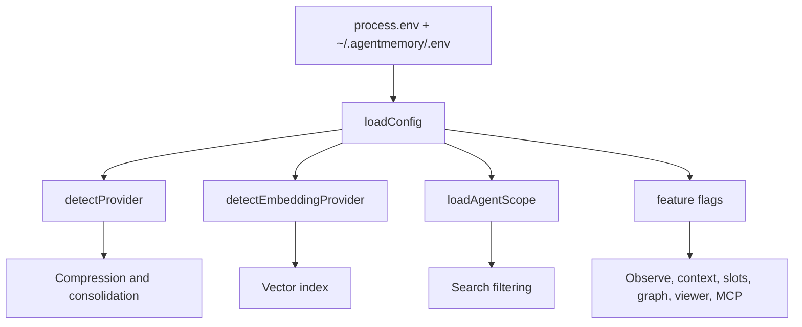

# AgentMemory Configuration

This document covers `AGENTMEMORY_*` variables found in source, integrations, plugin scripts, tests, and docs. Related non-`AGENTMEMORY_*` variables such as `OPENAI_API_KEY`, `BM25_WEIGHT`, `VECTOR_WEIGHT`, `CONSOLIDATION_ENABLED`, `GRAPH_EXTRACTION_ENABLED`, `RERANK_ENABLED`, `III_REST_PORT`, and `TEAM_ID` also affect runtime behavior but are outside this requested namespace.

## Configuration Decision Flow

## Variables

| Variable | Default | Affected modules | Affected pipeline | Performance impact | Compatibility impact |
| --- | --- | --- | --- | --- | --- |
| `AGENTMEMORY_AGENT_SCOPE` | `shared` | `src/config.ts`, search, smart-search, MCP handlers | Recall filtering | Isolated mode can overfetch before filtering | Legacy shared recall remains default; `agentId="*"` bypasses isolation. |
| `AGENTMEMORY_ALLOW_AGENT_SDK` | `false` | `src/config.ts`, providers, hook guards | LLM fallback/compression | Can add agent SDK latency | Off prevents recursive hook capture unless explicitly enabled. |
| `AGENTMEMORY_AUTO_COMPRESS` | `false` | `observe.ts`, `compress.ts`, provider config | Observation compression | True adds LLM call per observation | False preserves fast synthetic default. |
| `AGENTMEMORY_BASE_URL` | unset | eval/test adapters | Evaluation client | None in daemon | Test/eval-only base URL override. |
| `AGENTMEMORY_BENCH_AUTOSTART` | unset/false | benchmark tooling | Benchmark startup | May start extra process | Benchmark-only. |
| `AGENTMEMORY_COMMIT_SHA` | unset | `src/hooks/post-commit.ts` | Commit capture | None | Allows commit hook attribution without extra git parsing. |
| `AGENTMEMORY_COPILOT_MCP_BLOCK` | generated/internal | plugin/copilot config references | MCP install config | None | Internal block marker. |
| `AGENTMEMORY_CWD` | process/hook cwd | `post-commit.ts`, integrations | Commit/session attribution | None | Override for hooks launched outside repo cwd. |
| `AGENTMEMORY_DEBUG` | `false` | MCP standalone/proxy | MCP diagnostics | More stderr output | Debug-only; helps inspect unexpected server responses. |
| `AGENTMEMORY_DROP_STALE_INDEX` | `false` | `src/config.ts`, index boot | Vector index loading | True may force rebuild/drop | Escape hatch for embedding dimension changes. |
| `AGENTMEMORY_EXPORT_ROOT` | `~/.agentmemory` | `obsidian-export.ts` | Export/Obsidian sync | Changes filesystem IO target | External export path override. |
| `AGENTMEMORY_FOLLOWUP_WINDOW_SECONDS` | `30` | `src/config.ts`, `smart-search.ts` | Follow-up diagnostics | Small KV read/write overhead | Controls grouping window for recent-search diagnostics. |
| `AGENTMEMORY_FORCE_PROXY` | `false` | `src/mcp/rest-proxy.ts` | MCP shim proxy/local decision | Skips health probe | Useful for sandboxed or remote clients; trusts configured URL. |
| `AGENTMEMORY_FS_WATCH_ALLOW_BINARY` | `0` | filesystem watcher integration | File-change capture | Binary reads can be large | Off protects payload size. |
| `AGENTMEMORY_FS_WATCH_DIRS` | unset | filesystem watcher integration | File-change capture | More roots create more observations | Integration-only. |
| `AGENTMEMORY_FS_WATCH_IGNORE` | built-in ignores plus unset extra | filesystem watcher integration | File-change capture | More ignores reduce events | Regex extension without daemon changes. |
| `AGENTMEMORY_GRAPH_WEIGHT` | `0.3` | `src/index.ts`, `HybridSearch` | Hybrid ranking | Changes graph influence after graph work exists | Weight normalized with active streams. |
| `AGENTMEMORY_III_CONFIG` | unset | CLI/engine startup | iii-engine config selection | Startup only | Overrides packaged engine config path. |
| `AGENTMEMORY_III_VERSION` | repo-defined default | CLI/install scripts | Engine dependency management | Install/startup only | Pins engine version. |
| `AGENTMEMORY_IMAGE_EMBEDDINGS` | `false` | `observe.ts`, `vision-search.ts` | Image embedding/search | Adds image embedding and storage work | Off keeps text-only deployments compatible. |
| `AGENTMEMORY_IMAGE_STORE_MAX_BYTES` | `524288000` | `src/utils/image-store.ts` | Managed image storage | Larger value allows more disk use | Disk safety knob. |
| `AGENTMEMORY_INJECT_CONTEXT` | `false` | context-injecting hooks, config | Hook stdout context injection | True waits for context fetch | Off preserves low-latency hooks and avoids surprise stdout. |
| `AGENTMEMORY_LLM_TIMEOUT_MS` | provider-specific, commonly `60000` | providers | LLM compression/consolidation | Higher values can block longer | Bounds provider calls. |
| `AGENTMEMORY_MCP_BLOCK` | generated/internal | plugin config references | MCP install config | None | Internal block marker. |
| `AGENTMEMORY_PROBE_TIMEOUT_MS` | `2000` | `src/mcp/rest-proxy.ts` | MCP daemon probe | Higher values delay fallback | Supports slow remote daemons. |
| `AGENTMEMORY_PROJECT` | unset | filesystem watcher/integrations | Observation project attribution | None | Optional project override outside standard hooks. |
| `AGENTMEMORY_PROJECT_NAME` | git root basename, else cwd basename | `src/hooks/_project.ts` | Hook project attribution | None | Stable project naming override. |
| `AGENTMEMORY_PROVIDER` | unset | `src/config.ts`, consolidation gate | Provider/consolidation detection | Can enable LLM paths when set to `agent-sdk` | Provider compatibility shim. |
| `AGENTMEMORY_REFLECT` | `false` | `src/functions/slots.ts`, API gates | Reflection/slots | Adds reflection/slot work | Requires slots; off preserves old context behavior. |
| `AGENTMEMORY_REQUIRE_HTTPS` | off | `integrations/pi`, `hermes`, `openclaw` | Remote integration auth | None | When `1`, refuses bearer token over plaintext non-loopback URL. |
| `AGENTMEMORY_SDK_CHILD` | unset | hook sdk guards | Hook capture recursion prevention | Skips hook network work | Internal flag set by agent-sdk provider. |
| `AGENTMEMORY_SECRET` | unset | REST auth, hooks, MCP proxy, viewer, integrations, mesh | Auth headers/protected endpoints | Minimal | Enables bearer auth; required for non-loopback viewer bind. |
| `AGENTMEMORY_SESSION_ID` | unset | hooks/integrations/post-commit | Session attribution | None | Lets external integrations attach to a known session. |
| `AGENTMEMORY_SLOTS` | `false` | `slots.ts`, API gates, context | Pinned memory slots | Small context read/packing cost | Feature gated. |
| `AGENTMEMORY_SUPPRESS_COST_WARNING` | `false` | `src/config.ts` | Provider startup warnings | None | Suppresses OpenRouter premium model warning only. |
| `AGENTMEMORY_TEST_URL` | unset | tests | Test integration | None in daemon | Test-only. |
| `AGENTMEMORY_TOOLS` | `all` | `tools-registry.ts`, install config | MCP tool surface | More visible tools, not more automatic work | `core` exposes lean set on full server; local standalone fallback has its own limited set. |
| `AGENTMEMORY_URL` | `http://localhost:3111` | hooks, plugin scripts, MCP proxy, integrations, tests | REST target | Remote URLs add network latency | Primary remote/proxy compatibility knob; literal `${...}` placeholders are stripped by shim. |
| `AGENTMEMORY_USE_DOCKER` | `false` | CLI/install scripts | Deployment/startup | Docker startup overhead | Deployment mode switch. |
| `AGENTMEMORY_VERBOSE` | `false` | CLI/logging scripts | Diagnostics | More output | Debug-only. |
| `AGENTMEMORY_VERSION` | package/runtime specific | deploy/plugin references | Version display/deploy | None | External version metadata. |
| `AGENTMEMORY_VERSION__` | generated/internal | viewer/build output | Viewer display/cache metadata | None | Internal generated value. |
| `AGENTMEMORY_VIEWER_HOST` | `127.0.0.1` | `src/viewer/server.ts` | Viewer bind address | None | Non-loopback requires `AGENTMEMORY_SECRET` and `VIEWER_ALLOWED_HOSTS`. |
| `AGENTMEMORY_VIEWER_NONCE__` | generated per response | viewer | CSP/security | None | Internal nonce for viewer assets. |
| `AGENTMEMORY_VIEWER_PORT` | documented `3113`; runtime mainly uses `III_VIEWER_PORT` | README/deploy docs | Viewer port documentation | None | Documentation/deploy alias rather than primary source config. |
| `AGENTMEMORY_VIEWER_URL` | computed from viewer host/port | CLI/deploy/status | Viewer link display | None | External display URL override. |
