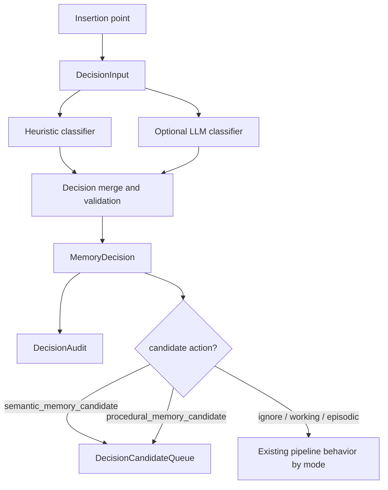

# AgentMemory v2 Decision Engine Design

## Goal

Add a central Memory Decision Engine that classifies memory events without changing existing hook payloads, REST payloads, MCP schemas, KV record shapes, search indexes, or default behavior. When disabled, AgentMemory must behave exactly as it does today.

The engine is a routing and audit layer. It does not replace `mem::observe`, `mem::remember`, `mem::consolidate`, `mem::consolidation-pipeline`, BM25, vector search, graph search, RRF, or context packing in the first milestone.

Disabled invariant: when `AGENTMEMORY_DECISION_MODE=disabled`, no `DecisionInput` is built, no `MemoryDecision` is created, no `DecisionAudit` is persisted, and no `DecisionCandidateQueue` row is written. In disabled mode, insertion points must behave as if the Decision Engine does not exist.

## Architecture



## Supported Actions

| Action | Meaning | First milestone behavior |
| --- | --- | --- |
| `ignore` | Event is not useful memory. | Shadow/advisory audit only; enforce may skip persistence for explicitly safe noise after tests. |
| `working_memory` | Useful for near-term context but not durable long-term memory. | Candidate/audit only at first; enforce may avoid episodic promotion while preserving raw capture semantics. |
| `episodic_memory` | Suitable for current `Memory` creation path. | Advisory only at first; existing remember/consolidate still write as today unless enforce is later expanded. |
| `semantic_memory_candidate` | Candidate fact for batch semantic consolidation. | Advisory and later modes may persist it in a new candidate queue; shadow mode does so only behind an explicit experimental flag. |
| `procedural_memory_candidate` | Candidate workflow/procedure evidence for batch procedural consolidation. | Advisory and later modes may persist it in a new candidate queue; shadow mode does so only behind an explicit experimental flag. |

## DecisionInput

`DecisionInput` is the normalized envelope given to the engine. It is intentionally separate from existing storage records so v2 does not alter `RawObservation`, `CompressedObservation`, `Memory`, `SemanticMemory`, or `ProceduralMemory`.

```ts
type DecisionInput = {
  id: string;
  inputHash: string;
  mode: "shadow" | "advisory" | "enforce";
  sourceFunction:
    | "mem::observe"
    | "mem::compress"
    | "mem::remember"
    | "mem::consolidate"
    | "mem::consolidation-pipeline"
    | "mem::context"
    | "mem::search"
    | "mem::smart-search";
  insertionPoint: string;
  timestamp: string;
  project?: string;
  sessionId?: string;
  cwd?: string;
  agentId?: string;
  observationId?: string;
  observationState?: "raw" | "compressed" | "unknown";
  hookType?: string;
  toolName?: string;
  rawSignals?: Record<string, unknown>;
  compressedSignals?: {
    type?: string;
    title?: string;
    facts?: string[];
    narrative?: string;
    concepts?: string[];
    files?: string[];
    importance?: number;
    confidence?: number;
  };
  memoryDraft?: {
    type?: string;
    title?: string;
    content?: string;
    concepts?: string[];
    files?: string[];
    project?: string;
    agentId?: string;
  };
  retrievalSignals?: {
    query?: string;
    resultIds?: string[];
    resultCount?: number;
  };
  contextSignals?: {
    blockCount?: number;
    tokenBudget?: number;
    sourceKinds?: string[];
  };
  evidenceRefs: Array<{
    kind: "observation" | "memory" | "summary" | "semantic" | "procedural" | "lesson" | "graph";
    id: string;
    sessionId?: string;
  }>;
  constraints: {
    preserveDefaultBehavior: boolean;
    mayWriteExistingKvShape: false;
    mayChangeHookPayload: false;
    mayChangeSearchRanking: false;
  };
};
```

## DecisionCandidate

`DecisionCandidate` is the engine's internal representation of a possible memory action. Multiple candidates may be produced from one input before validation selects the final decision.

```ts
type DecisionCandidate = {
  id: string;
  inputId: string;
  action:
    | "ignore"
    | "working_memory"
    | "episodic_memory"
    | "semantic_memory_candidate"
    | "procedural_memory_candidate";
  source: "heuristic" | "llm" | "merged";
  reasonCodes: string[];
  explanation: string;
  confidence: number;
  importance: number;
  ttlDays?: number;
  tags: string[];
  concepts: string[];
  files: string[];
  evidenceRefs: DecisionInput["evidenceRefs"];
  proposedQueue?: "semantic" | "procedural";
  createdAt: string;
};
```

## MemoryDecision

`MemoryDecision` is the validated result used by insertion points. Its `mode` does not include `disabled` because `mem::decide` must not be called when the Decision Engine mode is disabled. Disabled mode produces no input, no decision, no audit row, and no candidate queue row.

```ts
type MemoryDecision = {
  id: string;
  inputId: string;
  mode: "shadow" | "advisory" | "enforce";
  action:
    | "ignore"
    | "working_memory"
    | "episodic_memory"
    | "semantic_memory_candidate"
    | "procedural_memory_candidate";
  confidence: number;
  importance: number;
  ttlDays?: number;
  reasonCodes: string[];
  explanation: string;
  candidates: DecisionCandidate[];
  selectedCandidateId?: string;
  appliesTo: {
    observationId?: string;
    memoryId?: string;
    sessionId?: string;
    project?: string;
    agentId?: string;
  };
  effects: {
    persistAudit: boolean;
    enqueueCandidate: boolean;
    alterExistingFlow: boolean;
    skipExistingWrite: boolean;
    alterIndexing: false;
  };
  createdAt: string;
};
```

Invariant: `alterIndexing` is false in the first milestone. Search ranking/indexing remains unchanged unless an enforce decision safely prevents an upstream write; BM25/vector/graph/RRF internals are not changed.

## DecisionAudit

`DecisionAudit` is an append-style record in a new KV scope. It does not replace existing `AuditEntry`.

```ts
type DecisionAudit = {
  id: string;
  decisionId: string;
  inputId: string;
  inputHash: string;
  mode: "shadow" | "advisory" | "enforce";
  sourceFunction: DecisionInput["sourceFunction"];
  insertionPoint: string;
  action: MemoryDecision["action"];
  confidence: number;
  importance: number;
  ttlDays?: number;
  reasonCodes: string[];
  explanation: string;
  evidenceRefs: DecisionInput["evidenceRefs"];
  outcome: "observed" | "advised" | "enforced" | "fallback";
  fallbackReason?: string;
  existingBehaviorPreserved: boolean;
  createdAt: string;
};
```

## DecisionCandidateQueue

`DecisionCandidateQueue` is a new KV-backed queue for batch semantic/procedural consolidation. It stores candidates, not final `SemanticMemory` or `ProceduralMemory` rows.

```ts
type DecisionCandidateQueue = {
  id: string;
  kind: "semantic" | "procedural";
  status: "pending" | "consumed" | "rejected" | "expired";
  decisionId: string;
  candidateId: string;
  project?: string;
  sessionId?: string;
  agentId?: string;
  content: string;
  concepts: string[];
  files: string[];
  confidence: number;
  importance: number;
  ttlDays?: number;
  evidenceRefs: DecisionInput["evidenceRefs"];
  createdAt: string;
  expiresAt?: string;
  consumedAt?: string;
  consumedBy?: "mem::consolidation-pipeline";
};
```

## New KV Scopes Only

The design uses only new scopes:

- `mem:decision:audit` for `DecisionAudit`.
- `mem:decision:candidates` for `DecisionCandidateQueue`.
- Optional `mem:decision:metrics` for aggregate diagnostics.

No existing KV record shape changes are required.

## Raw and Compressed Observation Constraint

The engine must never assume raw and compressed observations are separate durable rows. At observe-time, it may receive raw hook data before the first write. At compression-time, it may receive a compressed shape that overwrites the same observation id. Background consumers must tolerate mixed rows in `KV.observations(sessionId)`.
