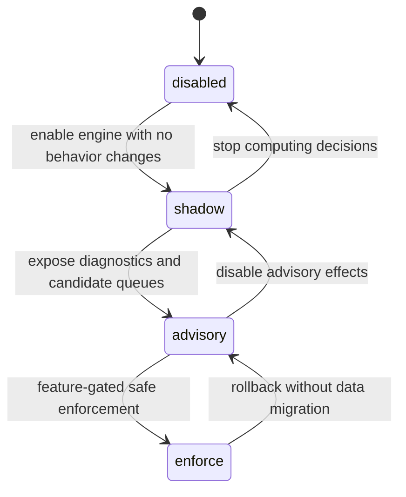

# Decision Engine Modes

The Decision Engine must be mode-gated. `disabled` is the default and must preserve current AgentMemory behavior byte-for-byte at the API contract level.

## Mode Summary

| Mode | Purpose | Existing behavior changed? | New persistence |
| --- | --- | --- | --- |
| `disabled` | Current AgentMemory behavior. | No. | None. |
| `shadow` | Compute decisions and audit them without affecting behavior. | No. | Decision audit only by default. Candidate queue only behind an explicit experimental flag. |
| `advisory` | Surface decisions to diagnostics and batch queues; existing writes continue. | No user-facing API/schema changes; no ranking change. | Decision audit, candidate queue, metrics. |
| `enforce` | Apply a limited set of safe routing decisions. | Only for explicitly supported decisions. First milestone: `ignore` and `working_memory` only. | Decision audit, candidate queue, metrics. |

## Disabled

| Area | Behavior |
| --- | --- |
| Observe | `mem::observe` validates, stores raw, compresses, indexes, streams, and updates sessions exactly as today. |
| Remember | `mem::remember` validates, supersedes/version-checks, saves, indexes, and cascades exactly as today. |
| Consolidate | `mem::consolidate` groups observations and creates/evolves `Memory` exactly as today. |
| Consolidation pipeline | Semantic/procedural generation and decay run exactly as current config allows. |
| Context/search | Context packing, BM25/vector/graph/RRF, filtering, and formatting are unchanged. |
| Persisted | No decision audit, no decision candidates. |
| Indexed | Existing BM25/vector/graph index behavior only. |
| Unchanged | Hook payloads, REST payloads, MCP schemas, KV record shapes, ranking pipeline, default flags. |

## Shadow

| Area | Behavior |
| --- | --- |
| Observe | Decision input may be computed after sanitization and/or after compression. Current raw write, compression, overwrite semantics, and indexing still happen. |
| Remember | Decision may classify the memory draft before save. Current save, supersede/version logic, indexing, and cascade still happen. |
| Consolidate | Decision may classify proposed `Memory` creation/evolution. Current consolidation output still writes as before. |
| Consolidation pipeline | Semantic/procedural candidates may be audited. Candidate queue rows must not be persisted by default in shadow mode. Queue persistence is allowed only behind an explicit experimental flag. Current semantic/procedural writes still happen as before. |
| Context/search | Decision diagnostics may observe context/search outputs after KV enrichment. Returned context/search results stay unchanged. |
| Persisted | `DecisionAudit` only by default. `DecisionCandidateQueue` rows require an explicit experimental shadow-queue flag. |
| Indexed | No new indexing. Existing BM25/vector/graph writes remain unchanged. |
| Unchanged | Observe, remember, search, context, consolidation, indexing, stream behavior, all public schemas, and all existing KV shapes. Search behavior must be identical. |

Shadow mode is the first safe rollout mode. It proves classifier quality and audits without controlling memory behavior. Advisory mode is the first normal mode that may persist semantic/procedural candidate queue rows.

## Advisory

| Area | Behavior |
| --- | --- |
| Observe | Decisions are computed and persisted as audit rows; semantic/procedural candidate rows may be persisted in this mode. Existing observe writes and indexes remain. |
| Remember | Decisions can produce diagnostics about whether a save looked episodic, semantic, procedural, or noisy. Existing save behavior remains. |
| Consolidate | Decisions can mark proposed memories as high/low quality for diagnostics. Current memory creation still occurs. |
| Consolidation pipeline | Candidate queues can be read as additional evidence, but only in additive paths that do not change existing semantic/procedural behavior unless explicitly enabled. |
| Context/search | Decisions may be exposed by new diagnostics endpoints/tools. Existing context/search response shapes and ranking remain unchanged. |
| Persisted | Decision audit, semantic/procedural candidate queue rows, metrics. |
| Indexed | No direct decision indexing. Existing indexed records remain the only retrieval index inputs. |
| Unchanged | Hook/MCP/REST schemas, KV shapes, BM25/vector/graph/RRF, default behavior when advisory is off. |

Advisory mode can guide operators and tests but should not silently drop or reroute user-visible memory writes.

## Enforce

| Area | Behavior |
| --- | --- |
| Observe | First milestone may enforce only `ignore` and `working_memory` for safe, high-confidence cases. Raw/compressed observation storage semantics must remain compatible for non-enforced cases. |
| Remember | Enforcement should not block public `memory_save` in the first milestone except behind explicit tests and feature gates. Initially treat `episodic_memory` as advisory. |
| Consolidate | Enforcement should not change broad consolidation thresholds in the first milestone. It may prevent candidate-queue consumption for rejected candidates. |
| Consolidation pipeline | May consume semantic/procedural candidate queues only after candidate queue PRs land. Final writes still use existing `SemanticMemory` and `ProceduralMemory` shapes. |
| Context/search | No ranking changes. Enforced ignored items affect search only if their upstream existing write is safely skipped. Search filters and RRF remain unchanged. |
| Persisted | Decision audit always records enforced outcome and fallback reason if enforcement could not be safely applied. Candidate queue persists semantic/procedural candidates. |
| Indexed | No direct indexing changes. If an enforce decision skips a safe upstream write, normal downstream indexing simply does not receive that skipped record. |
| Unchanged | BM25/vector/graph/RRF internals, hook payloads, MCP schemas, REST schemas, existing KV record shapes. |

Enforce mode must be narrow at first. The first enforce milestone is not a full memory router; it only allows safe suppression of obvious noise and safe working-memory-only routing after shadow/advisory evidence proves compatibility.

## Mode Transition Diagram

