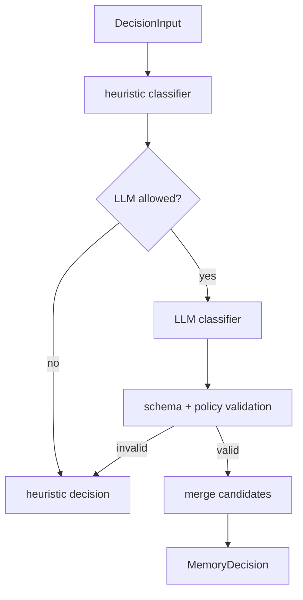

# Optional LLM Decision Classifier

The LLM classifier is optional. The v1 heuristic classifier must work without provider keys. If no provider is configured, provider calls fail, validation fails, or cost controls reject the request, the engine falls back to heuristic output.

## When To Use LLM Classification

Use LLM classification only when:

- decision mode is `shadow`, `advisory`, or explicitly enabled `enforce`,
- heuristic confidence is below a configurable high-confidence threshold,
- input size is under the configured token/byte budget,
- privacy filters allow the payload,
- a provider is configured and healthy.

Do not use the LLM classifier for every hook event by default.

## Prompt

System prompt:

```text
You are the AgentMemory Decision Engine classifier.

Classify the input into exactly one memory action:
- ignore
- working_memory
- episodic_memory
- semantic_memory_candidate
- procedural_memory_candidate

Rules:
- Preserve compatibility. Do not request changes to hook payloads, REST schemas, MCP schemas, KV record shapes, search indexes, or ranking.
- Treat RawObservation and CompressedObservation as lifecycle states of one observation id, not separate durable records.
- Semantic and procedural outputs are candidates for batch consolidation, not direct final writes.
- Prefer conservative classification when evidence is weak.
- Do not include secrets or private payload excerpts in explanations.
- Return only valid JSON matching the schema.
```

User prompt template:

```text
Classify this AgentMemory event.

Mode: {{mode}}
Source function: {{sourceFunction}}
Insertion point: {{insertionPoint}}
Project: {{project}}
Session: {{sessionId}}
Agent: {{agentId}}
Observation state: {{observationState}}

Signals:
{{sanitizedSignalsJson}}

Evidence refs:
{{evidenceRefsJson}}

Return a single JSON object.
```

## JSON Schema

```json
{
  "type": "object",
  "additionalProperties": false,
  "required": [
    "action",
    "confidence",
    "importance",
    "reasonCodes",
    "explanation",
    "concepts",
    "files",
    "privacy",
    "candidate"
  ],
  "properties": {
    "action": {
      "type": "string",
      "enum": [
        "ignore",
        "working_memory",
        "episodic_memory",
        "semantic_memory_candidate",
        "procedural_memory_candidate"
      ]
    },
    "confidence": {
      "type": "number",
      "minimum": 0,
      "maximum": 1
    },
    "importance": {
      "type": "number",
      "minimum": 0,
      "maximum": 10
    },
    "ttlDays": {
      "type": "integer",
      "minimum": 0,
      "maximum": 3650
    },
    "reasonCodes": {
      "type": "array",
      "items": { "type": "string", "minLength": 1 },
      "minItems": 1,
      "maxItems": 8
    },
    "explanation": {
      "type": "string",
      "minLength": 1,
      "maxLength": 500
    },
    "concepts": {
      "type": "array",
      "items": { "type": "string" },
      "maxItems": 20
    },
    "files": {
      "type": "array",
      "items": { "type": "string" },
      "maxItems": 20
    },
    "privacy": {
      "type": "object",
      "additionalProperties": false,
      "required": ["containsSensitiveData", "redactionRequired"],
      "properties": {
        "containsSensitiveData": { "type": "boolean" },
        "redactionRequired": { "type": "boolean" }
      }
    },
    "candidate": {
      "type": "object",
      "additionalProperties": false,
      "required": ["kind", "content"],
      "properties": {
        "kind": {
          "type": "string",
          "enum": ["semantic", "procedural", "none"]
        },
        "content": {
          "type": "string",
          "maxLength": 2000
        }
      }
    }
  }
}
```

## XML Alternative

JSON is preferred. XML can be used only if the existing provider path is more reliable with XML parsing.

```xml
<decision>
  <action>working_memory</action>
  <confidence>0.72</confidence>
  <importance>5</importance>
  <ttlDays>7</ttlDays>
  <reasonCodes>
    <code>file_specific_short_term_context</code>
  </reasonCodes>
  <explanation>Short safe explanation without secrets.</explanation>
  <concepts>
    <concept>observe pipeline</concept>
  </concepts>
  <files>
    <file>src/functions/observe.ts</file>
  </files>
  <privacy containsSensitiveData="false" redactionRequired="false" />
  <candidate kind="none"></candidate>
</decision>
```

## Validation Rules

Reject or downgrade the LLM result when:

- `action` is not one of the five supported actions,
- `confidence` is not finite or outside `0..1`,
- `importance` is not finite or outside `0..10`,
- `ttlDays` is negative, non-finite, or above policy maximum,
- `reasonCodes` is empty or contains unstable prose instead of code-like labels,
- explanation includes detected secrets,
- files/concepts exceed size limits,
- candidate kind conflicts with action,
- semantic/procedural action lacks candidate content,
- response includes instructions to modify schemas, hooks, KV shapes, indexes, or ranking.

Validation failure must fall back to heuristic classification. When decision audit is enabled for the active mode, the fallback path must record a fallback reason in `DecisionAudit`.

## Merge With Heuristics



Merge policy:

- If heuristic confidence is high and LLM disagrees, keep heuristic and audit disagreement.
- If heuristic confidence is medium and LLM confidence is higher, use LLM only after validation.
- If either classifier flags sensitive data, choose the safer action.
- In enforce mode, only high-confidence `ignore` and `working_memory` may be enforced in the first milestone.

## Privacy Constraints

- Run redaction before building the prompt.
- Do not include raw secrets, bearer tokens, API keys, full JWTs, private keys, or long tool outputs.
- Prefer summaries and extracted signals over full raw payloads.
- Cap file content snippets aggressively.
- Do not send image data unless a future explicit multimodal classifier is designed.
- Record only sanitized explanation in `DecisionAudit`.

## Cost Controls

- Heuristic classifier is default.
- LLM classifier is opt-in.
- Use only at selected insertion points, not every hook by default.
- Skip LLM for obvious noise, obvious secrets, and high-confidence heuristic decisions.
- Cap input size and output size.
- Batch only future offline candidate review, not latency-sensitive hooks.
- Respect provider timeout and circuit breaker behavior.
- Cache classification by `inputHash` when safe.

## Fallback

Fallback path:

1. Run heuristic classifier.
2. Attempt LLM only if allowed.
3. Validate LLM output.
4. If invalid/unavailable/timed out, use heuristic result.
5. Persist audit with `outcome=fallback` and `fallbackReason`.
6. Continue existing AgentMemory behavior according to mode.
