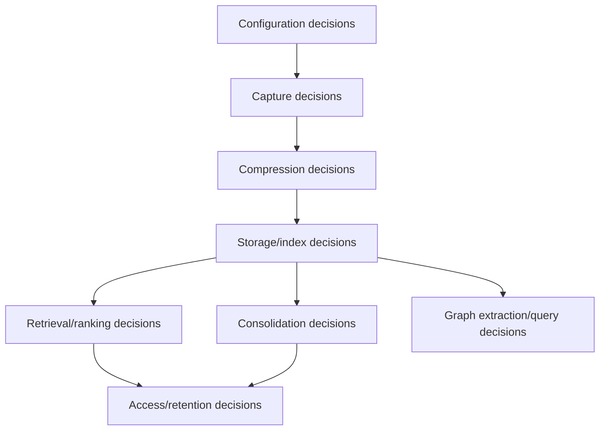

# AgentMemory Decision Points

This catalog lists domain-significant decisions: branches that alter capture, storage, retrieval, ranking, consolidation, compatibility, lifecycle, or security behavior. It excludes trivial loop control and error formatting.

| Source location | Input | Output | Decision criteria | Why it exists | Type |
| --- | --- | --- | --- | --- | --- |
| `src/config.ts:detectProvider` | API keys and provider env | LLM provider or noop/agent-sdk | Provider key order and `AGENTMEMORY_ALLOW_AGENT_SDK` | Select compression/consolidation backend safely | Configuration |
| `src/config.ts:detectEmbeddingProvider` | embedding env/API keys | embedding provider or null | explicit `EMBEDDING_PROVIDER`, then available keys | Enable vector search only when possible | Configuration |
| `src/config.ts:isConsolidationEnabled` | `CONSOLIDATION_ENABLED`, provider env | enabled/disabled | explicit true/false else provider presence | Avoid LLM work without provider | Configuration |
| `src/config.ts:isAutoCompressEnabled` | `AGENTMEMORY_AUTO_COMPRESS` | LLM or synthetic compression | flag equals `true` | Keep default observe path fast | Configuration |
| `src/config.ts:isContextInjectionEnabled` | `AGENTMEMORY_INJECT_CONTEXT` | hook stdout injection or none | flag equals `true` | Avoid surprising hook latency/stdout | Configuration |
| `src/config.ts:loadAgentScope` | `AGENT_ID`, `AGENTMEMORY_AGENT_SCOPE` | shared or isolated scope | mode is `isolated` else shared | Multi-agent memory isolation | Configuration |
| `src/mcp/tools-registry.ts:getAllTools` | `AGENTMEMORY_TOOLS` | core or all tool list | `core` vs default `all` | Keep lean MCP surface available | Configuration |
| `src/mcp/rest-proxy.ts:resolveHandle` | `AGENTMEMORY_URL`, livez probe, `AGENTMEMORY_FORCE_PROXY` | proxy or local fallback | force proxy, livez success, local TTL | Standalone MCP works with or without daemon | Compatibility |
| `src/triggers/api.ts:checkAuth` | request auth, `AGENTMEMORY_SECRET` | allow or deny | bearer matches configured secret | Protect REST surface | Configuration |
| `src/viewer/server.ts` | viewer host, secret, allowed hosts | bind or startup error | non-loopback bind requires auth and host allowlist | Prevent accidental public viewer exposure | Configuration |
| `src/hooks/*` SDK guard | `AGENTMEMORY_SDK_CHILD` | skip or send hook | env equals `1` | Prevent recursive capture during agent-sdk provider calls | Compatibility |
| `src/hooks/pre-tool-use.ts`, `session-start.ts`, `pre-compact.ts` | inject flag and REST response | stdout context or empty | `AGENTMEMORY_INJECT_CONTEXT=true` and fetch succeeds | Context injection only when opted in | Configuration |
| `src/hooks/* telemetry` | hook type | awaited fetch or fire-and-forget | context hooks need stdout; telemetry hooks do not | Bound agent hook latency | Compatibility |
| `src/functions/observe.ts` | hook payload | reject or store | required fields and valid payload shape | Validate boundary input | Heuristic |
| `src/functions/observe.ts` | payload fingerprint/id | skip duplicate or continue | existing observation id/fingerprint | Avoid duplicate hook events | Heuristic |
| `src/functions/observe.ts` | raw hook data | normalized observation fields | hook type, tool fields, prompt/output fields | Convert heterogeneous agents into one evidence model | Compatibility |
| `src/functions/observe.ts` | image data and image flag | image refs/embeddings or text-only | modality, image presence, `AGENTMEMORY_IMAGE_EMBEDDINGS` | Optional multimodal pipeline | Configuration |
| `src/functions/observe.ts` | session id | create or update session | session row hit/miss | Preserve session timeline | Heuristic |
| `src/functions/observe.ts` | compression flag | call `mem::compress` or synthetic compressor | `AGENTMEMORY_AUTO_COMPRESS` | Trade LLM quality for default speed | Configuration |
| `src/functions/compress.ts` | raw observation and provider output | compressed observation or error | provider response parses and validates | Convert raw telemetry to retrieval object | LLM-driven |
| `src/functions/compress.ts` | image fields/provider capability | image description or none | image present and provider can process it | Make screenshots retrievable as text | Configuration/LLM-driven |
| `src/functions/compress-synthetic.ts` | hook/tool names and payload fields | type, files, concepts, importance | rule mapping and field extraction | Provide compression without LLM | Heuristic |
| `src/functions/context.ts` | project/query/token budget | selected context blocks | relevance, recency, importance, source availability | Fit useful memory into prompt budget | Heuristic |
| `src/functions/context.ts` | `AGENTMEMORY_SLOTS` | include/exclude slots | flag equals `true` | Feature-gate pinned editable context | Configuration |
| `src/functions/search.ts` | search input | reject or execute | query/session/type/project/limit validation | Boundary validation | Heuristic |
| `src/functions/search.ts` | agent scope and agent id | filtered rows or fail-closed | isolated mode, wildcard, missing id | Multi-agent safety | Configuration |
| `src/functions/search.ts` | requested format/budget | full, compact, or narrative output | format and token budget | Compatibility with multiple consumers | Compatibility |
| `src/functions/search.ts` | index availability | rebuild or use existing | index loaded/size/dimensions | Keep search usable after restart | Heuristic |
| `src/state/search-index.ts` | query/doc terms | BM25 score | BM25 formula, synonyms, prefix hits | Lexical relevance | Heuristic |
| `src/state/vector-index.ts` | query/stored vector | cosine score or zero | dimension match and finite values | Semantic relevance with safety | Heuristic |
| `src/state/hybrid-search.ts` | active search streams | fused score | stream availability and configured weights | Combine heterogeneous ranking streams | Heuristic |
| `src/state/hybrid-search.ts` | result sessions | diversified results | max per session before fill | Avoid one session dominating | Heuristic |
| `src/state/reranker.ts` | `RERANK_ENABLED`, model availability | reranked or fallback order | flag and successful model load | Optional fine ranking | Configuration/ML-driven |
| `src/functions/smart-search.ts` | `expandIds` vs query | exact expansion or hybrid search | `expandIds` present | Support follow-up expansion UX | Input-driven |
| `src/functions/smart-search.ts` | recent searches and time window | diagnostic follow-up or none | `AGENTMEMORY_FOLLOWUP_WINDOW_SECONDS` | Detect likely missed recall | Heuristic |
| `src/functions/remember.ts` | content/type/project | reject or create | required content, allowed type, project guard | Stable memory writes | Heuristic |
| `src/functions/remember.ts` | candidate vs existing memories | supersede or independent memory | Jaccard similarity threshold and project guard | Version similar memories | Heuristic |
| `src/functions/remember.ts` | TTL/forgetAfter input | expiring or permanent memory | optional input | User-directed retention | Input/configuration |
| `src/functions/remember.ts:forget` | target type/id | delete memory, observation, or session | requested target type | Governance delete across scopes | Input-driven |
| `src/functions/consolidate.ts` | observations and group size | skip or create/evolve memory | importance and minimum observation thresholds | Promote repeated evidence | Heuristic/LLM-driven |
| `src/functions/consolidate.ts` | similar memory exists | evolve or create | project-scoped similarity | Preserve lineage and avoid duplicates | Heuristic |
| `src/functions/consolidation-pipeline.ts` | enabled/force/provider | skip or run | config gate and force flag | Avoid background LLM cost without provider | Configuration |
| `src/functions/consolidation-pipeline.ts` | summaries count | extract semantic facts or skip | enough recent summaries | Avoid weak generalization | Heuristic/LLM-driven |
| `src/functions/consolidation-pipeline.ts` | fact confidence/similarity | create, update, or ignore semantic memory | confidence threshold and existing match | Reinforce stable facts | Heuristic/LLM-driven |
| `src/functions/consolidation-pipeline.ts` | pattern frequency | create/update procedural memory | repeated sessions/patterns | Promote repeated workflows | Heuristic |
| `src/functions/consolidation-pipeline.ts` | age/strength | decay semantic/procedural memory | `CONSOLIDATION_DECAY_DAYS` | Weaken stale knowledge | Configuration/heuristic |
| `src/functions/lessons.ts:lesson-save` | content fingerprint | create or strengthen | same non-deleted fingerprint exists | Deduplicate lessons | Heuristic |
| `src/functions/lessons.ts:lesson-recall` | query/project/confidence | matched lessons | term overlap, min confidence, recency boost | Lightweight lesson recall | Heuristic |
| `src/functions/lessons.ts:lesson-decay-sweep` | age/confidence/reinforcements | decay or soft-delete | at least one week; confidence/reinforcement thresholds | Manage lesson staleness | Heuristic |
| `src/functions/retention.ts:retention-score` | memories, access logs, config | retention scores/tiers | salience, temporal decay, reinforcement | Quantify keep/evict priority | Heuristic |
| `src/functions/retention.ts:retention-evict` | scores/threshold/dryRun | delete or dry-run candidates | score below threshold, max cap, source scope | Storage lifecycle control | Configuration/heuristic |
| `src/functions/graph.ts:graph-extract` | observations/provider XML | graph nodes/edges | parsed XML and valid attrs | Extract relational memory | LLM-driven |
| `src/functions/graph.ts:graph-extract` | name/edge indexes and reset marker | merge or create | index hit and not pre-reset | Deduplicate graph safely after reset | Compatibility/heuristic |
| `src/functions/graph.ts:graph-query` | query/start/empty body | snapshot path or live traversal | no query/start uses snapshot | Avoid expensive full graph enumeration | Performance heuristic |
| `src/functions/graph.ts:graph-query` | limit/offset/maxDepth | paginated or truncated result | caps and timeout fallback | Protect engine response size | Performance heuristic |
| `src/functions/vision-search.ts` | image flag/query args | search or error | `AGENTMEMORY_IMAGE_EMBEDDINGS=true` and valid input | Optional multimodal retrieval | Configuration |
| `src/functions/slots.ts` | slots/reflect flags | allow or feature-disabled | `AGENTMEMORY_SLOTS`, `AGENTMEMORY_REFLECT` | Keep editable context gated | Configuration |
| `integrations/*/security` | URL, secret, HTTPS flag | warn, allow, or throw | plaintext non-loopback bearer and `AGENTMEMORY_REQUIRE_HTTPS` | Prevent leaking bearer token | Configuration |

## Implementation Map for Decision Engine

This map identifies practical insertion points for a future Memory Decision Engine while preserving current behavior. The current implementation has no central engine; these are the places where the engine would need to observe, advise, or eventually enforce decisions.

| Decision point | Exact function name | Approximate location in flow | Before/after operation | Current behavior | Risk if changed | Suggested test file or test case |
| --- | --- | --- | --- | --- | --- | --- |
| Observe validation | `registerObserveFunction` handler for `mem::observe` in `src/functions/observe.ts` | Capture ingress | Before sanitization and before any KV write | Rejects malformed hook payloads and missing required fields. | Allowing invalid payloads can corrupt session scopes or break hook compatibility; rejecting more aggressively can drop valid agent hooks. | Add/extend `test/observe-implicit-session.test.ts` for invalid payloads and implicit session preservation. |
| Observe dedupe | `registerObserveFunction` handler for `mem::observe` | Capture ingress after id/fingerprint calculation | Before raw observation KV write | Skips duplicate observation ids/fingerprints so repeated hook delivery does not double-store or double-index. | Changing dedupe can create duplicate evidence, inflated session counts, duplicate image refs, and repeated index rows. | Extend `test/auto-compress.test.ts` or add an observe dedupe case that sends the same payload twice and asserts one stored row/index event. |
| Observe after sanitization before KV write | `registerObserveFunction` handler for `mem::observe` | Capture normalization | After hook data is sanitized and normalized; before `kv.set(KV.observations(sessionId), id, rawObservation)` | Stores raw observation first with normalized tool/prompt/image/session metadata. | A Decision Engine here can choose ignore/working candidate early, but changing the write shape can break raw/compressed storage semantics and downstream compression. | Add an observe test that inspects the stored row immediately before compression or with compression disabled; include sanitized secrets/tool fields. |
| Observe compression choice | `registerObserveFunction` handler for `mem::observe` | Capture to compression transition | After raw KV write/session update; before calling `mem::compress` or synthetic compression | Uses `AGENTMEMORY_AUTO_COMPRESS=true` for LLM compression, otherwise synthetic compression. | Changing this can add hook latency/cost or reduce compressed quality; must preserve default synthetic compatibility. | `test/auto-compress.test.ts` already covers the auto-compress gate. Add Decision Engine shadow/advisory cases around the same gate. |
| Observe after compression before indexing | `registerCompressFunction` in `src/functions/compress.ts` and synthetic path invoked from `registerObserveFunction` | Compression to retrieval projection | After `CompressedObservation` exists; before BM25/vector indexing and graph/consolidation consumers see it | Writes compressed representation and indexes it; indexing failures are generally non-fatal. | Classifying here affects search visibility. Blocking indexing can make stored observations invisible to recall while still present in KV. | Extend `test/search.test.ts`, `test/vector-index-populate.test.ts`, and `test/auto-compress.test.ts` with “stored but not indexed” shadow-mode expectations. |
| Remember before save | `registerRememberFunction` handler for `mem::remember` in `src/functions/remember.ts` | Manual/import memory write | After input validation and normalization; before constructing/saving `Memory` | Creates an episodic/manual `Memory` from accepted content/type/project/agent fields. | Rejecting or reclassifying here changes public MCP/REST `memory_save` behavior and can break user-visible memory persistence. | `test/remember-project-scope.test.ts`, `test/agent-id-scope.test.ts`, and `test/search.test.ts` for save/search visibility. |
| Remember supersede/version logic | `registerRememberFunction` handler for `mem::remember` | Memory save dedupe/versioning | Before new memory write and before marking older memory `isLatest=false` | Uses similarity and project guard to supersede compatible latest memories. | Changing this can create cross-project supersedes, broken lineage, stale latest rows, or missed cascade behavior. | `test/remember-project-scope.test.ts` for cross-project and legacy unscoped compatibility; `test/cascade.test.ts` for supersede cascade side effects. |
| Search agent isolation filtering | `registerSearchFunction` handler for `mem::search` in `src/functions/search.ts`; related `mem::smart-search` path in `src/functions/smart-search.ts` | Retrieval filtering | Before returning results; after candidate retrieval and KV enrichment where agent metadata is available | Isolated mode filters by explicit/env agent id, fails closed without id, wildcard bypasses. | Relaxing this can leak another agent's memory; over-tightening can hide shared memory and break recall. | `test/agent-isolation-search.test.ts` and `test/agent-id-scope.test.ts`. |
| Context block packing | `registerContextFunction` handler for `mem::context` in `src/functions/context.ts` | Context generation | After candidate blocks are built; before XML context string is returned | Sorts/selects blocks by source, relevance, recency, importance, lessons/slots, and token budget. | Changing packing can exceed prompt budget, remove pinned/lesson context, or alter hook stdout behavior. | `test/context-slots.test.ts`, `test/context-lessons.test.ts`, `test/context-injection.test.ts`, and integration context cases in `test/integration.test.ts`. |
| Consolidate memory creation | `registerConsolidateFunction` handler for `mem::consolidate` in `src/functions/consolidate.ts` | Episodic consolidation | After grouping observations; before creating or evolving `Memory` | Creates/evolves episodic `Memory` from repeated/high-importance observation groups using provider output and project guards. | Changing thresholds or creation semantics can overproduce memories, miss important long-term memories, or violate project-scope behavior. | `test/consolidate-project-scope.test.ts`; add a case where candidate groups are only advised in shadow mode. |
| Consolidation-pipeline semantic write | `registerConsolidationPipelineFunction` handler for `mem::consolidation-pipeline` in `src/functions/consolidation-pipeline.ts` | Batch consolidation | After semantic candidates are extracted; before `KV.semantic` write/update | Creates or updates `SemanticMemory` from summary-derived facts when confidence/evidence criteria pass. | Writing directly from hook-level data would bypass batch evidence; changing confidence behavior can pollute semantic memory with weak facts. | `test/consolidation-pipeline.test.ts` for enabled/disabled/force/audit; add semantic candidate queue assertions for future Decision Engine modes. |
| Consolidation-pipeline procedural write | `registerConsolidationPipelineFunction` handler for `mem::consolidation-pipeline` | Batch consolidation | After repeated workflow/pattern evidence is detected; before `KV.procedural` write/update | Creates or updates `ProceduralMemory` from repeated workflow/pattern evidence, not every episodic memory. | Direct procedural writes from raw hooks can create noisy procedures and break the intended repeated-evidence semantics. | `test/consolidation-pipeline.test.ts`; add procedural candidate queue and no-direct-hook-promotion cases. |

## Decision Distribution Diagram

