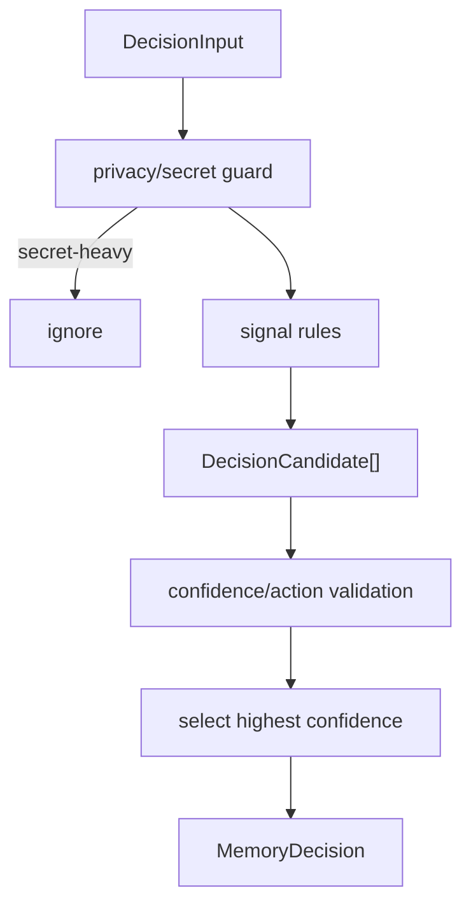

# Decision Rules v1

The v1 classifier is heuristic-first and requires no LLM, embedding provider, graph index, or external API key. It should run from normalized `DecisionInput` fields and must degrade safely when fields are missing.

## Classifier Output

Each rule emits:

- action: `ignore`, `working_memory`, `episodic_memory`, `semantic_memory_candidate`, or `procedural_memory_candidate`
- confidence: `0..1`
- importance: `0..10`
- ttlDays: optional retention hint for candidate/audit use
- reasonCodes: stable machine-readable strings

When multiple rules match, choose the highest confidence candidate. If confidence ties, prefer `working_memory` over `ignore` unless the matching ignore rule is secret-specific or obvious-noise-specific. Ambiguous evidence should be retained as working memory rather than dropped.

Tie-break policy:

- Prefer `working_memory` over `ignore` for ambiguous evidence.
- Prefer `ignore` only when the tied rule is secret-heavy, duplicated telemetry, empty output, progress notification, or other obvious post-tool noise.
- Prefer `semantic_memory_candidate` or `procedural_memory_candidate` over direct `episodic_memory` when the evidence should be batch-consolidated.
- Prefer direct `episodic_memory` only when the evidence is explicitly session/event-specific or comes from an explicit remember/import/consolidate path.
- Enforce mode must be conservative and must not drop ambiguous evidence.

This tie-break avoids accidental durable memory writes while also avoiding accidental evidence loss.

## Rules

| Rule | Input signals | Output action | Confidence | Importance | ttlDays | Examples |
| --- | --- | --- | --- | --- | --- | --- |
| Temporary tool noise | `hookType` is notification/progress-like; tool output contains only timing, spinner text, empty result, or generic success with no files/concepts/facts | `ignore` | 0.75 | 1 | 1 | “Command completed”, “No output”, “Fetching...”, empty tool result. |
| Failed command with no learning | Tool result is failure, but no file/concept/error detail is present | `working_memory` | 0.55 | 3 | 3 | “exit code 1” with no stderr or file path. |
| Failed attempt with useful error | `type=error`, stderr/traceback, failing command, file path, dependency, or explicit cause appears | `episodic_memory` | 0.72 | 7 | 90 | “npm test fails because module X is missing”, “migration fails on users.email constraint”. |
| Bug and fix evidence | Text contains bug/fix/regression/root cause/resolved language plus files or tests | `episodic_memory` | 0.78 | 8 | 180 | “Fixed auth token refresh race in src/auth.ts”. |
| Architecture fact | Concepts or narrative include architecture/module/data flow/API/storage/schema terms, with stable project files | `semantic_memory_candidate` | 0.72 | 8 | 365 | “State is persisted through iii-engine StateModule, not direct SQLite.” |
| User preference | User prompt or memory draft states preference/style/policy such as “prefer”, “always”, “never”, “do not” | `semantic_memory_candidate` | 0.8 | 8 | 365 | “Prefer apply_patch for manual edits.” |
| Project decision | Narrative includes chose/decided/rejected/accepted/tradeoff and project/files/concepts | `semantic_memory_candidate` | 0.76 | 8 | 365 | “Decided to keep MCP schemas unchanged for v2.” |
| Repeated workflow signal | Same or similar concepts/files/commands appear across multiple sessions or memory drafts | `procedural_memory_candidate` | 0.7 | 7 | 365 | “Run npm test after modifying memory functions.” |
| Successful procedure | Ordered steps, command sequence, expected outcome, or “worked after” pattern is present | `procedural_memory_candidate` | 0.74 | 8 | 365 | “To release: build, run tests, update plugin manifest, publish.” |
| Session milestone | `hookType` is stop/session-end/task-completed or summary title/key decisions present | `episodic_memory` | 0.65 | 6 | 120 | “Task completed: generated architecture docs.” |
| File-specific short-term context | File paths present, low generality, current edit/search/read context, no durable fact | `working_memory` | 0.7 | 5 | 7 | “Currently editing src/functions/observe.ts around image refs.” |
| Search/read-only context | Tool is read/search/list and no decision/fix/preference/error is extracted | `working_memory` | 0.62 | 4 | 3 | “Read README section about MCP tools.” |
| Raw prompt asks to remember | User prompt explicitly says remember/save/note/keep this | `episodic_memory` | 0.82 | 8 | 365 | “Remember that this repo uses iii primitives only.” |
| Secret or credential-like content | Sanitizer marks redaction or content appears credential-heavy with no durable safe fact | `ignore` | 0.85 | 1 | 0 | Bearer tokens, API keys, JWT payloads. |
| Low-confidence synthetic compression | `observationState=compressed`, `confidence <= 0.35`, generic title, no files/facts/concepts | `working_memory` | 0.58 | 3 | 3 | Synthetic “Tool usage” with little content. |
| High-importance compressed observation | `importance >= 8` and has facts/concepts/files | `episodic_memory` | 0.68 | 8 | 180 | Significant code change or decision captured by compression. |
| Consolidation semantic candidate | Batch evidence includes repeated fact across summaries or memories | `semantic_memory_candidate` | 0.82 | 8 | 365 | Same architecture fact appears in three session summaries. |
| Consolidation procedural candidate | Batch evidence includes repeated ordered steps or workflow memories | `procedural_memory_candidate` | 0.82 | 8 | 365 | Multiple sessions show same deploy/test workflow. |

## Rule Evaluation Flow

## Rule Notes

Temporary tool noise:

- Should be conservative in enforce mode.
- `ignore` should be enforced only for very high-confidence secret/noise cases.
- In shadow/advisory, audit all matches for evaluation.
- Do not treat command failure as noise if stderr, stack traces, file paths, or concepts are present.

User preferences:

- Prefer semantic candidates over direct `Memory` creation when captured from hooks.
- Explicit `mem::remember` remains current behavior in shadow/advisory.

Repeated workflows:

- A single observation can become a procedural candidate, but final `ProceduralMemory` should be formed through batch consolidation.
- Candidate rows should include evidence refs so the pipeline can verify repetition.

File-specific short-term context:

- Working memory ttl should be short.
- It should support near-term context without becoming durable semantic/procedural memory.

Session milestones:

- Milestones are episodic because they describe what happened in a session.
- Semantic/procedural learning from milestones should happen later through consolidation.

## Confidence Bands

| Band | Meaning | Expected mode behavior |
| --- | --- | --- |
| `0.00-0.49` | Weak signal | Audit only; no queue by default. |
| `0.50-0.69` | Useful but uncertain | Shadow audit only unless an experimental shadow-queue flag is enabled; advisory may queue non-destructive candidate actions if configured. |
| `0.70-0.84` | Strong signal | Eligible for advisory queues; enforce only for safe working-memory routing after tests. Do not enforce ignore unless it is secret/noise-specific. |
| `0.85-1.00` | Very strong signal | Eligible for enforce of `ignore` only for secret/noise cases, and `working_memory` only when preserving evidence without durable promotion. |
