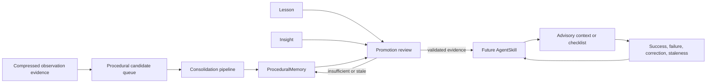
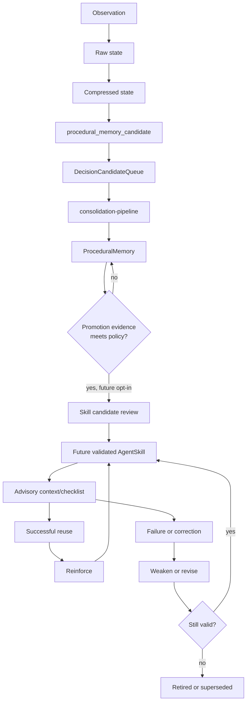
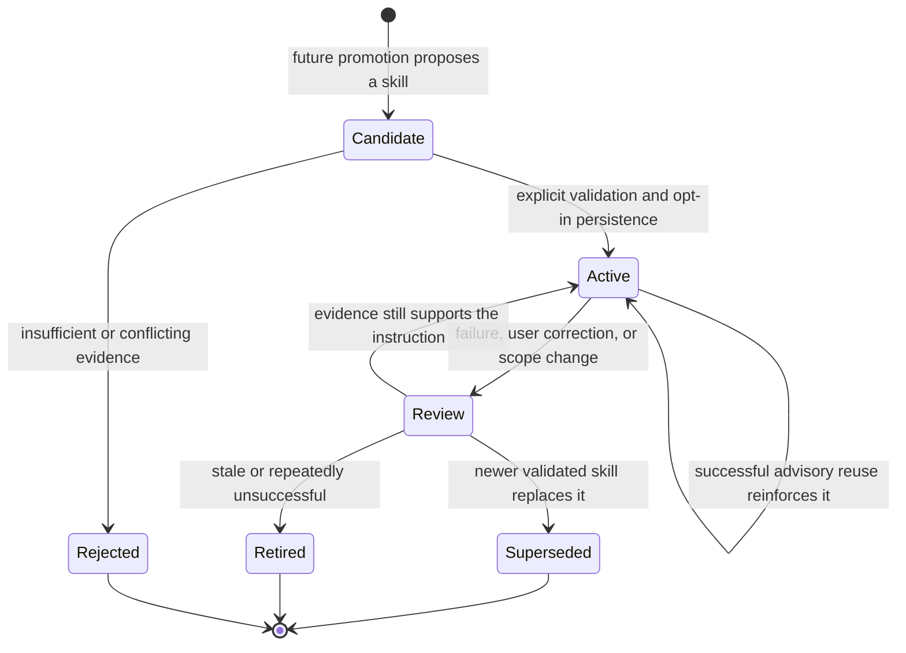
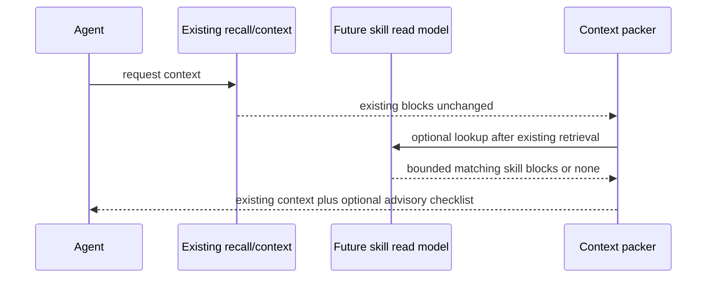

# Skill / Self-Improvement Layer Design

## Status and Scope

This is the PR11 design document for an opt-in Skill / Self-Improvement Layer
for AgentMemory. PR12 now implements only its additive, default-off read model
and diagnostics scaffold; it does not add skill creation, promotion, injection,
feedback, or enforcement.

The Decision Engine PR1-PR10 and its milestone documentation are already in
`main`. This document designs how durable procedural evidence could become
reusable agent guidance without changing existing memory behavior.

### Non-Goals

- No automatic tool execution, code modification, or skill enforcement.
- No LLM classifier or working-memory enforcement.
- No changes to observe, remember, search, smart search, context,
  consolidation, ranking, vector search, graph search, REST, MCP, or hooks.
- No existing KV record-shape changes and no company-repository changes.

The first implementation milestone after this design must be advisory only. A
skill may be shown as context or a checklist, but it must not make an agent
take an action by itself.

## What a Skill Means

A skill is a validated, reusable instruction for an agent working in a known
scope. It is not merely a remembered fact or a transcript of a successful
session. It combines a trigger condition, ordered project-scoped steps, an
expected outcome, evidence, and feedback that can strengthen, weaken, retire,
or supersede the guidance.

`ProceduralMemory` describes a learned repeated workflow. A future
`AgentSkill` packages sufficiently strong procedural evidence into an
advisory instruction that can be recalled predictably.

## Current and Future Domain Roles

| Object | Current role | Future relationship to skills |
| --- | --- | --- |
| `CompressedObservation` | Retrieval-ready evidence. Raw and compressed forms are lifecycle states of one observation identity. | Evidence only. One observation must not normally create a skill. |
| Procedural Decision Candidate | Decision Engine proposal that workflow evidence should be batch-consolidated. | Early, unvalidated signal; never a skill by itself. |
| `DecisionCandidateQueue` procedural row | Opt-in queue row consumed by `mem::consolidation-pipeline`. | Provenance and batch evidence, not a durable skill row. |
| `ProceduralMemory` | Consolidated workflow with trigger, steps, outcome, frequency, scope, strength, and source evidence. | Primary evidence source for future promotion; it remains useful even when no skill exists. |
| `Lesson` | Content-fingerprinted learning artifact with confidence, reinforcement, source ids, decay, and soft deletion. | Can supply corrections or anti-patterns; never silently becomes a skill. |
| `Insight` | Consolidated interpretation across memories, lessons, and crystals. | May explain usefulness or reveal a conflict; it is not executable guidance. |
| `AgentSkill` (PR12 scaffold) | Additive, default-off type, scope, and read-only diagnostics. | Promotion and advisory recall remain future work. |



## Representation Options

### Option A: Enhanced `ProceduralMemory`

Under this option, a skill is a `ProceduralMemory` with stronger metadata and
special recall rules.

| Dimension | Assessment |
| --- | --- |
| Compatibility | Risks changing the meaning and shape of an existing `KV.procedural` row. Consumers currently treat it as consolidated evidence, not a validated instruction. |
| Implementation risk | Small initial surface, but ordinary procedures and promoted skills become hard to distinguish. |
| Migration risk | Existing rows would need new optional fields or implicit interpretation, which creates ambiguity for exports, imports, and clients. |
| Retrieval/context impact | Existing procedural retrieval could accidentally become skill recall, coupling a future feature to current ranking and context behavior. |
| Default-off posture | Possible, but harder to prove because one stored object has two meanings. |
| Existing memory behavior | Weaker preservation because a new skill interpretation can change how procedures are presented or maintained. |

### Option B: New `AgentSkill` Entity in a New KV Scope

Under this option, a future skill is a separate entity derived from existing
procedural evidence. It stores source references but never modifies those
sources.

| Dimension | Assessment |
| --- | --- |
| Compatibility | Strong. Current observations, memories, procedural rows, hooks, REST payloads, MCP schemas, and indexes retain their shape and meaning. |
| Implementation risk | Requires an additive read model and diagnostics, both of which can be independently default-off. |
| Migration risk | None. New rows exist only after future opt-in promotion. |
| Retrieval/context impact | Isolated. Skill recall can be packed separately and must not alter BM25/vector/graph/RRF scoring. |
| Default-off posture | Direct: no scope reads, writes, injection, or feedback work until future explicit flags enable them. |
| Existing memory behavior | Strong preservation. `ProceduralMemory` remains evidence whether or not a skill is ever created. |

### Recommendation

Use **Option B** for the first implementation milestone after this design: a
dedicated future `AgentSkill` entity in a new KV scope, derived only through
explicit advisory promotion. This is the safer compatibility boundary because
it does not overload `ProceduralMemory` or alter existing record shapes.

Option A remains a useful conceptual view: every skill is grounded in
procedural memory. It should not become the storage contract because evidence
and instruction have different lifecycles, feedback, and safety requirements.

## Proposed AgentSkill Schema

This schema was design-only in PR11. PR12 now adds it to `src/types.ts` and
declares its dedicated KV scope, but no code creates or mutates rows yet.

```ts
type AgentSkillStatus = "active" | "retired" | "superseded";

type AgentSkill = {
  id: string;
  name: string;
  triggerCondition: string;
  steps: string[];
  expectedOutcome: string;
  antiPatterns: string[];

  project?: string;
  agentId?: string;
  files: string[];
  concepts: string[];

  confidence: number;
  strength: number;
  usageCount: number;
  successCount: number;
  failureCount: number;

  sourceProceduralMemoryIds: string[];
  sourceCandidateIds: string[];
  sourceObservationIds: string[];
  sourceSessionIds: string[];

  createdAt: string;
  updatedAt: string;
  lastUsedAt?: string;
  lastReinforcedAt?: string;
  status: AgentSkillStatus;
  supersedes?: string;
  version: number;
};
```

| Group | Fields | Purpose |
| --- | --- | --- |
| Identity and instruction | `id`, `name`, `triggerCondition`, `steps`, `expectedOutcome`, `antiPatterns` | Lets an agent recognize applicability and use the skill as an advisory checklist. |
| Scope | `project`, `agentId`, `files`, `concepts` | Prevents project-specific procedures from leaking into unrelated work or agents. |
| Quality | `confidence`, `strength`, `usageCount`, `successCount`, `failureCount` | Represents evidence quality separately from retrieval ranking. |
| Provenance | Source id arrays | Makes each promoted instruction traceable to its evidence. |
| Lifecycle | Timestamps, `status`, `supersedes`, `version` | Supports reinforcement, retirement, and replacement without rewriting history. |

PR12 declares the dedicated `mem:skills` scope. It does not create rows in the
scope; future promotion remains explicitly opt-in.

## Skill Lifecycle



The first six stages already exist conceptually. Candidate review, skill
persistence, recall, and feedback are future stages. The diagram must never
be read as saying raw and compressed observations are separate durable rows.



## Promotion Rules

Promotion is a future explicit operation. It is not a side effect of
observation capture, one `remember` call, or direct hook input.

### Default Evidence Gates

Promotion should normally require all of the following:

1. Repeated evidence, preferably across independent observations or sessions,
   rather than one successful event.
2. A clear trigger, ordered steps, and observable expected outcome.
3. A project, agent, file, and concept scope that does not depend on ambiguous
   global assumptions.
4. No stronger, newer project decision or lesson that contradicts it.
5. No secret-bearing, sanitization-warning, or unsafe instruction content.

One-off events stay as observations, memories, lessons, or procedural
evidence. A future explicit user save/promotion request is the only intended
exception, and it must retain provenance and audit information.

| Pattern | Typical evidence | Proposed result |
| --- | --- | --- |
| Repeated successful workflow | Multiple procedural sources report the same ordered steps and outcome. | Project-scoped workflow skill. |
| Failed attempt followed by successful fix | A lesson identifies the failure and later procedure resolves it. | Skill with the failed approach in `antiPatterns`. |
| Recurring command sequence | Sessions repeatedly use the same test, build, validation, or release steps. | Command/checklist skill, never auto-execution. |
| Project testing checklist | Stable setup prerequisites and expected assertions recur. | Narrow test-preparation skill scoped to project/files. |
| Deployment or release checklist | Repeated validated release steps plus explicit project decision. | Advisory release checklist with conservative applicability. |
| User coding convention | Repeated user corrections or explicit preference. | Project-scoped convention skill with clear sources. |
| Tool usage strategy | Repeated tool sequence succeeds for the same trigger. | Tool-selection checklist, never automatic tool invocation. |
| Recurring debugging pattern | Similar symptoms, diagnosis, and fix recur. | Diagnosis-and-checks skill with known anti-patterns. |

The following must not promote automatically: a single tool output or hook
event, an ambiguous summary without source procedures, unsafe or secret-heavy
content, a procedure with no measurable outcome, or an instruction
contradicted by a newer project decision, lesson, or user correction.

## Future Recall and Application

Skill recall must be a separate advisory read model. It must not alter the
existing search ranking pipeline or retrofit skills into current observation
or memory index scores.

| Future insertion point | Existing surface | Future advisory behavior | Boundary |
| --- | --- | --- | --- |
| Session start | Session-start context hook | Recall a small number of scope-matched skills as startup context. | No hook-payload change and no automatic commands. |
| Context generation | `mem::context`, before final block packing | Add bounded skill checklist blocks only after existing retrieval completes. | Existing blocks, budgets, ordering, and packing remain intact when disabled. |
| Before tool use | Pre-tool-use context | Show applicable warnings or checks. | Never invoke, block, or alter a tool call. |
| Before code edit | Edit-oriented context | Show project convention or validation checklist. | Never edit code or rewrite user instructions. |
| Before test/build/deploy | Tool-context path | Show prerequisites, expected checks, and anti-patterns. | Never execute commands or enforce a checklist. |
| MCP `recall_context` prompt | Existing task-context prompt | Optionally append a clearly labeled skill advisory section. | Existing input/output schema and `memory_recall` behavior stay unchanged. |

Future injection should use a visible source label such as `skill-advisory`,
include a skill id and provenance, and have its own small budget. It must be
skipped when confidence, scope match, or budget is insufficient. It must not
alter BM25, vector, graph, hybrid, RRF, reranker, or existing block ranking.



## Feedback and Quality Lifecycle

Feedback should use only future explicit, additive mechanisms. Showing a
skill must never imply success.

| Event | Future quality treatment | Required guard |
| --- | --- | --- |
| Agent follows skill and task succeeds | Increment usage and success evidence; reinforce conservatively. | Require attributable outcome evidence or explicit confirmation. |
| Agent follows skill and task fails | Increment usage and failure evidence; open review instead of deleting. | Preserve sources and failure for diagnostics. |
| User corrects the agent | Treat as strong negative or replacement evidence. | Correction must be attributable to the relevant project/scope. |
| Project files/configuration change | Mark matching skills for review when their scope may be stale. | Never rewrite a skill automatically from file changes. |
| Newer project decision conflicts | Prefer newer, stronger evidence and mark old skill for review/supersession. | Retain links and prior version for audit. |
| Skill becomes stale | Weaken confidence/strength and retire only after policy threshold or review. | Never delete historical evidence. |

`usageCount`, `successCount`, and `failureCount` are quality signals only.
Neither high count nor high confidence authorizes auto-execution or
enforcement.

## Safety and Compatibility Constraints

| Constraint | Design consequence |
| --- | --- |
| No hook payload changes | Future recall uses existing context boundaries or additive internal reads only. |
| No REST/MCP schema changes | Initial diagnostics/read models must be additive, not altered existing schemas. |
| No existing KV shape changes | `AgentSkill` uses a new scope and source references; existing `ProceduralMemory` rows are not extended in place. |
| No ranking changes | Skill recall is separately scoped and bounded after current retrieval. |
| Default off | No skill reads, writes, context blocks, or feedback work until future explicit flags enable each stage. |
| Advisory only | Skills can describe checks but cannot execute, block, or modify agent actions. |
| No self-modification | A skill cannot change itself, repository files, configuration, hooks, tools, or memories without explicit user instruction. |
| Auditability | Future promotion, recall, feedback, retirement, and supersession retain source references and append-style diagnostics. |

## PR12 Read Model Scaffold

PR12 adds the additive `AgentSkill` type, `mem:skills` scope constant, and
read-only diagnostics surfaces. They remain disabled unless
`AGENTMEMORY_SKILLS=true` (default `false`); no PR12 path writes skill rows,
promotes procedures, injects context, reinforces feedback, or changes existing
memory pipelines.

When enabled, `GET /agentmemory/skills` and `memory_skills` only inspect
`mem:skills`. Diagnostics are independently disableable with
`AGENTMEMORY_SKILL_DIAGNOSTICS` (default `true` only when skills are enabled),
and their limit defaults to 50 and is bounded to 1..500 by
`AGENTMEMORY_SKILL_DIAGNOSTICS_LIMIT`.

When diagnostics are disabled, `GET /agentmemory/skills` returns an explicit
`503` feature-disabled response before reading `mem:skills`; `memory_skills`
returns the corresponding MCP diagnostic. This is expected default-off behavior,
not a memory-server failure.

## Conservative Implementation Roadmap

The following PRs remain future work after PR12:

1. **PR13: Promote ProceduralMemory to skill candidate behind explicit
   configuration.** Add opt-in promotion into a new skill scope with
   provenance and no injection.
2. **PR14: Skill recall diagnostics.** Explain why a future skill matched,
   was skipped, or was excluded by scope or budget.
3. **PR15: Skill context injection in advisory mode.** Append bounded,
   labeled checklist context without changing current retrieval behavior.
4. **PR16: Skill reinforcement metrics.** Add explicit success/failure,
   correction, staleness, retirement, and supersession accounting.
5. **Later: LLM-assisted skill extraction in shadow mode only.** It may
   propose candidates but cannot promote, inject, or enforce without
   separately approved validation and compatibility work.

Each future PR must preserve the default-off posture, introduce one auditable
behavior at a time, and avoid unrelated refactors or ranking work.
