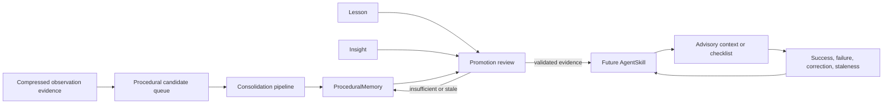
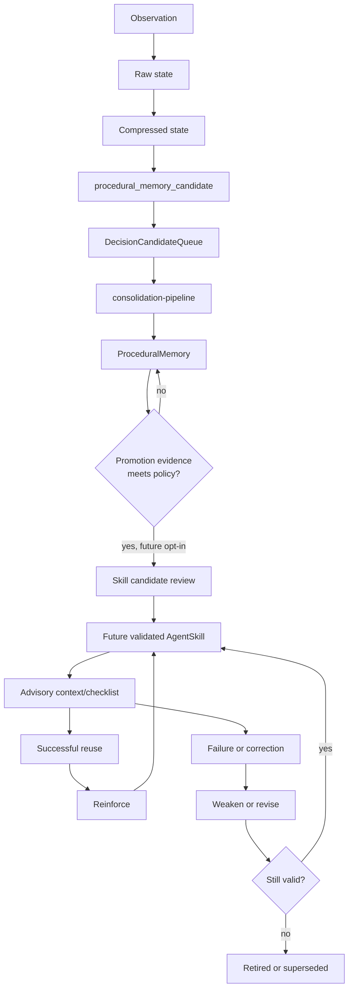
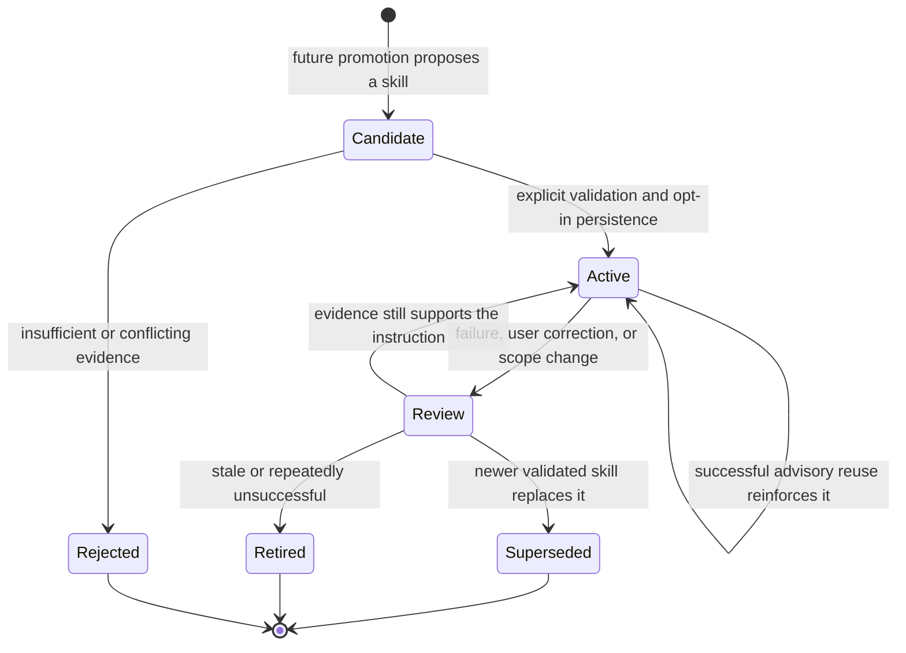
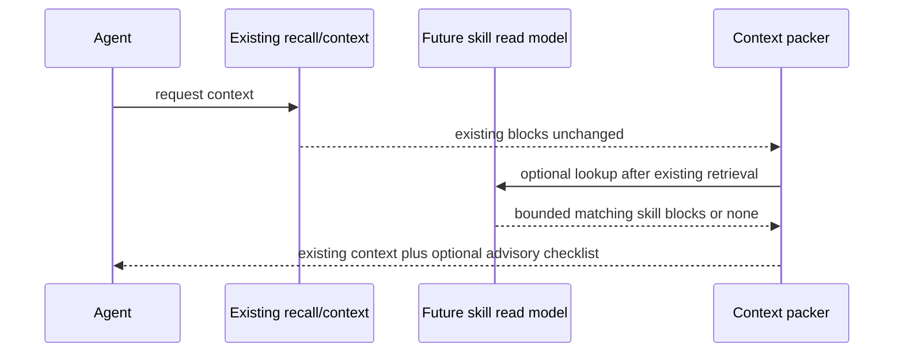

# Skill / Self-Improvement Layer Design

## Status and Scope

This is the PR11 design document for an opt-in Skill / Self-Improvement Layer
for AgentMemory. PR12 now implements only its additive, default-off read model
and diagnostics scaffold. PR13a adds direct promotion. Subsequent milestones
add promotion eligibility and inventory diagnostics, advisory recall, bounded
context injection, and the current explicit append-only feedback ledger. None
of these stages adds enforcement or an automatic skill lifecycle reducer.

The Decision Engine PR1-PR10 and its milestone documentation are already in
`main`. This document designs how durable procedural evidence could become
reusable agent guidance without changing existing memory behavior.

### Non-Goals

- No automatic tool execution, code modification, or skill enforcement.
- No LLM classifier or working-memory enforcement.
- No changes to observe, remember, search, smart search, consolidation,
  ranking, vector search, graph search, REST, MCP, or hooks. Existing
  retrieval and ranking behavior remains unchanged.
- Context injection is additive, separately gated, and advisory-only. No hook
  or command automatically records feedback.
- No existing KV record-shape changes and no company-repository changes.

The first implementation milestone after this design must be advisory only. A
skill may be shown as context or a checklist, but it must not make an agent
take an action by itself.

## What a Skill Means

A skill is a validated, reusable instruction for an agent working in a known
scope. It is not merely a remembered fact or a transcript of a successful
session. It combines a trigger condition, ordered project-scoped steps, an
expected outcome, evidence, and feedback that can strengthen, weaken, retire,
or supersede the guidance.

`ProceduralMemory` describes a learned repeated workflow. A future
`AgentSkill` packages sufficiently strong procedural evidence into an
advisory instruction that can be recalled predictably.

## Current and Future Domain Roles

| Object | Current role | Future relationship to skills |
| --- | --- | --- |
| `CompressedObservation` | Retrieval-ready evidence. Raw and compressed forms are lifecycle states of one observation identity. | Evidence only. One observation must not normally create a skill. |
| Procedural Decision Candidate | Decision Engine proposal that workflow evidence should be batch-consolidated. | Early, unvalidated signal; never a skill by itself. |
| `DecisionCandidateQueue` procedural row | Opt-in queue row consumed by `mem::consolidation-pipeline`. | Provenance and batch evidence, not a durable skill row. |
| `ProceduralMemory` | Consolidated workflow with trigger, steps, outcome, frequency, scope, strength, and source evidence. | Primary evidence source for future promotion; it remains useful even when no skill exists. |
| `Lesson` | Content-fingerprinted learning artifact with confidence, reinforcement, source ids, decay, and soft deletion. | Can supply corrections or anti-patterns; never silently becomes a skill. |
| `Insight` | Consolidated interpretation across memories, lessons, and crystals. | May explain usefulness or reveal a conflict; it is not executable guidance. |
| `AgentSkill` | Additive, default-off instruction derived by direct promotion and optionally recalled as advisory context. | Explicit feedback is stored separately as append-only evidence; it does not mutate the skill. |



## Representation Options

### Option A: Enhanced `ProceduralMemory`

Under this option, a skill is a `ProceduralMemory` with stronger metadata and
special recall rules.

| Dimension | Assessment |
| --- | --- |
| Compatibility | Risks changing the meaning and shape of an existing `KV.procedural` row. Consumers currently treat it as consolidated evidence, not a validated instruction. |
| Implementation risk | Small initial surface, but ordinary procedures and promoted skills become hard to distinguish. |
| Migration risk | Existing rows would need new optional fields or implicit interpretation, which creates ambiguity for exports, imports, and clients. |
| Retrieval/context impact | Existing procedural retrieval could accidentally become skill recall, coupling a future feature to current ranking and context behavior. |
| Default-off posture | Possible, but harder to prove because one stored object has two meanings. |
| Existing memory behavior | Weaker preservation because a new skill interpretation can change how procedures are presented or maintained. |

### Option B: New `AgentSkill` Entity in a New KV Scope

Under this option, a future skill is a separate entity derived from existing
procedural evidence. It stores source references but never modifies those
sources.

| Dimension | Assessment |
| --- | --- |
| Compatibility | Strong. Current observations, memories, procedural rows, hooks, REST payloads, MCP schemas, and indexes retain their shape and meaning. |
| Implementation risk | Requires an additive read model and diagnostics, both of which can be independently default-off. |
| Migration risk | None. New rows exist only after future opt-in promotion. |
| Retrieval/context impact | Isolated. Skill recall can be packed separately and must not alter BM25/vector/graph/RRF scoring. |
| Default-off posture | Direct: no scope reads, writes, injection, or feedback work until future explicit flags enable them. |
| Existing memory behavior | Strong preservation. `ProceduralMemory` remains evidence whether or not a skill is ever created. |

### Recommendation

Use **Option B** for the first implementation milestone after this design: a
dedicated future `AgentSkill` entity in a new KV scope, derived only through
explicit advisory promotion. This is the safer compatibility boundary because
it does not overload `ProceduralMemory` or alter existing record shapes.

Option A remains a useful conceptual view: every skill is grounded in
procedural memory. It should not become the storage contract because evidence
and instruction have different lifecycles, feedback, and safety requirements.

## Proposed AgentSkill Schema

This schema was design-only in PR11. PR12 now adds it to `src/types.ts` and
declares its dedicated KV scope, but no code creates or mutates rows yet.

```ts
type AgentSkillStatus = "active" | "retired" | "superseded";

type AgentSkill = {
  id: string;
  name: string;
  triggerCondition: string;
  steps: string[];
  expectedOutcome: string;
  antiPatterns: string[];

  project?: string;
  agentId?: string;
  files: string[];
  concepts: string[];

  confidence: number;
  strength: number;
  usageCount: number;
  successCount: number;
  failureCount: number;

  sourceProceduralMemoryIds: string[];
  sourceCandidateIds: string[];
  sourceObservationIds: string[];
  sourceSessionIds: string[];

  createdAt: string;
  updatedAt: string;
  lastUsedAt?: string;
  lastReinforcedAt?: string;
  status: AgentSkillStatus;
  supersedes?: string;
  version: number;
};
```

| Group | Fields | Purpose |
| --- | --- | --- |
| Identity and instruction | `id`, `name`, `triggerCondition`, `steps`, `expectedOutcome`, `antiPatterns` | Lets an agent recognize applicability and use the skill as an advisory checklist. |
| Scope | `project`, `agentId`, `files`, `concepts` | Prevents project-specific procedures from leaking into unrelated work or agents. |
| Quality | `confidence`, `strength`, `usageCount`, `successCount`, `failureCount` | Represents evidence quality separately from retrieval ranking. |
| Provenance | Source id arrays | Makes each promoted instruction traceable to its evidence. |
| Lifecycle | Timestamps, `status`, `supersedes`, `version` | Supports reinforcement, retirement, and replacement without rewriting history. |

PR13a adds explicit, opt-in direct promotion. `mem::skill-promote` remains the
only production writer for `mem:skills`; automatic promotion remains absent.

## Eligibility Inventory Diagnostics

PR13c adds read-only inventory diagnostics over a deterministic
`ProceduralMemory` population. They report policy eligibility independently
from the runtime promotion flag, current promotability, active source-lineage
skills, and policy reason counts. The inventory never returns workflow content
or secret-heavy names, never creates `AgentSkill` rows, and describes only the
population selected by `scanLimit`.

`policyEligible` is structural: it ignores `promotion_disabled` and an
existing active skill. `currentlyPromotable` requires policy eligibility,
promotion enabled, a resolved source-lineage state, and no matching skill.
`alreadyPromoted` reports an active `AgentSkill` that lists the source
`ProceduralMemory`, including sources that no longer pass the present promotion
policy. Each item reports `promotionStateResolved` and
`currentlyPromotableResolved`: a positive active match is always resolved;
an unmatched source is resolved only after the required skill population was
fully inspected. `blockedCount` is exactly the count of scanned rows whose
`policyEligible` is false, so `policyEligibleCount + blockedCount` equals
`scannedCount`.

The current `StateKV` wrapper exposes `list(scope)` without cursor or limit
arguments. Inventory therefore performs one read of `mem:procedural`, sorts it
by `createdAt` descending and `id` ascending, then evaluates at most
`scanLimit` rows. For source-lineage resolution it performs at most one read of
`mem:skills` whenever at least one procedure was scanned, deterministically
inspects at most 5,000 skill rows as an application-level evaluation limit,
and stops early once every scanned source has an active match. It performs zero
skill reads for an empty scan and never performs per-procedure skill lookups or
KV writes. The physical engine read itself is not cursor-bounded; pagination or
indexing for this scope is deferred to a separately reviewed infrastructure PR.

The inventory returns `scanTruncated`, `resultTruncated`,
`skillScanTruncated`, and their OR as `truncated`. `promotionStateComplete`
is true only when `unresolvedPromotionStateCount` is zero. When an item has
`promotionStateResolved: false`, `alreadyPromoted: false` is unknown rather
than definitive. Likewise, a policy-valid, promotion-enabled item with
`currentlyPromotableResolved: false` is unknown rather than conclusively not
promotable. Boolean false filters exclude those unknown rows; callers may use
`promotionStateResolved=false` to inspect them explicitly.

`policyEligibleCount` and `blockedCount` are exact for the scanned procedural
population. `alreadyPromotedCount` and `currentlyPromotableCount` are exact
only when `promotionStateComplete` is true; otherwise they are lower bounds of
confirmed positives. `reasonCounts` is non-exclusive: structural blockers and
runtime/source-lineage states can both occur for one row, so its total can
exceed `scannedCount`.

## Skill Lifecycle



The first six stages already exist conceptually. Candidate review, skill
persistence, recall, and feedback are future stages. The diagram must never
be read as saying raw and compressed observations are separate durable rows.



## Promotion Rules

Promotion is a future explicit operation. It is not a side effect of
observation capture, one `remember` call, or direct hook input.

### Default Evidence Gates

Promotion should normally require all of the following:

1. Repeated evidence, preferably across independent observations or sessions,
   rather than one successful event.
2. A clear trigger, ordered steps, and observable expected outcome.
3. A project, agent, file, and concept scope that does not depend on ambiguous
   global assumptions.
4. No stronger, newer project decision or lesson that contradicts it.
5. No secret-bearing, sanitization-warning, or unsafe instruction content.

One-off events stay as observations, memories, lessons, or procedural
evidence. A future explicit user save/promotion request is the only intended
exception, and it must retain provenance and audit information.

| Pattern | Typical evidence | Proposed result |
| --- | --- | --- |
| Repeated successful workflow | Multiple procedural sources report the same ordered steps and outcome. | Project-scoped workflow skill. |
| Failed attempt followed by successful fix | A lesson identifies the failure and later procedure resolves it. | Skill with the failed approach in `antiPatterns`. |
| Recurring command sequence | Sessions repeatedly use the same test, build, validation, or release steps. | Command/checklist skill, never auto-execution. |
| Project testing checklist | Stable setup prerequisites and expected assertions recur. | Narrow test-preparation skill scoped to project/files. |
| Deployment or release checklist | Repeated validated release steps plus explicit project decision. | Advisory release checklist with conservative applicability. |
| User coding convention | Repeated user corrections or explicit preference. | Project-scoped convention skill with clear sources. |
| Tool usage strategy | Repeated tool sequence succeeds for the same trigger. | Tool-selection checklist, never automatic tool invocation. |
| Recurring debugging pattern | Similar symptoms, diagnosis, and fix recur. | Diagnosis-and-checks skill with known anti-patterns. |

The following must not promote automatically: a single tool output or hook
event, an ambiguous summary without source procedures, unsafe or secret-heavy
content, a procedure with no measurable outcome, or an instruction
contradicted by a newer project decision, lesson, or user correction.

## Future Recall and Application

Skill recall must be a separate advisory read model. It must not alter the
existing search ranking pipeline or retrofit skills into current observation
or memory index scores.

| Future insertion point | Existing surface | Future advisory behavior | Boundary |
| --- | --- | --- | --- |
| Session start | Session-start context hook | Recall a small number of scope-matched skills as startup context. | No hook-payload change and no automatic commands. |
| Context generation | `mem::context`, before final block packing | Add bounded skill checklist blocks only after existing retrieval completes. | Existing blocks, budgets, ordering, and packing remain intact when disabled. |
| Before tool use | Pre-tool-use context | Show applicable warnings or checks. | Never invoke, block, or alter a tool call. |
| Before code edit | Edit-oriented context | Show project convention or validation checklist. | Never edit code or rewrite user instructions. |
| Before test/build/deploy | Tool-context path | Show prerequisites, expected checks, and anti-patterns. | Never execute commands or enforce a checklist. |
| MCP `recall_context` prompt | Existing task-context prompt | Optionally append a clearly labeled skill advisory section. | Existing input/output schema and `memory_recall` behavior stay unchanged. |

Future injection should use a visible source label such as `skill-advisory`,
include a skill id and provenance, and have its own small budget. It must be
skipped when confidence, scope match, or budget is insufficient. It must not
alter BM25, vector, graph, hybrid, RRF, reranker, or existing block ranking.



## Feedback and Quality Lifecycle

Feedback should use only future explicit, additive mechanisms. Showing a
skill must never imply success.

| Event | Future quality treatment | Required guard |
| --- | --- | --- |
| Agent follows skill and task succeeds | Increment usage and success evidence; reinforce conservatively. | Require attributable outcome evidence or explicit confirmation. |
| Agent follows skill and task fails | Increment usage and failure evidence; open review instead of deleting. | Preserve sources and failure for diagnostics. |
| User corrects the agent | Treat as strong negative or replacement evidence. | Correction must be attributable to the relevant project/scope. |
| Project files/configuration change | Mark matching skills for review when their scope may be stale. | Never rewrite a skill automatically from file changes. |
| Newer project decision conflicts | Prefer newer, stronger evidence and mark old skill for review/supersession. | Retain links and prior version for audit. |
| Skill becomes stale | Weaken confidence/strength and retire only after policy threshold or review. | Never delete historical evidence. |

`usageCount`, `successCount`, and `failureCount` are quality signals only.
Neither high count nor high confidence authorizes auto-execution or
enforcement.

## Safety and Compatibility Constraints

| Constraint | Design consequence |
| --- | --- |
| No hook payload changes | Future recall uses existing context boundaries or additive internal reads only. |
| No REST/MCP schema changes | Initial diagnostics/read models must be additive, not altered existing schemas. |
| No existing KV shape changes | `AgentSkill` uses a new scope and source references; existing `ProceduralMemory` rows are not extended in place. |
| No ranking changes | Skill recall is separately scoped and bounded after current retrieval. |
| Default off | No skill reads, writes, context blocks, or feedback work until future explicit flags enable each stage. |
| Advisory only | Skills can describe checks but cannot execute, block, or modify agent actions. |
| No self-modification | A skill cannot change itself, repository files, configuration, hooks, tools, or memories without explicit user instruction. |
| Auditability | Future promotion, recall, feedback, retirement, and supersession retain source references and append-style diagnostics. |

## Implemented Read and Evidence Stages

PR12 adds the additive `AgentSkill` type, `mem:skills` scope constant, and
read-only diagnostics surfaces. PR13a adds an internal, direct-only
`mem::skill-promote` function that can promote one eligible `ProceduralMemory`
when both skill flags are explicitly enabled. It remains disabled unless
`AGENTMEMORY_SKILLS=true` (default `false`); no PR12 path writes skill rows,
and PR13a does not automatically promote procedures, inject context, reinforce
feedback, or change existing memory pipelines.

Direct promotion requires a non-empty `expectedOutcome`. A
`ProceduralMemory` without that optional source field is safely rejected;
PR13a does not infer, synthesize, or write an outcome. The current
consolidation pipeline may create procedural rows without it, and improving
that extraction remains future separately reviewed work.

When enabled, `GET /agentmemory/skills` and `memory_skills` inspect `mem:skills`.
`GET /agentmemory/skills/promotion-eligibility` and
`memory_skill_promotion_eligibility` evaluate one `ProceduralMemory` against
the same promotion policy without creating an `AgentSkill`, mutating either
scope, or calling `mem::skill-promote`. Direct `mem::skill-promote` remains
the only skill write path. Diagnostics are independently disableable with
`AGENTMEMORY_SKILL_DIAGNOSTICS` (default `true` only when skills are enabled),
and their limit defaults to 50 and is bounded to 1..500 by
`AGENTMEMORY_SKILL_DIAGNOSTICS_LIMIT`.

### Explicit Feedback Ledger

`AGENTMEMORY_SKILL_FEEDBACK` is independently default-off and also requires
`AGENTMEMORY_SKILLS=true`. When enabled, only a direct internal call to
`mem::skill-feedback-record` can append an immutable event to
`mem:skill-feedback`. The event captures a validated skill/version snapshot,
explicit success, failure, correction, or staleness attribution, caller scope,
and bounded source identifiers. It has no REST, MCP, hook, context, recall, or
promotion-pipeline surface.

The ledger does not infer success from display or recall and does not mutate an
`AgentSkill`: usage/success/failure counters, confidence, strength, timestamps,
status, supersession, and version remain unchanged. Reinforcement is therefore
split into four stages: explicit append-only feedback, read-only diagnostics and
aggregation, separately gated counter/reinforcement reduction, and review-driven
retirement and supersession.

### Read-Only Feedback Diagnostics

Phase 2A adds the internal-only `mem::skill-feedback-diagnostics` reader. It is
default-off behind `AGENTMEMORY_SKILL_FEEDBACK_DIAGNOSTICS` and requires only
`AGENTMEMORY_SKILLS=true`; it can inspect historical ledger rows while
`AGENTMEMORY_SKILL_FEEDBACK=false` prevents new records. The function reads only
`mem:skill-feedback`, validates each row without repairing it, skips malformed
rows while counting them, applies exact caller filters, and returns deterministic
evidence counts and defensive event copies.

The aggregate is not reinforcement: it does not read the current skill, infer
success, emit recommendations, or change counters, confidence, strength, status,
or lifecycle. It has no hook, context, recall, promotion, audit, index, or write
surface. Phase 2B1 adds an authenticated read-only REST adapter at
`GET /agentmemory/skill-feedback/diagnostics`; Phase 2B2 adds the matching
read-only MCP adapter. Both delegate to the internal reader, preserve its
feature gate, and never access KV directly.

### Read-Only Reduction Planning

Phase 3A adds the internal-only `mem::skill-feedback-reduction-plan` function.
It is default-off behind `AGENTMEMORY_SKILL_FEEDBACK_REDUCER` and requires only
`AGENTMEMORY_SKILLS=true`; it can inspect historical ledger rows while
`AGENTMEMORY_SKILL_FEEDBACK=false` prevents new records. The planner reads one
current `AgentSkill` and the existing append-only feedback ledger, validates
feedback without repairing it, and deterministically selects current-version,
scope-compatible evidence using `createdAt` descending and `id` ascending for
equal timestamps.

The returned plan proposes only `successCount` and `failureCount` deltas:
success contributes success `+1`; failure and correction each contribute failure
`+1`; stale contributes no counter delta. It always returns `applied: false`.
It does not write, consume, mark, or mutate feedback evidence; it does not alter
usage count, confidence, strength, timestamps, status, supersession, version,
or provenance. Repeated calls return the same plan for unchanged inputs.
Phase 3A is not reinforcement. Phase 3B, idempotent application of approved
counter deltas with its own atomicity design, remains future and separately
reviewed.

### Read-Only Lifecycle Review

Phase 4A adds the internal-only `mem::skill-lifecycle-review` evaluator. It is
default-off behind `AGENTMEMORY_SKILL_LIFECYCLE_REVIEW` and requires
`AGENTMEMORY_SKILLS=true`. It validates one current `AgentSkill` and its
append-only explicit feedback ledger without repairing persisted rows.

The evaluator returns advisory `none`, `keep_active`, `review_for_revision`,
or `review_for_retirement` recommendations with deterministic evidence counts,
reason codes, and source event IDs. It always returns `applied: false`: it does
not mutate skills or feedback, change counters or status, prescribe a
replacement, expose REST/MCP/CLI/hooks, or execute a lifecycle transition.

Phase 4A2 adds the internal-only `mem::skill-lifecycle-review-inventory` diagnostic.
It reuses the same shared pure policy as single-skill review, scans a bounded
persisted skill population deterministically, and returns aggregate counts plus
filterable recommendation items. Inventory responses intentionally exclude
source event bodies and source event IDs; operators use the single-skill review
for detailed source IDs. It performs no mutation and implies no REST or MCP
surface. Phase 4A1 and Phase 4A2 are implemented and merged; Phase 4B
lifecycle mutation remains future and separately authorized.

### Read-Only Skill Lineage Topology Diagnostics

Phase 4A3 adds the internal-only `mem::skill-lineage-diagnostics` function. It
uses the existing `AGENTMEMORY_SKILLS=true` and
`AGENTMEMORY_SKILL_DIAGNOSTICS=true` gate, performs one `KV.skills` list, and
describes only the persisted optional `AgentSkill.supersedes` topology. It
reports roots, resolved links, malformed and missing references,
self-references, directed cycles, shared targets, and descriptive direct scope
relations. It has no status or version policy, performs no mutation, and has no
REST or MCP exposure. Phase 4A3 is implemented by this milestone; Phase 4B
remains future and separately authorized.

### Read-Only Skill Recall Explanation

Phase 5A adds the internal-only `mem::skill-recall-explain` evaluator. It uses
the existing advisory recall gate and performs one `KV.skills` list only after
validating its requested skill ID and recall context. It shares the pure recall
policy with `mem::skill-recall`, so scope, privacy suppression, confidence,
contextual applicability, score caps, ranking, limits, and advisory construction
remain identical to normal recall.

The explanation is read-only and returns whether the requested persisted skill
is malformed, privacy-suppressed, excluded, selected, or matched outside the
effective limit. Private explanations never return instruction text, steps,
outcomes, anti-patterns, files, concepts, provenance, score, or advisory data.
It has no REST, MCP, hook, scheduler, audit, or queue surface, and does not
change recall behavior. Phase 4B lifecycle mutation remains future and
separately authorized.

### Read-Only Skill Recall Population Diagnostics

Phase 5B adds the internal-only `mem::skill-recall-diagnostics` function. It
reuses the same advisory recall gate and shared pure policy as recall and
single-skill explanation, then performs exactly one `KV.skills` list after
validating its recall context and diagnostic filters. It returns recall-
equivalent aggregate counts, safe four-state and reason summaries, and a
bounded deterministic list of selected, outside-limit, excluded, or malformed
skills.

Every private-content row is counted in `privateProtectedCount` but is omitted
from diagnostic items and their summaries. Diagnostics fail closed when any
normalized persisted skill ID is duplicated, including malformed, private, and
trim-normalized rows. The function has no writes, audit, queue, REST, MCP, CLI,
hook, viewer, scheduler, or background surface. It does not alter ordinary
recall or Phase 5A explanation behavior. Phase 4B remains future and separately
authorized.

### Phase 3B Idempotency Contract

The Phase 3B design contract is documented in
[`skill-feedback-reducer-idempotency.md`](skill-feedback-reducer-idempotency.md).
It selects a future single-record design: optional reduction metadata is
colocated with an `AgentSkill`, absolute counters derive from an immutable
per-version baseline and complete canonical evidence hash, and a future write
requires a proven conditional atomic update to the same skill key. The current
process-local keyed mutex is not sufficient for multi-worker safety.

This is documentation only. It neither adds the proposed metadata nor permits
an apply function, a receipt scope, an audit path, or any counter mutation.
Phase 3B implementation remains separately authorized after state-layer
conditional-update semantics are proven by source inspection and concurrency
tests.

When diagnostics are disabled, `GET /agentmemory/skills` returns an explicit
`503` feature-disabled response before reading `mem:skills`; `memory_skills`
returns the corresponding MCP diagnostic. This is expected default-off behavior,
not a memory-server failure.

### PR13b Promotion Eligibility Diagnostics

PR13b adds only a read-only evaluator. It uses the same pure policy as direct
promotion and reports `promotion_disabled`, missing name/trigger/outcome,
insufficient steps, secret-heavy content, insufficient strength, insufficient
independent evidence, or `already_promoted`. A valid procedure with promotion
disabled reports `promotion_disabled` rather than being described as malformed.

The evaluator reads the `ProceduralMemory` first and reads `mem:skills` only
when the procedure otherwise satisfies the policy, solely to report an active
source-lineage match. It never writes `mem:skills`, `KV.procedural`, candidate
queues, indexes, timestamps, counters, or statuses. `ProceduralMemory` has no
status field in the current KV shape, so source existence is the current source
lifecycle check; PR13b does not invent or persist a new status.

## Explicit Feedback Roadmap

1. **Phase 1 - Explicit append-only feedback ledger: implemented and merged.**
   Direct-only feedback preserves source evidence without
   mutating an `AgentSkill`.
2. **Phase 2A - Internal read-only diagnostics and deterministic aggregation:
   implemented and merged.** It may inspect ledger evidence but cannot update
   skill quality or lifecycle state.
3. **Phase 2B1 - Authenticated REST diagnostics surface: implemented by this
   milestone.** It delegates to the Phase 2A reader and introduces no direct KV
   access or write behavior.
4. **Phase 2B2 - Optional MCP diagnostics surface: implemented and merged.**
   It delegates to the Phase 2A reader without adding a write path.
5. **Phase 3A - Read-only deterministic reduction planning: implemented by
   this milestone.** It proposes counter deltas but never applies them.
6. **Phase 3B Design - Idempotency and atomic application contract:
   documented.** It defines prerequisites only and does not apply counter
   deltas. Phase 3B2A capability audit is complete and concludes
   **PROVEN_UNSUITABLE** for the currently resolved public state surface; no
   conditional write or reducer application has been implemented.
7. **Phase 3B1 - Read-only planner contract hardening: implemented.** It
   returns canonical lowercase SHA-256 evidence hashes and rejects duplicate
   applicable event IDs without writing state.
8. **Phase 3B2A - Conditional state capability audit: completed by PR #26.**
   It concludes **PROVEN_UNSUITABLE** for the resolved public state surface and
   recommends **ADD_NEW_RUNTIME_PRIMITIVE**. It is documentation only.
9. **Phase 3B2B - Full-record conditional replacement contract: designed.**
   It is documentation only; no primitive exists, is implemented, or is proven
   available. The companion [Phase 3B2B1 missing-key creation contract](conditional-state-create-if-absent-contract.md)
   is likewise designed only and leaves its API shape pending upstream
   alignment.
10. **Phase 3B2C0 - Upstream ownership and version-line audit: inspected and
    documentation-only.** It selects **`BLOCKED_PENDING_UPSTREAM_ALIGNMENT`**:
    iii-hq/iii owns the primitive, no maintained 0.11 backport line or current
    upgrade path has been proven, and no runtime/SDK work is authorized.
11. **Phase 3B2C1 - Upstream alignment and implementation-plan approval:
    waiting on substantive maintainer response.** It precedes any
    implementation and authorizes none while waiting.
12. **Phase 3B2C2 - Runtime/SDK primitive implementation: future and
    separately authorized.** It must occur in a maintainer-approved upstream
    target line.
13. **Phase 3B2C3 - Authoritative proof and release artifacts: future.** It
    must prove the contract and artifact provenance before AgentMemory adoption.
14. **Phase 3B2D - AgentMemory `StateKV` adoption and capability/integration
    proof: future and separately authorized.** It follows, rather than replaces,
    the runtime/SDK proof.
15. **Phase 3B3 - Internal counter application: future and blocked.** It may
   proceed only after Phase 3B2C3 and Phase 3B2D are complete.
   It must introduce and require the separate default-off
   `AGENTMEMORY_SKILL_FEEDBACK_REDUCER_APPLY` gate; the existing Phase 3A
   planner flag alone remains read-only.
16. **Phase 3B4 - Optional reviewed public surface: future and not implied by
    prior phases.** Any REST or MCP exposure requires its own authorization.
17. **Phase 4A - Read-only lifecycle review recommendation: implemented.** It
    identifies evidence for explicit human review without changing lifecycle
    state.
18. **Phase 4B0 - Review-driven skill lifecycle mutation contract and
    state-safety audit: documented.**
    [The contract](skill-lifecycle-mutation-contract.md) freezes the
    precondition, concurrency, idempotency, recovery, privacy, and compatibility
    requirements for future lifecycle writes. It changes no runtime behavior.
    **Phase 4B - Review-driven retirement and supersession remains blocked,
    future, and separately authorized** until a safe conditional write primitive
    or recoverable protocol is authorized and proven.
19. **Phase 4B1 - Supersession atomicity strategy and durable protocol:
    documented.** [The protocol](skill-lifecycle-supersession-protocol.md)
    selects a staged design requiring full-record CAS and
    [CREATE_IF_ABSENT](conditional-state-create-if-absent-contract.md);
    Phase 4B runtime remains blocked pending those proven primitives.
20. **Phase 5A - Read-only skill recall explanation: implemented by this
    milestone.** It explains existing advisory recall selection without adding a
    public surface or mutating persisted skills. Phase 4B remains future and
    separately authorized.
20. **Phase 5B - Read-only skill recall population diagnostics: implemented by
    this milestone.** It exposes safe aggregate and bounded item diagnostics
    internally without changing recall behavior or mutating persisted skills.
    Phase 4B remains future and separately authorized.
21. **Phase 5C - Read-only skill context packing explanation: implemented by
    this milestone.** The internal-only `mem::skill-context-explain` function
    reuses the existing context gate, performs one `KV.skills` list, shares the
    recall policy, and uses the same pure packing evaluator as
    `packSkillAdvisories`. It returns only safe per-advisory budget decisions;
    it never returns advisory content, mutates state, or adds a public surface.
    The refactored packer remains byte-for-byte compatible, private instruction
    content is completely suppressed, duplicate normalized skill IDs fail
    closed, and `mem::context` remains unchanged. Phase 4B remains future and
    separately authorized.
22. **Phase 5D - Read-only skill context admission explanation: implemented by
    this milestone.** The internal-only
    `mem::skill-context-admission-explain` function reuses the existing context
    gate and a shared pure admission evaluator with `mem::context`. It explains
    outer-budget admission using aggregate-only values, performs zero reads when
    no skill budget remains and one `KV.skills` list otherwise, and reuses the
    existing recall and packing policies. `mem::context` delegates only its
    admission arithmetic while preserving its observable behavior. Private
    content remains suppressed, duplicate normalized skill IDs fail closed, no
    public surface or state mutation is introduced, and Phase 4B remains future
    and separately authorized.
23. **Phase 5E - Read-only skill context runtime handoff explanation:
    implemented by this milestone.** The internal-only
    `mem::skill-context-runtime-explain` function explains the live
    `mem::context` handoff from outer-budget admission through one internal
    `mem::skill-recall` trigger, result parsing, packing, and final admission.
    It and `mem::context` share a pure recall-request builder, preserving the
    runtime request shape. The no-budget path performs no trigger; the
    positive-budget path performs exactly one trigger and the explainer never
    reads KV directly. It reuses existing parser, packing, and admission
    policies, returns aggregate-only results, exposes no public surface, and
    writes no state. It does not diagnose physical duplicate rows hidden behind
    recall. Phase 4B remains future and separately authorized.
24. **Phase 5F - Read-only skill context path parity diagnostics: implemented
    by this milestone.** The internal-only
    `mem::skill-context-parity-diagnostics` function compares Phase 5D's direct
    admission explanation with Phase 5E's runtime handoff using a shared,
    aggregate-only parity snapshot. It strictly parses both nested results,
    compares every shared field using canonical mismatch codes, and invokes the
    two explainers sequentially in direct-before-runtime order. No-budget
    comparison performs no reads; a positive-budget integrated comparison
    performs the existing two `KV.skills` reads. The diagnostic receives no KV,
    exposes no public surface, writes no state, and never repairs a mismatch.
    Its `sequential_best_effort_non_atomic` result can observe different state
    moments and therefore does not prove implementation drift. Phase 4B remains
    future and separately authorized.
25. **Phase 5G - Read-only skill context parity stability diagnostics: implemented
    by this milestone.** The internal-only
    `mem::skill-context-parity-stability-diagnostics` function takes exactly two
    sequential Phase 5F samples using the same normalized request. It strictly
    parses the Phase 5F contract, returns only aggregate sample summaries, and
    classifies the pair as `stable_consistent`, `stable_mismatch`, or
    `observed_drift`. A stable mismatch is bounded repeatability evidence, not
    proof of implementation drift; observed drift does not identify a particular
    state mutation. Sampling is sequential and non-atomic. A no-budget chain
    makes six triggers and zero reads, while a positive-budget chain makes eight
    triggers and the existing four `KV.skills` lists. The diagnostic has no
    direct KV access, public surface, state mutation, or automatic repair.
    Phase 4B remains future and separately authorized.
26. **Phase 5H - Read-only skill context parity drift attribution diagnostics:
    implemented by this milestone.** The internal-only
    `mem::skill-context-parity-drift-attribution-diagnostics` takes one strict
    Phase 5G stability result and converts only canonical mismatch/drift codes
    into fixed aggregate stages: `path_contract`, `budget`, `recall`,
    `packing`, and `admission`. Stable consistency has no attribution; a stable
    mismatch attributes only its repeatable mismatch codes; observed drift
    attributes direct and runtime drift independently. A changed parity outcome
    without snapshot drift is reported only as `parityOutcomeChanged`, without
    inventing a causal stage. This is bounded attribution evidence, not proof of
    a particular mutation or implementation defect. The one-sample outer call
    remains sequential and non-atomic through Phase 5G: the no-budget chain has
    seven triggers and zero reads, while a positive-budget chain has nine
    triggers and the existing four `KV.skills` lists. The diagnostic has no
    direct KV access, public surface, state mutation, or automatic repair.
    Phase 4B remains future and separately authorized.
27. **Phase 5I - Read-only skill context parity drift scope diagnostics:
    implemented by this milestone.** The internal-only
    `mem::skill-context-parity-drift-scope-diagnostics` takes one strict Phase
    5H attribution result and exposes only its aggregate scope: the canonical
    union of affected stages, the fixed `repeatable_mismatch`, `direct_drift`,
    `runtime_drift`, and `parity_outcome` lanes, stage/lane counts,
    `crossStage`, `crossPathDrift`, and `parityOnly`. It is descriptive and
    non-causal: it does not identify a root cause, implementation defect,
    skill, state mutation, or severity. The no-budget chain makes eight
    triggers and zero reads; a positive-budget chain makes ten triggers and
    the existing four `KV.skills` lists. It has no direct KV access, public
    surface, state mutation, or automatic repair. Phase 4B remains future and
    separately authorized.
28. **Phase 5J - Read-only skill context parity drift shape diagnostics:
    implemented by this milestone.** The internal-only
    `mem::skill-context-parity-drift-shape-diagnostics` takes one strict Phase
    5I scope result and emits only categorical lane and stage-span shapes. It
    never exposes stage names, does not infer severity or cause, and has no
    direct KV access, public surface, state mutation, or repair. The no-budget
    chain makes nine triggers and zero reads; the positive-budget chain makes
    eleven triggers and the existing four `KV.skills` lists. Phase 4B remains
    future and separately authorized.
29. **Phase 5K - Read-only skill context parity drift signature diagnostics:
    implemented by this milestone.** The internal-only
    `mem::skill-context-parity-drift-signature-diagnostics` takes one strict
    Phase 5J shape result and emits one of sixteen fixed versioned `v1`
    signatures. The signature is deterministic and descriptive only: it has no
    historical comparison, persistence, stage names, severity, confidence, or
    causal interpretation. The no-budget chain makes ten triggers and zero
    reads; a positive-budget chain makes twelve triggers and the existing four
    `KV.skills` lists. It has no direct KV access, public surface, state
    mutation, or automatic repair. Phase 4B remains future and separately
    authorized.
30. **Phase 5L - Read-only skill context parity drift signature stability
    diagnostics: implemented by this milestone.** The internal-only
    `mem::skill-context-parity-drift-signature-stability-diagnostics` takes
    exactly two sequential Phase 5K observations with an identical normalized
    request and compares only their canonical v1 signatures. It reports
    `signature_stable` when the two signatures are equal and `signature_drift`
    when they differ. This is bounded repeatability evidence only: sampling is
    sequential and non-atomic, stability does not prove an implementation is
    unchanged, and drift does not identify a state mutation, cause, severity,
    or root cause. It exposes no signature, historical baseline, stage, lane,
    project, agent, or lower-level result details. The no-budget chain makes
    twenty-two triggers and zero reads; the positive-budget chain makes
    twenty-six triggers and the existing eight `KV.skills` lists. It has no
    direct KV access, public surface, state mutation, persistence, automatic
    repair, or promotion. Phase 4B remains future and separately authorized.
31. **Phase 5M - Read-only skill context parity drift signature transition
    diagnostics: implemented by this milestone.** The internal-only
    `mem::skill-context-parity-drift-signature-transition-diagnostics` takes
    exactly two sequential Phase 5K observations using an identical normalized
    request. It exposes only their coarse relationship: `same_signature`, a
    same-family variant change, or one of six cross-family transitions between
    `stable_consistent`, `stable_mismatch`, and `observed_drift`. It never
    exposes either signature, a family, a stage, a lane, project, agent, or
    lower-level result details. The result is bounded sequential, non-atomic
    evidence only: an unchanged signature does not prove the implementation or
    state is unchanged, and a transition does not establish a cause, mutation,
    defect, severity, confidence, sample correctness, or future instability.
    The no-budget chain makes twenty-two triggers and zero reads; a positive-
    budget chain makes twenty-six triggers and the existing eight `KV.skills`
    lists. It has no direct KV access, public surface, state mutation,
    persistence, automatic repair, or promotion. Phase 4B remains future and
    separately authorized.
32. **Phase 5N - Read-only skill context parity drift signature transition
    stability diagnostics: implemented by this milestone.** The internal-only
    `mem::skill-context-parity-drift-signature-transition-stability-diagnostics`
    compares exactly two sequential Phase 5M observations using identical
    normalized requests. It exposes only coarse transition equality as
    `transition_stable` or `transition_drift`; it never returns the raw
    transition class, v1 signature, family, stage, or lane. The samples are
    bounded and non-atomic repeatability evidence, not proof of unchanged
    state, a race-free execution, or a causal implementation change. The
    exhausted-budget real chain makes forty-six triggers with no recall or KV
    operations; the positive-budget chain makes fifty-four triggers, eight
    recalls, and the existing sixteen `KV.skills` lists. It has no direct KV
    access, persistence, history, baseline, repair, state mutation, or public
    surface. Phase 4B remains future and separately authorized.

### Skill Context Diagnostic Closure Gate

Phase 5A through Phase 5N are the currently completed skill-context
diagnostic ladder. No next phase number is implied by alphabetical succession;
in particular, this closure gate does not establish a Phase 5O.

Phase 5N remains bounded, sequential, non-atomic evidence only. Stability is
not a historical proof, a baseline, evidence of state immutability or race
freedom, causal evidence, a severity or confidence measure, or a correctness
proof. Drift is not automatically a defect, root cause, mutation, or repair
signal. No further recursive diagnostic layer should be added merely to measure
the repeatability of the immediately preceding repeatability layer.

Any future runtime milestone must pose a distinct architectural question and
receive separate explicit authorization. Phase 4B and all lifecycle or
persistence work remain separately gated. A proposal that would write or
persist state must explicitly address ownership, idempotency, concurrency,
failure isolation, backward compatibility, rollback and recovery semantics,
bounded IO, privacy, and default-off behavior before implementation can be
authorized.

This closure gate changes no behavior. Existing hooks, REST and MCP schemas,
CLI and viewer surfaces, KV record shapes, BM25/vector/graph/RRF behavior,
skill and public counts, and default behavior remain unchanged. It does not
authorize a future implementation.

Automatic execution, automatic promotion, and LLM-assisted lifecycle behavior
remain out of scope.

Each future PR must preserve the default-off posture, introduce one auditable
behavior at a time, and avoid unrelated refactors or ranking work.
