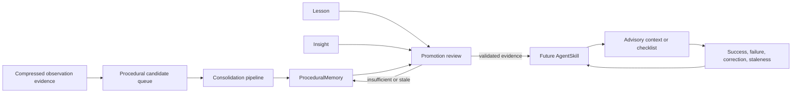
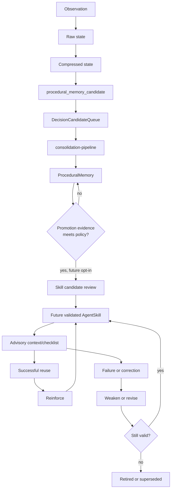
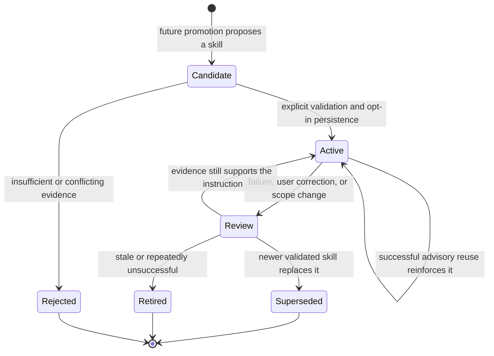
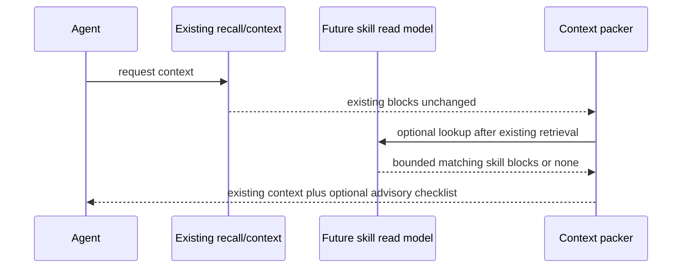

# Skill / Self-Improvement Layer Design

## Status and Scope

This is the PR11 design document for an opt-in Skill / Self-Improvement Layer
for AgentMemory. PR12 now implements only its additive, default-off read model
and diagnostics scaffold. PR13a adds direct promotion. Subsequent milestones
add promotion eligibility and inventory diagnostics, advisory recall, bounded
context injection, and the current explicit append-only feedback ledger. None
of these stages adds enforcement or an automatic skill lifecycle reducer.

The Decision Engine PR1-PR10 and its milestone documentation are already in
`main`. This document designs how durable procedural evidence could become
reusable agent guidance without changing existing memory behavior.

### Non-Goals

- No automatic tool execution, code modification, or skill enforcement.
- No LLM classifier or working-memory enforcement.
- No changes to observe, remember, search, smart search, consolidation,
  ranking, vector search, graph search, REST, MCP, or hooks. Existing
  retrieval and ranking behavior remains unchanged.
- Context injection is additive, separately gated, and advisory-only. No hook
  or command automatically records feedback.
- No existing KV record-shape changes and no company-repository changes.

The first implementation milestone after this design must be advisory only. A
skill may be shown as context or a checklist, but it must not make an agent
take an action by itself.

## What a Skill Means

A skill is a validated, reusable instruction for an agent working in a known
scope. It is not merely a remembered fact or a transcript of a successful
session. It combines a trigger condition, ordered project-scoped steps, an
expected outcome, evidence, and feedback that can strengthen, weaken, retire,
or supersede the guidance.

`ProceduralMemory` describes a learned repeated workflow. A future
`AgentSkill` packages sufficiently strong procedural evidence into an
advisory instruction that can be recalled predictably.

## Current and Future Domain Roles

| Object | Current role | Future relationship to skills |
| --- | --- | --- |
| `CompressedObservation` | Retrieval-ready evidence. Raw and compressed forms are lifecycle states of one observation identity. | Evidence only. One observation must not normally create a skill. |
| Procedural Decision Candidate | Decision Engine proposal that workflow evidence should be batch-consolidated. | Early, unvalidated signal; never a skill by itself. |
| `DecisionCandidateQueue` procedural row | Opt-in queue row consumed by `mem::consolidation-pipeline`. | Provenance and batch evidence, not a durable skill row. |
| `ProceduralMemory` | Consolidated workflow with trigger, steps, outcome, frequency, scope, strength, and source evidence. | Primary evidence source for future promotion; it remains useful even when no skill exists. |
| `Lesson` | Content-fingerprinted learning artifact with confidence, reinforcement, source ids, decay, and soft deletion. | Can supply corrections or anti-patterns; never silently becomes a skill. |
| `Insight` | Consolidated interpretation across memories, lessons, and crystals. | May explain usefulness or reveal a conflict; it is not executable guidance. |
| `AgentSkill` | Additive, default-off instruction derived by direct promotion and optionally recalled as advisory context. | Explicit feedback is stored separately as append-only evidence; it does not mutate the skill. |



## Representation Options

### Option A: Enhanced `ProceduralMemory`

Under this option, a skill is a `ProceduralMemory` with stronger metadata and
special recall rules.

| Dimension | Assessment |
| --- | --- |
| Compatibility | Risks changing the meaning and shape of an existing `KV.procedural` row. Consumers currently treat it as consolidated evidence, not a validated instruction. |
| Implementation risk | Small initial surface, but ordinary procedures and promoted skills become hard to distinguish. |
| Migration risk | Existing rows would need new optional fields or implicit interpretation, which creates ambiguity for exports, imports, and clients. |
| Retrieval/context impact | Existing procedural retrieval could accidentally become skill recall, coupling a future feature to current ranking and context behavior. |
| Default-off posture | Possible, but harder to prove because one stored object has two meanings. |
| Existing memory behavior | Weaker preservation because a new skill interpretation can change how procedures are presented or maintained. |

### Option B: New `AgentSkill` Entity in a New KV Scope

Under this option, a future skill is a separate entity derived from existing
procedural evidence. It stores source references but never modifies those
sources.

| Dimension | Assessment |
| --- | --- |
| Compatibility | Strong. Current observations, memories, procedural rows, hooks, REST payloads, MCP schemas, and indexes retain their shape and meaning. |
| Implementation risk | Requires an additive read model and diagnostics, both of which can be independently default-off. |
| Migration risk | None. New rows exist only after future opt-in promotion. |
| Retrieval/context impact | Isolated. Skill recall can be packed separately and must not alter BM25/vector/graph/RRF scoring. |
| Default-off posture | Direct: no scope reads, writes, injection, or feedback work until future explicit flags enable them. |
| Existing memory behavior | Strong preservation. `ProceduralMemory` remains evidence whether or not a skill is ever created. |

### Recommendation

Use **Option B** for the first implementation milestone after this design: a
dedicated future `AgentSkill` entity in a new KV scope, derived only through
explicit advisory promotion. This is the safer compatibility boundary because
it does not overload `ProceduralMemory` or alter existing record shapes.

Option A remains a useful conceptual view: every skill is grounded in
procedural memory. It should not become the storage contract because evidence
and instruction have different lifecycles, feedback, and safety requirements.

## Proposed AgentSkill Schema

This schema was design-only in PR11. PR12 now adds it to `src/types.ts` and
declares its dedicated KV scope, but no code creates or mutates rows yet.

```ts
type AgentSkillStatus = "active" | "retired" | "superseded";

type AgentSkill = {
  id: string;
  name: string;
  triggerCondition: string;
  steps: string[];
  expectedOutcome: string;
  antiPatterns: string[];

  project?: string;
  agentId?: string;
  files: string[];
  concepts: string[];

  confidence: number;
  strength: number;
  usageCount: number;
  successCount: number;
  failureCount: number;

  sourceProceduralMemoryIds: string[];
  sourceCandidateIds: string[];
  sourceObservationIds: string[];
  sourceSessionIds: string[];

  createdAt: string;
  updatedAt: string;
  lastUsedAt?: string;
  lastReinforcedAt?: string;
  status: AgentSkillStatus;
  supersedes?: string;
  version: number;
};
```

| Group | Fields | Purpose |
| --- | --- | --- |
| Identity and instruction | `id`, `name`, `triggerCondition`, `steps`, `expectedOutcome`, `antiPatterns` | Lets an agent recognize applicability and use the skill as an advisory checklist. |
| Scope | `project`, `agentId`, `files`, `concepts` | Prevents project-specific procedures from leaking into unrelated work or agents. |
| Quality | `confidence`, `strength`, `usageCount`, `successCount`, `failureCount` | Represents evidence quality separately from retrieval ranking. |
| Provenance | Source id arrays | Makes each promoted instruction traceable to its evidence. |
| Lifecycle | Timestamps, `status`, `supersedes`, `version` | Supports reinforcement, retirement, and replacement without rewriting history. |

PR13a adds explicit, opt-in direct promotion. `mem::skill-promote` remains the
only production writer for `mem:skills`; automatic promotion remains absent.

## Eligibility Inventory Diagnostics

PR13c adds read-only inventory diagnostics over a deterministic
`ProceduralMemory` population. They report policy eligibility independently
from the runtime promotion flag, current promotability, active source-lineage
skills, and policy reason counts. The inventory never returns workflow content
or secret-heavy names, never creates `AgentSkill` rows, and describes only the
population selected by `scanLimit`.

`policyEligible` is structural: it ignores `promotion_disabled` and an
existing active skill. `currentlyPromotable` requires policy eligibility,
promotion enabled, a resolved source-lineage state, and no matching skill.
`alreadyPromoted` reports an active `AgentSkill` that lists the source
`ProceduralMemory`, including sources that no longer pass the present promotion
policy. Each item reports `promotionStateResolved` and
`currentlyPromotableResolved`: a positive active match is always resolved;
an unmatched source is resolved only after the required skill population was
fully inspected. `blockedCount` is exactly the count of scanned rows whose
`policyEligible` is false, so `policyEligibleCount + blockedCount` equals
`scannedCount`.

The current `StateKV` wrapper exposes `list(scope)` without cursor or limit
arguments. Inventory therefore performs one read of `mem:procedural`, sorts it
by `createdAt` descending and `id` ascending, then evaluates at most
`scanLimit` rows. For source-lineage resolution it performs at most one read of
`mem:skills` whenever at least one procedure was scanned, deterministically
inspects at most 5,000 skill rows as an application-level evaluation limit,
and stops early once every scanned source has an active match. It performs zero
skill reads for an empty scan and never performs per-procedure skill lookups or
KV writes. The physical engine read itself is not cursor-bounded; pagination or
indexing for this scope is deferred to a separately reviewed infrastructure PR.

The inventory returns `scanTruncated`, `resultTruncated`,
`skillScanTruncated`, and their OR as `truncated`. `promotionStateComplete`
is true only when `unresolvedPromotionStateCount` is zero. When an item has
`promotionStateResolved: false`, `alreadyPromoted: false` is unknown rather
than definitive. Likewise, a policy-valid, promotion-enabled item with
`currentlyPromotableResolved: false` is unknown rather than conclusively not
promotable. Boolean false filters exclude those unknown rows; callers may use
`promotionStateResolved=false` to inspect them explicitly.

`policyEligibleCount` and `blockedCount` are exact for the scanned procedural
population. `alreadyPromotedCount` and `currentlyPromotableCount` are exact
only when `promotionStateComplete` is true; otherwise they are lower bounds of
confirmed positives. `reasonCounts` is non-exclusive: structural blockers and
runtime/source-lineage states can both occur for one row, so its total can
exceed `scannedCount`.

## Skill Lifecycle



The first six stages already exist conceptually. Candidate review, skill
persistence, recall, and feedback are future stages. The diagram must never
be read as saying raw and compressed observations are separate durable rows.



## Promotion Rules

Promotion is a future explicit operation. It is not a side effect of
observation capture, one `remember` call, or direct hook input.

### Default Evidence Gates

Promotion should normally require all of the following:

1. Repeated evidence, preferably across independent observations or sessions,
   rather than one successful event.
2. A clear trigger, ordered steps, and observable expected outcome.
3. A project, agent, file, and concept scope that does not depend on ambiguous
   global assumptions.
4. No stronger, newer project decision or lesson that contradicts it.
5. No secret-bearing, sanitization-warning, or unsafe instruction content.

One-off events stay as observations, memories, lessons, or procedural
evidence. A future explicit user save/promotion request is the only intended
exception, and it must retain provenance and audit information.

| Pattern | Typical evidence | Proposed result |
| --- | --- | --- |
| Repeated successful workflow | Multiple procedural sources report the same ordered steps and outcome. | Project-scoped workflow skill. |
| Failed attempt followed by successful fix | A lesson identifies the failure and later procedure resolves it. | Skill with the failed approach in `antiPatterns`. |
| Recurring command sequence | Sessions repeatedly use the same test, build, validation, or release steps. | Command/checklist skill, never auto-execution. |
| Project testing checklist | Stable setup prerequisites and expected assertions recur. | Narrow test-preparation skill scoped to project/files. |
| Deployment or release checklist | Repeated validated release steps plus explicit project decision. | Advisory release checklist with conservative applicability. |
| User coding convention | Repeated user corrections or explicit preference. | Project-scoped convention skill with clear sources. |
| Tool usage strategy | Repeated tool sequence succeeds for the same trigger. | Tool-selection checklist, never automatic tool invocation. |
| Recurring debugging pattern | Similar symptoms, diagnosis, and fix recur. | Diagnosis-and-checks skill with known anti-patterns. |

The following must not promote automatically: a single tool output or hook
event, an ambiguous summary without source procedures, unsafe or secret-heavy
content, a procedure with no measurable outcome, or an instruction
contradicted by a newer project decision, lesson, or user correction.

## Future Recall and Application

Skill recall must be a separate advisory read model. It must not alter the
existing search ranking pipeline or retrofit skills into current observation
or memory index scores.

| Future insertion point | Existing surface | Future advisory behavior | Boundary |
| --- | --- | --- | --- |
| Session start | Session-start context hook | Recall a small number of scope-matched skills as startup context. | No hook-payload change and no automatic commands. |
| Context generation | `mem::context`, before final block packing | Add bounded skill checklist blocks only after existing retrieval completes. | Existing blocks, budgets, ordering, and packing remain intact when disabled. |
| Before tool use | Pre-tool-use context | Show applicable warnings or checks. | Never invoke, block, or alter a tool call. |
| Before code edit | Edit-oriented context | Show project convention or validation checklist. | Never edit code or rewrite user instructions. |
| Before test/build/deploy | Tool-context path | Show prerequisites, expected checks, and anti-patterns. | Never execute commands or enforce a checklist. |
| MCP `recall_context` prompt | Existing task-context prompt | Optionally append a clearly labeled skill advisory section. | Existing input/output schema and `memory_recall` behavior stay unchanged. |

Future injection should use a visible source label such as `skill-advisory`,
include a skill id and provenance, and have its own small budget. It must be
skipped when confidence, scope match, or budget is insufficient. It must not
alter BM25, vector, graph, hybrid, RRF, reranker, or existing block ranking.



## Feedback and Quality Lifecycle

Feedback should use only future explicit, additive mechanisms. Showing a
skill must never imply success.

| Event | Future quality treatment | Required guard |
| --- | --- | --- |
| Agent follows skill and task succeeds | Increment usage and success evidence; reinforce conservatively. | Require attributable outcome evidence or explicit confirmation. |
| Agent follows skill and task fails | Increment usage and failure evidence; open review instead of deleting. | Preserve sources and failure for diagnostics. |
| User corrects the agent | Treat as strong negative or replacement evidence. | Correction must be attributable to the relevant project/scope. |
| Project files/configuration change | Mark matching skills for review when their scope may be stale. | Never rewrite a skill automatically from file changes. |
| Newer project decision conflicts | Prefer newer, stronger evidence and mark old skill for review/supersession. | Retain links and prior version for audit. |
| Skill becomes stale | Weaken confidence/strength and retire only after policy threshold or review. | Never delete historical evidence. |

`usageCount`, `successCount`, and `failureCount` are quality signals only.
Neither high count nor high confidence authorizes auto-execution or
enforcement.

## Safety and Compatibility Constraints

| Constraint | Design consequence |
| --- | --- |
| No hook payload changes | Future recall uses existing context boundaries or additive internal reads only. |
| No REST/MCP schema changes | Initial diagnostics/read models must be additive, not altered existing schemas. |
| No existing KV shape changes | `AgentSkill` uses a new scope and source references; existing `ProceduralMemory` rows are not extended in place. |
| No ranking changes | Skill recall is separately scoped and bounded after current retrieval. |
| Default off | No skill reads, writes, context blocks, or feedback work until future explicit flags enable each stage. |
| Advisory only | Skills can describe checks but cannot execute, block, or modify agent actions. |
| No self-modification | A skill cannot change itself, repository files, configuration, hooks, tools, or memories without explicit user instruction. |
| Auditability | Future promotion, recall, feedback, retirement, and supersession retain source references and append-style diagnostics. |

## Implemented Read and Evidence Stages

PR12 adds the additive `AgentSkill` type, `mem:skills` scope constant, and
read-only diagnostics surfaces. PR13a adds an internal, direct-only
`mem::skill-promote` function that can promote one eligible `ProceduralMemory`
when both skill flags are explicitly enabled. It remains disabled unless
`AGENTMEMORY_SKILLS=true` (default `false`); no PR12 path writes skill rows,
and PR13a does not automatically promote procedures, inject context, reinforce
feedback, or change existing memory pipelines.

Direct promotion requires a non-empty `expectedOutcome`. A
`ProceduralMemory` without that optional source field is safely rejected;
PR13a does not infer, synthesize, or write an outcome. The current
consolidation pipeline may create procedural rows without it, and improving
that extraction remains future separately reviewed work.

When enabled, `GET /agentmemory/skills` and `memory_skills` inspect `mem:skills`.
`GET /agentmemory/skills/promotion-eligibility` and
`memory_skill_promotion_eligibility` evaluate one `ProceduralMemory` against
the same promotion policy without creating an `AgentSkill`, mutating either
scope, or calling `mem::skill-promote`. Direct `mem::skill-promote` remains
the only skill write path. Diagnostics are independently disableable with
`AGENTMEMORY_SKILL_DIAGNOSTICS` (default `true` only when skills are enabled),
and their limit defaults to 50 and is bounded to 1..500 by
`AGENTMEMORY_SKILL_DIAGNOSTICS_LIMIT`.

### Explicit Feedback Ledger

`AGENTMEMORY_SKILL_FEEDBACK` is independently default-off and also requires
`AGENTMEMORY_SKILLS=true`. When enabled, only a direct internal call to
`mem::skill-feedback-record` can append an immutable event to
`mem:skill-feedback`. The event captures a validated skill/version snapshot,
explicit success, failure, correction, or staleness attribution, caller scope,
and bounded source identifiers. It has no REST, MCP, hook, context, recall, or
promotion-pipeline surface.

The ledger does not infer success from display or recall and does not mutate an
`AgentSkill`: usage/success/failure counters, confidence, strength, timestamps,
status, supersession, and version remain unchanged. Reinforcement is therefore
split into four stages: explicit append-only feedback, read-only diagnostics and
aggregation, separately gated counter/reinforcement reduction, and review-driven
retirement and supersession.

### Read-Only Feedback Diagnostics

Phase 2A adds the internal-only `mem::skill-feedback-diagnostics` reader. It is
default-off behind `AGENTMEMORY_SKILL_FEEDBACK_DIAGNOSTICS` and requires only
`AGENTMEMORY_SKILLS=true`; it can inspect historical ledger rows while
`AGENTMEMORY_SKILL_FEEDBACK=false` prevents new records. The function reads only
`mem:skill-feedback`, validates each row without repairing it, skips malformed
rows while counting them, applies exact caller filters, and returns deterministic
evidence counts and defensive event copies.

The aggregate is not reinforcement: it does not read the current skill, infer
success, emit recommendations, or change counters, confidence, strength, status,
or lifecycle. It has no hook, context, recall, promotion, audit, index, or write
surface. Phase 2B1 adds an authenticated read-only REST adapter at
`GET /agentmemory/skill-feedback/diagnostics`; Phase 2B2 adds the matching
read-only MCP adapter. Both delegate to the internal reader, preserve its
feature gate, and never access KV directly.

### Read-Only Reduction Planning

Phase 3A adds the internal-only `mem::skill-feedback-reduction-plan` function.
It is default-off behind `AGENTMEMORY_SKILL_FEEDBACK_REDUCER` and requires only
`AGENTMEMORY_SKILLS=true`; it can inspect historical ledger rows while
`AGENTMEMORY_SKILL_FEEDBACK=false` prevents new records. The planner reads one
current `AgentSkill` and the existing append-only feedback ledger, validates
feedback without repairing it, and deterministically selects current-version,
scope-compatible evidence using `createdAt` descending and `id` ascending for
equal timestamps.

The returned plan proposes only `successCount` and `failureCount` deltas:
success contributes success `+1`; failure and correction each contribute failure
`+1`; stale contributes no counter delta. It always returns `applied: false`.
It does not write, consume, mark, or mutate feedback evidence; it does not alter
usage count, confidence, strength, timestamps, status, supersession, version,
or provenance. Repeated calls return the same plan for unchanged inputs.
Phase 3A is not reinforcement. Phase 3B, idempotent application of approved
counter deltas with its own atomicity design, remains future and separately
reviewed.

### Phase 3B Idempotency Contract

The Phase 3B design contract is documented in
[`skill-feedback-reducer-idempotency.md`](skill-feedback-reducer-idempotency.md).
It selects a future single-record design: optional reduction metadata is
colocated with an `AgentSkill`, absolute counters derive from an immutable
per-version baseline and complete canonical evidence hash, and a future write
requires a proven conditional atomic update to the same skill key. The current
process-local keyed mutex is not sufficient for multi-worker safety.

This is documentation only. It neither adds the proposed metadata nor permits
an apply function, a receipt scope, an audit path, or any counter mutation.
Phase 3B implementation remains separately authorized after state-layer
conditional-update semantics are proven by source inspection and concurrency
tests.

When diagnostics are disabled, `GET /agentmemory/skills` returns an explicit
`503` feature-disabled response before reading `mem:skills`; `memory_skills`
returns the corresponding MCP diagnostic. This is expected default-off behavior,
not a memory-server failure.

### PR13b Promotion Eligibility Diagnostics

PR13b adds only a read-only evaluator. It uses the same pure policy as direct
promotion and reports `promotion_disabled`, missing name/trigger/outcome,
insufficient steps, secret-heavy content, insufficient strength, insufficient
independent evidence, or `already_promoted`. A valid procedure with promotion
disabled reports `promotion_disabled` rather than being described as malformed.

The evaluator reads the `ProceduralMemory` first and reads `mem:skills` only
when the procedure otherwise satisfies the policy, solely to report an active
source-lineage match. It never writes `mem:skills`, `KV.procedural`, candidate
queues, indexes, timestamps, counters, or statuses. `ProceduralMemory` has no
status field in the current KV shape, so source existence is the current source
lifecycle check; PR13b does not invent or persist a new status.

## Explicit Feedback Roadmap

1. **Phase 1 - Explicit append-only feedback ledger: implemented and merged.**
   Direct-only feedback preserves source evidence without
   mutating an `AgentSkill`.
2. **Phase 2A - Internal read-only diagnostics and deterministic aggregation:
   implemented and merged.** It may inspect ledger evidence but cannot update
   skill quality or lifecycle state.
3. **Phase 2B1 - Authenticated REST diagnostics surface: implemented by this
   milestone.** It delegates to the Phase 2A reader and introduces no direct KV
   access or write behavior.
4. **Phase 2B2 - Optional MCP diagnostics surface: implemented and merged.**
   It delegates to the Phase 2A reader without adding a write path.
5. **Phase 3A - Read-only deterministic reduction planning: implemented by
   this milestone.** It proposes counter deltas but never applies them.
6. **Phase 3B Design - Idempotency and atomic application contract:
   documented.** It defines prerequisites only and does not apply counter
   deltas.
7. **Phase 3B1 - Read-only planner contract hardening: future and separately
   authorized.** It remains zero-write.
8. **Phase 3B2 - Conditional state primitive: future and separately
   authorized.** It must prove conditional state semantics before any reducer
   write.
9. **Phase 3B3 - Internal counter application: future and separately
   authorized.** It may proceed only after the reviewed conditional primitive.
   It must introduce and require the separate default-off
   `AGENTMEMORY_SKILL_FEEDBACK_REDUCER_APPLY` gate; the existing Phase 3A
   planner flag alone remains read-only.
10. **Phase 3B4 - Optional reviewed public surface: future and not implied by
    prior phases.** Any REST or MCP exposure requires its own authorization.
11. **Phase 4 - Review-driven retirement and supersession: future.** Lifecycle
   changes remain explicit and auditable.

Automatic execution, automatic promotion, and LLM-assisted lifecycle behavior
remain out of scope.

Each future PR must preserve the default-off posture, introduce one auditable
behavior at a time, and avoid unrelated refactors or ranking work.
