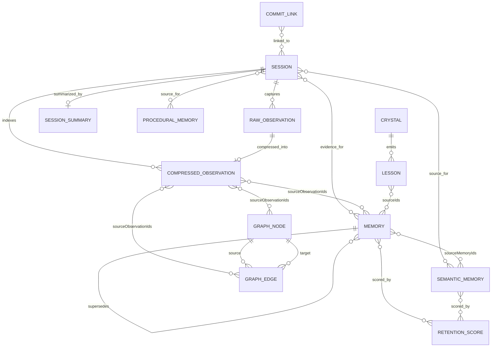

# AgentMemory Entity Relationships

## ER Diagram

## Object Ownership

| Owner | Entity | Notes |
| --- | --- | --- |
| `KV.sessions` | `Session` | Keyed by session id; updated by observe and lifecycle hooks. |
| `KV.observations(sessionId)` | `RawObservation`, `CompressedObservation` | Session-scoped evidence. Search indexes store ids, not complete rows. |
| `KV.memories` | `Memory` | Episodic/manual/consolidated long-term memories. |
| `KV.summaries` | `SessionSummary` | One row per session id. |
| `KV.semantic` | `SemanticMemory` | Consolidated facts. Separate tier, not a subclass of `Memory`. |
| `KV.procedural` | `ProceduralMemory` | Consolidated workflows/procedures. Separate tier. |
| `KV.lessons` | `Lesson` | Content-fingerprinted lessons; soft deletion via `deleted`. |
| `KV.graphNodes` | `GraphNode` | Canonical extracted entities. |
| `KV.graphEdges` | `GraphEdge` | Canonical extracted relationships. |
| `KV.graphNameIndex` | node name index | Maps normalized node type/name to node id. |
| `KV.graphEdgeKey` | edge key index | Maps source/target/type to edge id. |
| `KV.graphNodeDegree` | degree cache | Node degree materialization for graph snapshots. |
| `KV.graphSnapshot` | `GraphSnapshot` | Cached top-node/top-edge aggregate view. |
| `KV.commits` | `CommitLink` | Git commit to session relationships. |
| `KV.accessLog` | access logs | Retrieval history by memory id. |
| `KV.retentionScores` | `RetentionScore` | Derived rescore output for memory retention/eviction. |
| `KV.audit` | `AuditEntry` | Governance/audit events. |
| `KV.slots`, `KV.globalSlots` | `MemorySlot` | Project/global editable pinned context. |

## References

| Source object | Reference fields | Target |
| --- | --- | --- |
| `RawObservation` | `sessionId` | `Session.id` |
| `CompressedObservation` | `sessionId` | `Session.id` |
| `Memory` | `sessionIds` | `Session.id[]` |
| `Memory` | `sourceObservationIds` | Observation ids across session scopes |
| `Memory` | `parentId`, `supersedes`, `relatedIds` | `Memory.id` |
| `SessionSummary` | `sessionId` | `Session.id` |
| `SemanticMemory` | `sourceSessionIds`, `sourceMemoryIds` | `Session.id[]`, `Memory.id[]` |
| `ProceduralMemory` | `sourceSessionIds`, `sourceObservationIds` | Sessions and observations |
| `Lesson` | `sourceIds` | Crystal/manual/consolidation source ids depending on `source` |
| `GraphNode` | `sourceObservationIds` | Observation evidence |
| `GraphEdge` | `sourceNodeId`, `targetNodeId` | `GraphNode.id` |
| `GraphEdge` | `sourceObservationIds` | Observation evidence |
| `GraphEdge` | `supersededBy` | `GraphEdge.id` |
| `CommitLink` | `sessionIds` | `Session.id[]` |
| `TeamSharedItem` | source id/type fields | Shared memory/session/lesson/action items |

## Versioning

| Entity | Versioning mechanism |
| --- | --- |
| `Memory` | `version`, `parentId`, `supersedes`, and `isLatest` implement lineage. Latest memories are active retrieval/consolidation candidates. |
| `GraphEdge` | `version`, `supersededBy`, `isLatest`, `tvalid`, and `tvalidEnd` model temporal relationship changes when populated. |
| `GraphSnapshot` | `generation`, `dirty`, `updatedAt`, and `resetAt` track aggregate graph cache currency and reset boundaries. |
| `ExportData` | Version union controls import/export compatibility. |
| `SnapshotMeta` | Snapshot id/path/hash/counts/version describe point-in-time store exports. |
| `Lesson` / `Insight` | No lineage object; reinforcement, decay, and soft-delete mutate the same id. |
| `SessionSummary` | Rewritten/replaced by `sessionId` rather than versioned. |

## Ownership and Cascade Behavior

AgentMemory uses KV scopes rather than relational foreign-key cascades. References are denormalized arrays, and cleanup is explicit in functions such as forget, retention eviction, image reference decrement, and index removal. This means the domain model is relationship-rich, but referential integrity is enforced by function behavior rather than by the storage engine.

Secondary projections include BM25 index rows, vector embeddings, graph name/edge indexes, graph degree caches, graph snapshots, access logs, and retention scores. These projections exist for retrieval performance and compatibility, not as independent sources of truth.
