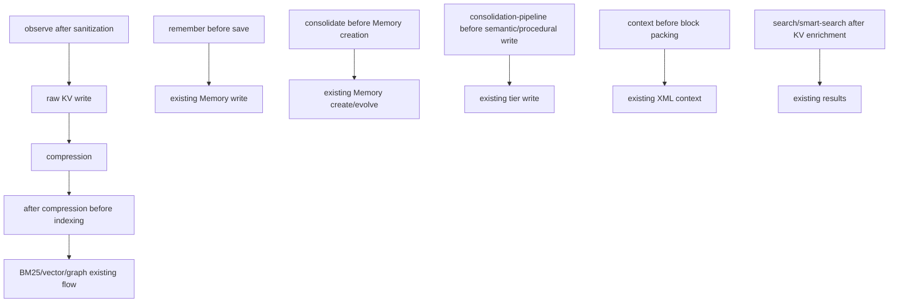

# Decision Engine Insertion Points

Insertion points must wrap existing behavior rather than replace it. In `disabled` mode, no insertion point should execute decision logic. In `shadow`, every insertion point must preserve the exact current flow.

## Pipeline Overview

## Insertion Point Table

| Insertion point | Exact function | Approximate location | Current behavior | Proposed v2 behavior | Risk | Fallback | Test strategy |
| --- | --- | --- | --- | --- | --- | --- | --- |
| Observe after sanitization before KV write | `registerObserveFunction` handler for `mem::observe` in `src/functions/observe.ts` | After hook payload validation, normalization, sanitization, image/session metadata extraction; before first `KV.observations(sessionId)` write | Stores sanitized `RawObservation` first. | Build `DecisionInput` with `observationState=raw`; run engine in shadow/advisory/enforce mode; record audit/candidate only unless enforce safely ignores high-confidence noise. | Dropping or reshaping raw data can break hook capture and raw/compressed overwrite semantics. | If decision fails, continue current observe flow and write fallback audit only if possible. | `test/observe-implicit-session.test.ts`, `test/auto-compress.test.ts`; add “decision failure still stores raw” and “shadow produces identical stored observation” cases. |
| Observe after compression before indexing | `registerCompressFunction` in `src/functions/compress.ts`; synthetic compression path invoked from `registerObserveFunction` | After `CompressedObservation` exists and before BM25/vector add and stream/index side effects | Writes compressed row and indexes it. | Build `DecisionInput` with compressed signals; enqueue semantic/procedural candidates if applicable; do not alter indexing in shadow/advisory. | Blocking indexing makes stored observations invisible to recall; altering importance/confidence can change context/consolidation. | On invalid decision, index compressed observation exactly as today. | `test/search.test.ts`, `test/vector-index-populate.test.ts`, `test/auto-compress.test.ts`; assert shadow result count and index behavior unchanged. |
| Remember before save | `registerRememberFunction` handler for `mem::remember` in `src/functions/remember.ts` | After validation/normalization; before memory object is saved | Creates `Memory`, possibly supersedes existing memory, indexes immediately. | Classify the memory draft. Shadow/advisory audit only. Enforce should not block public saves in first milestone unless separately feature-gated. | Public `memory_save` semantics can change; user-requested memories may be lost. | On decision failure or unsupported action, run current remember path. | `test/remember-project-scope.test.ts`, `test/agent-id-scope.test.ts`, `test/search.test.ts`; add “shadow remember writes identical memory and index” case. |
| Consolidate before Memory creation | `registerConsolidateFunction` handler for `mem::consolidate` in `src/functions/consolidate.ts` | After observations are grouped and provider output proposes a memory; before create/evolve write | Creates or evolves `Memory` using existing thresholds/project guard. | Classify proposed memory as episodic/semantic/procedural/noise. In shadow/advisory, write current memory anyway and audit. In later enforce, only safe rejection should be feature-gated. | Overproduction or underproduction of episodic memories; project-scope evolution regressions. | If engine unavailable, write current consolidation memory. | `test/consolidate-project-scope.test.ts`; add candidate audit and fallback tests. |
| Consolidation-pipeline before semantic/procedural write | `registerConsolidationPipelineFunction` handler for `mem::consolidation-pipeline` in `src/functions/consolidation-pipeline.ts` | After semantic/procedural candidates are identified; before `KV.semantic` or `KV.procedural` write/update | Writes/updates `SemanticMemory` and `ProceduralMemory` from batch evidence. | Validate current candidates through engine; also consume queued semantic/procedural candidates when that PR lands. Writes still use existing record shapes. | Direct hook-level promotion could pollute semantic/procedural memory; changing batch criteria can regress consolidation tests. | If decision queue is empty or engine fails, current pipeline runs unchanged. | `test/consolidation-pipeline.test.ts`; add “empty queue unchanged”, “candidate consumed”, and “invalid candidate rejected” cases. |
| Context before block packing | `registerContextFunction` handler for `mem::context` in `src/functions/context.ts` | After candidate blocks are assembled; before sorting/packing into XML | Packs blocks by source/relevance/recency/importance/token budget. | In shadow/advisory, audit what would be included/excluded. Do not change packed context in first milestone. | Hook context stdout can change; token budget or pinned slot behavior can regress. | If engine fails, pack exactly as today. | `test/context-slots.test.ts`, `test/context-lessons.test.ts`, `test/context-injection.test.ts`; add “shadow context output byte-equivalent” case. |
| Search/smart-search after KV enrichment before final return | `registerSearchFunction` in `src/functions/search.ts`; `registerSmartSearchFunction` in `src/functions/smart-search.ts` | After BM25/hybrid results are loaded from KV and filtered; before final formatting/return | Records access and returns ranked results using existing ranking/filtering. | In shadow/advisory, audit low-value/noisy hits and possible working-memory candidates. Do not reorder, filter, or rescore in first milestone. | Search leakage or ranking regressions; agent isolation regressions. | If engine fails, return current results. | `test/agent-isolation-search.test.ts`, `test/search.test.ts`, `test/hybrid-search.test.ts`; add “shadow search ordering unchanged” case. |

## Fallback Rules

- Engine unavailable: run current behavior.
- Classifier throws: run current behavior and record fallback audit if possible.
- Decision fails validation: run current behavior.
- Unsupported enforce action: downgrade to advisory for that decision.
- Missing provider: use heuristic classifier only.
- Mixed raw/compressed observation rows: classify with available fields and mark missing state as `unknown`.

## Non-Goals

- No hook payload changes.
- No MCP schema changes.
- No REST schema changes.
- No existing KV record shape changes.
- No BM25/vector/graph/RRF changes.
- No vector optimization work.
