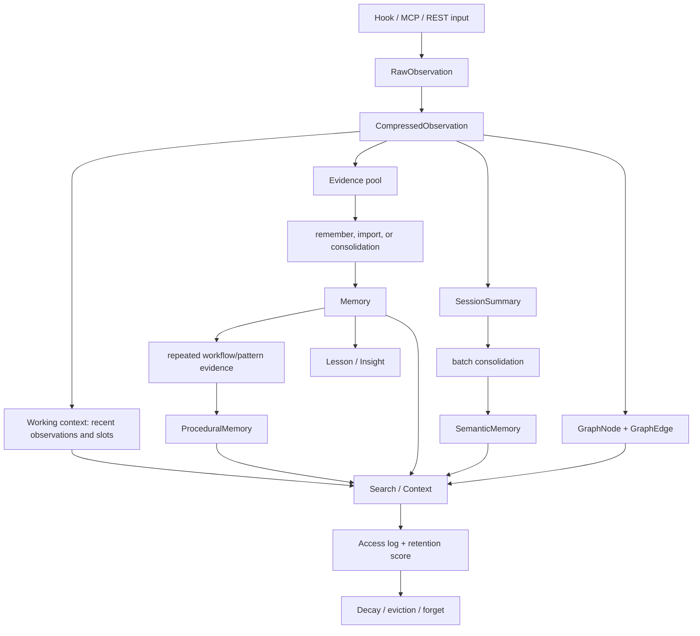
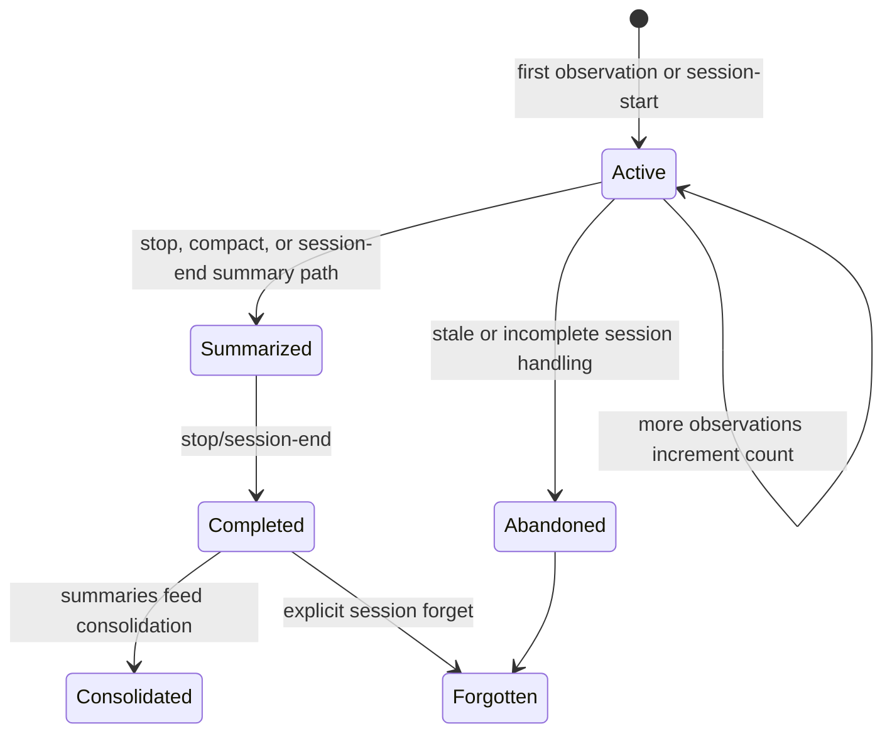
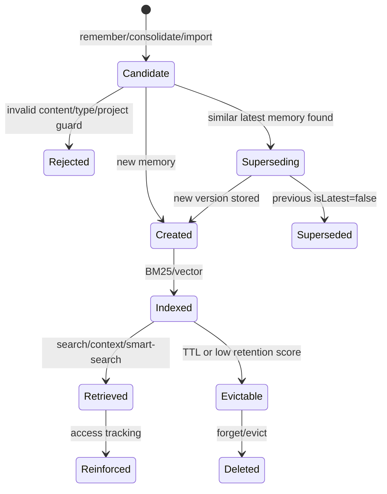
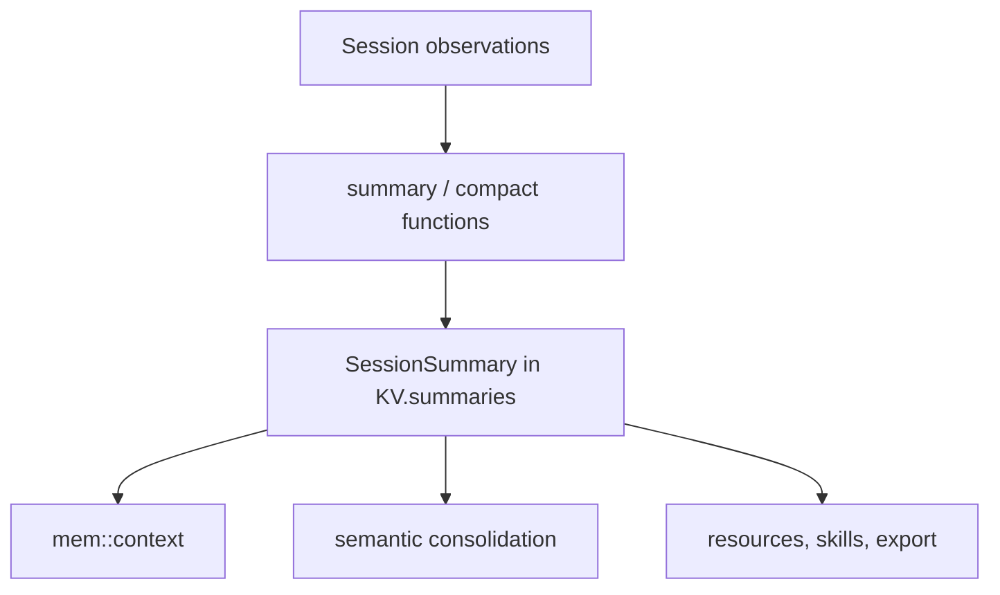
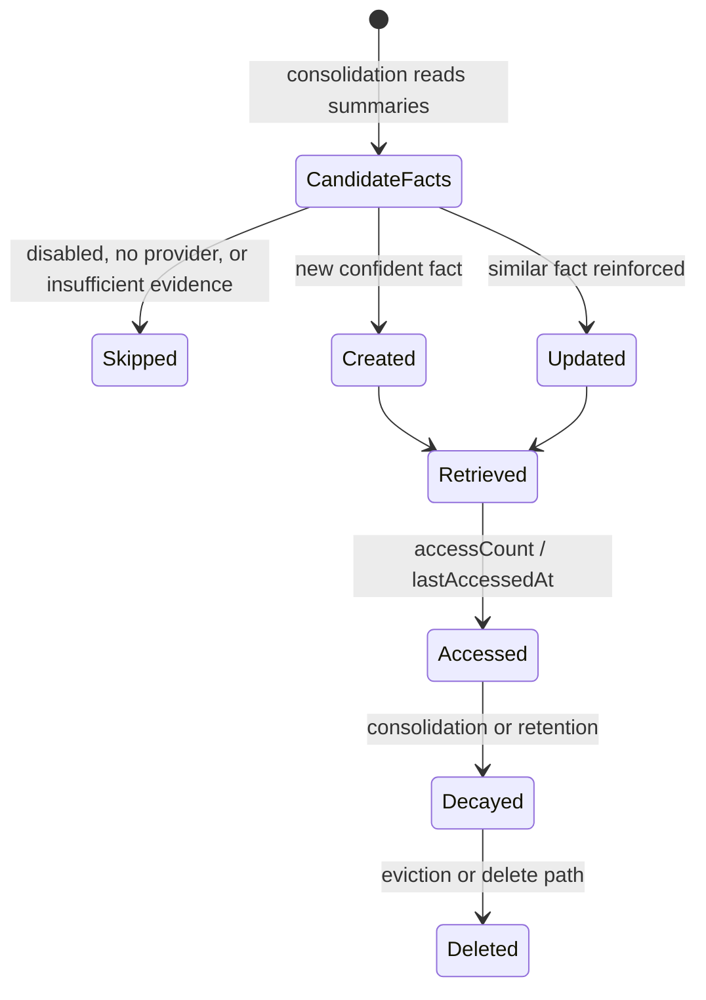
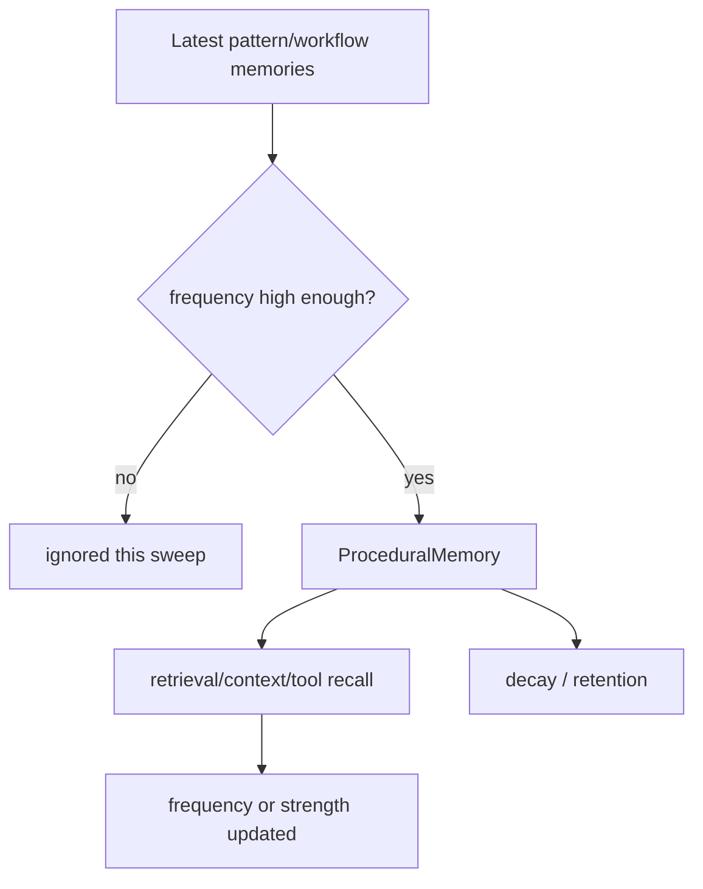
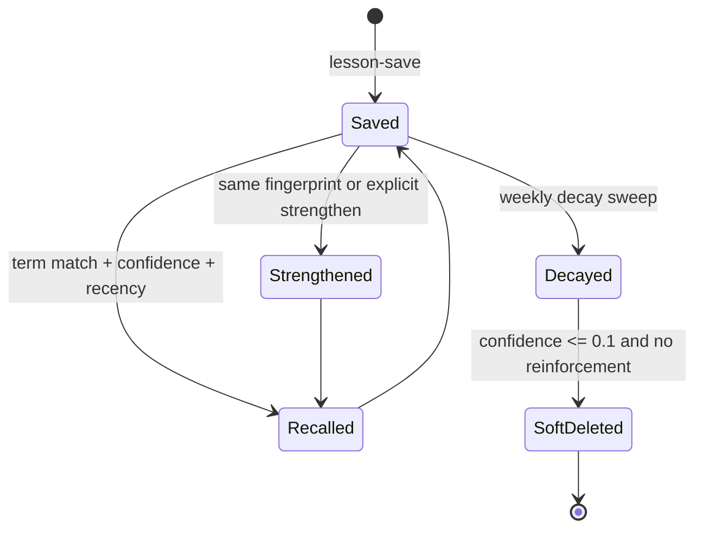
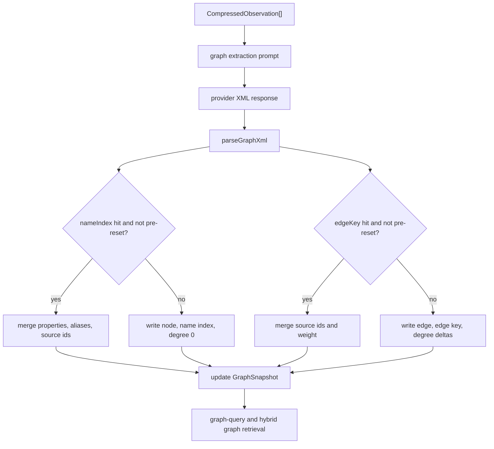

# AgentMemory Lifecycle

Important caveats:

- Not every `CompressedObservation` becomes an episodic `Memory`. Most observations remain evidence/search material only.
- `Memory` is created through explicit remember flows, import, or consolidation. It is not automatically emitted for every hook event.
- Working memory is contextual and operational; it is not necessarily a durable long-term tier like `Memory`, `SemanticMemory`, or `ProceduralMemory`.
- `ProceduralMemory` is derived from repeated workflow/pattern evidence, not directly from every episodic memory.
- `SemanticMemory` and `ProceduralMemory` should normally be formed through batch consolidation, not directly from raw hook events.

## Memory Lifecycle Diagram



## Observation Lifecycle

```mermaid
stateDiagram-v2
  [*] --> HookPayload
  HookPayload --> Rejected: invalid required fields or duplicate
  HookPayload --> RawStored: mem::observe stores raw
  RawStored --> SyntheticCompressed: auto compression off
  RawStored --> LLMCompressed: auto compression on
  SyntheticCompressed --> Indexed
  LLMCompressed --> Indexed
  Indexed --> GraphExtracted: graph extraction enabled
  Indexed --> Retrieved: search/context
  Indexed --> Summarized: summary path
  Indexed --> Forgotten: explicit forget/session delete
  Retrieved --> Indexed
  Forgotten --> [*]
```

Trace:
1. Hook scripts or integrations send a `HookPayload` to REST.
2. `mem::observe` validates, sanitizes, deduplicates, updates or creates `Session`, and stores `RawObservation`.
3. Compression creates `CompressedObservation`: synthetic by default, LLM-backed when `AGENTMEMORY_AUTO_COMPRESS=true`.
4. The compressed observation is written to BM25 and, when embeddings are configured, vector search.
5. Optional graph extraction derives nodes and edges from compressed observations.
6. Search, context, summaries, consolidation, and graph retrieval consume the observation.
7. Forget paths remove the observation and associated index/image references explicitly.

## Session Lifecycle



Trace: a session starts implicitly on first observation. Its observation count, first prompt, model, agent id, cwd, project, and commit metadata accumulate. Completion writes end metadata and often a summary. Completed summaries feed semantic consolidation while the session remains the parent scope for observations.

## Memory Lifecycle



Trace: `Memory` is the episodic/manual long-term object. New content may supersede an older similar memory. The active member of a lineage is the row with `isLatest=true`. Retrieval updates access metadata outside the memory row; retention or explicit forget later removes rows and projections.

## Summary Lifecycle



Trace: summaries are derived from session observations and keyed by `sessionId`. They compress decisions, modified files, concepts, and narrative. Context uses recent summaries; the consolidation pipeline uses them as evidence for semantic facts.

## Semantic Memory Lifecycle



Trace: semantic memory captures generalized facts with confidence, strength, source sessions, source memories, and access counters. It is not stored as a `Memory` subtype; it has its own KV scope and retention handling.

## Procedural Memory Lifecycle



Trace: procedural memory is extracted from repeated workflows and pattern memories. It stores name, steps, trigger condition, expected outcome, source sessions/observations, concepts/tags, frequency, strength, and timestamps.

## Lessons Lifecycle



Trace: `Lesson` ids are fingerprints of normalized lesson content. Saving the same lesson reinforces it. Recall matches query terms against content, context, and tags, then applies confidence and recency. Decay lowers confidence weekly and soft-deletes weak unreinforced lessons.

## Graph Node and Edge Lifecycle



Trace: graph extraction is LLM-driven and XML-parsed. Deduplication is by node type/name and source-target-type edge key. Snapshot and degree caches avoid full graph listing for common viewer and empty-query paths. `resetAt` acts as a reset boundary so old indexed rows are ignored after graph reset.
