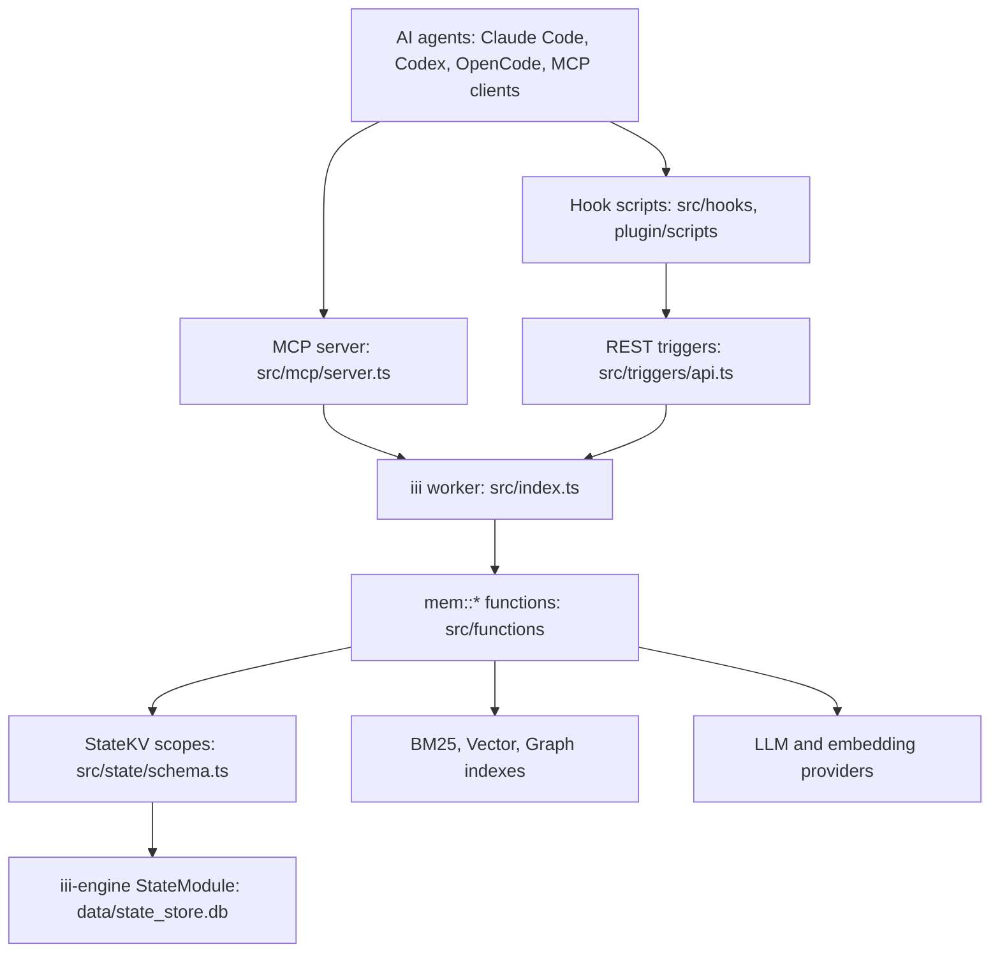
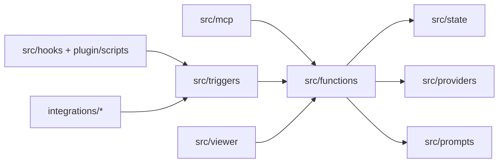
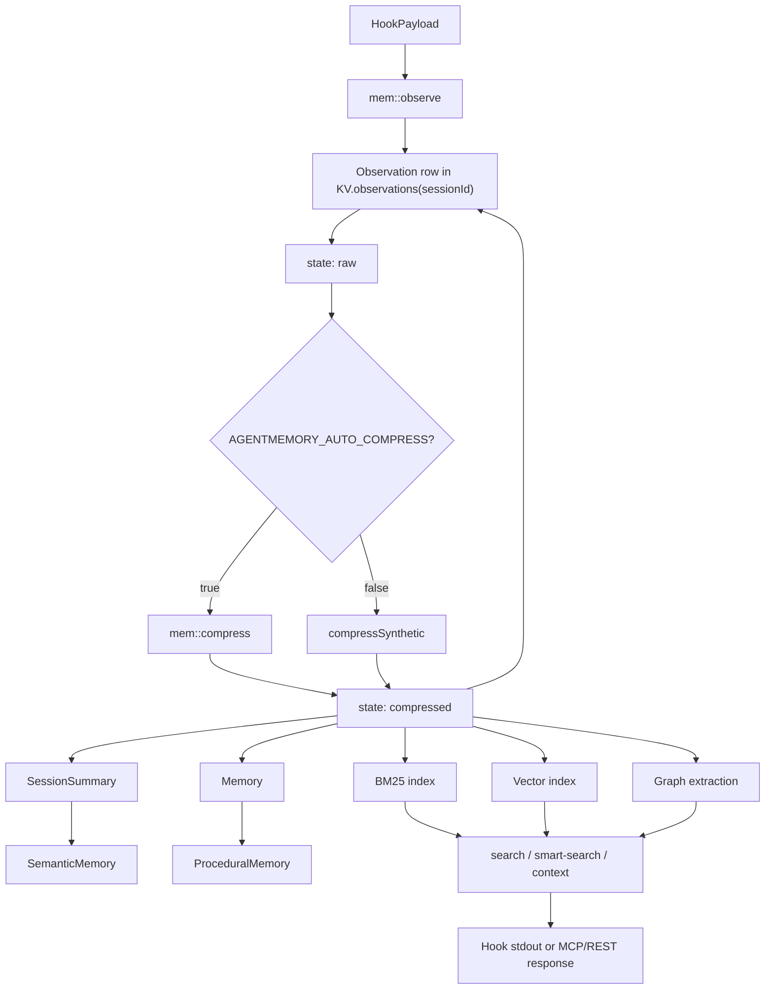

# AgentMemory Domain Model

Sources of truth: `src/types.ts` defines domain shapes; `src/state/schema.ts` defines KV ownership. AgentMemory stores evidence first, then derives search, graph, summary, semantic, procedural, lesson, and retention projections from that evidence.

## Component Diagram

## Package Diagram

## Data Flow Diagram

## Class Relationship Diagram

```mermaid
classDiagram
  class Session { id; project; cwd; startedAt; endedAt; status; observationCount; model; tags; firstPrompt; summary; commitShas; agentId }
  class Observation { id; sessionId; state: raw|compressed; timestamp; agentId }
  class RawObservation { id; sessionId; timestamp; hookType; toolName; toolInput; toolOutput; userPrompt; assistantResponse; raw; modality; imageData; agentId }
  class CompressedObservation { id; sessionId; timestamp; type; title; subtitle; facts; narrative; concepts; files; importance; confidence; imageRef; imageData; imageDescription; modality; agentId }
  class Memory { id; createdAt; updatedAt; type; title; content; concepts; files; sessionIds; strength; version; parentId; supersedes; relatedIds; sourceObservationIds; isLatest; forgetAfter; imageRef; imageData; agentId; project }
  class SessionSummary { sessionId; project; createdAt; title; narrative; keyDecisions; filesModified; concepts; observationCount }
  class SemanticMemory { id; fact; confidence; sourceSessionIds; sourceMemoryIds; accessCount; lastAccessedAt; strength; createdAt; updatedAt }
  class ProceduralMemory { id; name; steps; triggerCondition; expectedOutcome; frequency; sourceSessionIds; sourceObservationIds; tags; concepts; strength; createdAt; updatedAt }
  class Lesson { id; content; context; confidence; reinforcements; source; sourceIds; project; tags; createdAt; updatedAt; lastReinforcedAt; lastDecayedAt; decayRate; deleted }
  class GraphNode { id; type; name; properties; sourceObservationIds; createdAt; updatedAt; aliases; stale }
  class GraphEdge { id; type; sourceNodeId; targetNodeId; weight; sourceObservationIds; createdAt; tcommit; tvalid; tvalidEnd; context; version; supersededBy; isLatest; stale }
  Session "1" --> "many" Observation
  Observation ..> RawObservation : raw state shape
  Observation ..> CompressedObservation : compressed state shape
  Session "1" --> "0..1" SessionSummary
  Memory "many" --> "many" Session
  Memory "many" --> "many" Observation
  SemanticMemory "many" --> "many" Memory
  ProceduralMemory "many" --> "many" Session
  GraphNode "many" --> "many" Observation
  GraphEdge "many" --> "many" GraphNode
```

## Core Objects

### Session

Fields: `id` identifies the session; `project` scopes recall; `cwd` stores workspace location; `startedAt` and `endedAt` bound time; `status` is `active`, `completed`, or `abandoned`; `observationCount` tracks captured events; `model`, `tags`, `firstPrompt`, `summary`, `commitShas`, and `agentId` provide display, filtering, and attribution metadata.

Relationships: parent for raw/compressed observations and summaries; referenced by memories, semantic memories, procedural memories, commits, and audit trails.

Lifecycle: created on first observation/session-start, updated as hooks arrive, ended by stop/session-end, then reused as evidence for retrieval and consolidation.

### CommitLink

Fields: `sha`, `shortSha`, `branch`, `repo`, `message`, `author`, `authoredAt`, `files`, `sessionIds`, `linkedAt`.

Purpose: connects Git commits to sessions and changed files. Lifecycle: produced by post-commit capture and later used for session/project context.

### RawObservation

Fields: `id` is the evidence id; `sessionId` links to the session; `timestamp` is capture time; `hookType` names the source hook; `toolName`, `toolInput`, `toolOutput`, `userPrompt`, and `assistantResponse` normalize heterogeneous hook payloads; `raw` preserves original data; `modality`, `imageData`, and `agentId` support multimodal and multi-agent attribution.

Relationships: session child and source evidence for compressed observation.

Lifecycle: captured by `mem::observe`, deduplicated, sanitized, stored, compressed, indexed, summarized, retrieved, or forgotten.

### CompressedObservation

Fields: `id`, `sessionId`, and `timestamp` preserve evidence identity; `type` classifies the event; `title`, `subtitle`, `facts`, `narrative`, `concepts`, and `files` are retrieval text; `importance` and `confidence` drive ranking/consolidation trust; `imageRef`, `imageData`, `imageDescription`, and `modality` support image memories; `agentId` supports isolated recall.

Relationships: indexed by BM25/vector; referenced by memories and graph; consumed by context, summaries, search, and consolidation.

Lifecycle: produced by LLM or synthetic compression, indexed, optionally graph-extracted, then used until explicit deletion or session deletion.

## Raw vs Compressed Observation Storage Semantics

`RawObservation` and `CompressedObservation` are two lifecycle states of the same observation identity. They are not guaranteed to be two separate durable records.

The observe pipeline stores the raw observation first. Compression then derives a compressed representation and can write that representation back under the same observation id in `KV.observations(sessionId)`. In practice, the session observation scope can contain raw rows, compressed rows, or a mixture of both depending on timing, compression mode, failures, and whether a reader observes the store before or after compression finishes.

This means `KV.observations(sessionId)` should be treated as an observation store whose rows may currently be in a raw or compressed state, not as two parallel tables. Retrieval, summarization, graph extraction, and consolidation generally expect compressed rows, while capture and compatibility paths may still encounter raw rows.

Any future Decision Engine must account for this behavior. A decision made before the first KV write sees hook/raw data; a decision made after compression sees normalized compressed fields; a decision made by a background process may need to tolerate mixed rows and avoid assuming every observation id has both a durable raw record and a durable compressed record.

### Memory

Fields: `id`, `createdAt`, `updatedAt`; `type` is `pattern`, `preference`, `architecture`, `bug`, `workflow`, or `fact`; `title` and `content` are user-facing memory text; `concepts` and `files` power retrieval; `sessionIds` and `sourceObservationIds` hold evidence; `strength` scores salience; `version`, `parentId`, `supersedes`, and `isLatest` implement lineage; `relatedIds` links nearby memories; `forgetAfter` is TTL; `imageRef`, `imageData`, `agentId`, and `project` scope and enrich the row.

Relationships: may supersede another memory, may be source for semantic/procedural learning, and is indexed for retrieval.

Lifecycle: created by remember/import/consolidation, optionally supersedes an older latest memory, indexed, retrieved and access-tracked, retained, evicted, or forgotten.

### SessionSummary

Fields: `sessionId`, `project`, `createdAt`, `title`, `narrative`, `keyDecisions`, `filesModified`, `concepts`, `observationCount`.

Purpose: session-level compression for context and semantic extraction. Lifecycle: derived from observations near stop/compact/end, then read by context and consolidation.

## Retrieval Objects

| Object | Fields and field purpose |
| --- | --- |
| `SearchResult` | `observation` is matched evidence, `score` is rank score, `snippet` is display excerpt. |
| `ContextBlock` | `content` is prompt text, `source` names origin, `relevance` and `timestamp` guide packing, `metadata` carries display/source details. |
| `HybridSearchResult` / `TripleStreamResult` | `observation`, `vectorScore`, `bm25Score`, `graphScore`, `combinedScore`, `sessionId`, optional `graphContext`. |
| `CompactSearchResult` | `id`, `sessionId`, `title`, `summary`, `type`, `score`, `timestamp`, `files`, `concepts` for compact tool responses. |
| `CompactLessonResult` | `id`, `content`, `context`, `confidence`, `score`, `source`, `tags`. |
| `TimelineEntry` | `id`, `timestamp`, `type`, `title`, `summary`, optional `sessionId`, `memoryId`, `project`, `files`, `concepts`. |
| `ProjectProfile` | `project`, `summary`, `architecture`, `preferences`, `workflows`, `updatedAt`, `sourceMemoryIds`. |
| `MemorySlot` | `label`, `content`, `sizeLimit`, `description`, `pinned`, `readOnly`, `scope`, `createdAt`, `updatedAt`; editable pinned context. |
| `EnrichedChunk` | `id`, `originalObsId`, `sessionId`, `content`, `resolvedEntities`, `preferences`, `contextBridges`, `windowStart`, `windowEnd`, `createdAt`. |
| `LatentEmbedding` | `obsId`, `contentEmbedding`, `latentEmbedding`, `sessionId`. |
| `QueryExpansion` | `original`, `reformulations`, `temporalConcretizations`, `entityExtractions`. |
| `RetentionScore` | `memoryId`, optional `source`, `score`, `salience`, `temporalDecay`, `reinforcementBoost`, `lastAccessed`, `accessCount`. |
| `DecayConfig` | `lambda`, `sigma`, `tierThresholds.hot`, `tierThresholds.warm`, `tierThresholds.cold`. |

## Graph Objects

| Object | Fields and field purpose |
| --- | --- |
| `GraphNode` | `id`, `type`, `name`, `properties`, `sourceObservationIds`, `createdAt`, optional `updatedAt`, `aliases`, `stale`. Represents files, functions, concepts, decisions, errors, preferences, events, and other extracted entities. |
| `EdgeContext` | `reasoning`, `sentiment`, `alternatives`, `situationalFactors`, `confidence`; explanatory metadata for a relationship. |
| `GraphEdge` | `id`, `type`, `sourceNodeId`, `targetNodeId`, `weight`, `sourceObservationIds`, `createdAt`, optional `tcommit`, `tvalid`, `tvalidEnd`, `context`, `version`, `supersededBy`, `isLatest`, `stale`. |
| `GraphQueryResult` | `nodes`, `edges`, `depth`, `totalNodes`, `totalEdges`, `truncated`, optional `limit`, `offset`, `warning`. |
| `GraphSnapshot` | aggregate `stats`, `topNodes`, `topEdges`, `topDegrees`, `updatedAt`, `dirty`, `generation`, optional `resetAt`. |
| `TemporalQuery` | `entityName`, optional `asOf`, `from`, `to`, `includeHistory`. |
| `TemporalState` | `entity`, `currentEdges`, `historicalEdges`, `timeline` of edge validity windows. |

## Learning and Consolidation Objects

| Object | Fields and field purpose |
| --- | --- |
| `SemanticMemory` | `id`, `fact`, `confidence`, `sourceSessionIds`, `sourceMemoryIds`, `accessCount`, `lastAccessedAt`, `strength`, `createdAt`, `updatedAt`; generalized factual memory. |
| `ProceduralMemory` | `id`, `name`, `steps`, `triggerCondition`, optional `expectedOutcome`, `frequency`, `sourceSessionIds`, `sourceObservationIds`, `tags`, `concepts`, `strength`, `createdAt`, `updatedAt`; repeated workflow memory. |
| `MemoryRelation` | `type`, `sourceId`, `targetId`, `createdAt`, optional `confidence`; explicit relationship between memories. |
| `Lesson` | `id`, `content`, `context`, `confidence`, `reinforcements`, `source`, `sourceIds`, `project`, `tags`, `createdAt`, `updatedAt`, `lastReinforcedAt`, `lastDecayedAt`, `decayRate`, `deleted`. |
| `Crystal` | `id`, `narrative`, `keyOutcomes`, `filesAffected`, `lessons`, `sourceActionIds`, optional `sessionId`, `project`, `createdAt`. |
| `Insight` | `id`, `title`, `content`, `confidence`, `reinforcements`, `sourceConceptCluster`, `sourceMemoryIds`, `sourceLessonIds`, `sourceCrystalIds`, `project`, `tags`, timestamps, decay fields, `deleted`. |

## Orchestration and Operations Objects

| Object | Fields and field purpose |
| --- | --- |
| `Action` | action identity, type, title/description, status/priority, timestamps, assignee/project/session, related memory/observation ids, metadata. |
| `ActionEdge` | `id`, `sourceActionId`, `targetActionId`, `type`, `createdAt`, metadata for dependencies. |
| `Lease` | `id`, `resourceId`, `holderId`, `expiresAt`, `createdAt`, `renewedAt`; protects shared work. |
| `Routine`, `RoutineStep`, `RoutineRun` | reusable routine definition, ordered executable steps, and run history/status/results. |
| `Signal` | `id`, `type`, `payload`, `source`, `createdAt`, optional `consumedAt`, `project`; event bus-like record. |
| `Checkpoint` | `id`, `name`, `description`, `state`, `createdAt`, optional project/session. |
| `Sketch` | draft object with `id`, `title`, `content`, `status`, `sourceIds`, project, timestamps, expiry, promoted/discarded times. |
| `Facet` | `id`, `targetId`, `targetType`, `dimension`, `value`, `createdAt`; metadata facet. |
| `Sentinel` | watcher object with `id`, `name`, `type`, `status`, `config`, `result`, timestamps, linked actions, escalation. |
| `ProviderConfig`, `AgentMemoryConfig`, `EmbeddingConfig`, `FallbackConfig`, `ClaudeBridgeConfig`, `StandaloneConfig` | boot/runtime configuration objects. |
| `EvalResult`, `FunctionMetrics`, `HealthSnapshot`, `CircuitBreakerState`, `DiagnosticCheck` | evaluation, health, and operational telemetry objects. |
| `TeamConfig`, `AgentScope`, `TeamSharedItem`, `TeamProfile`, `MeshPeer` | team, agent isolation, sharing, and mesh sync objects. |
| `AuditEntry`, `GovernanceFilter`, `SnapshotMeta`, `SnapshotDiff`, `ExportData`, `AccessLogExport`, `StateScope` | governance, export/import, snapshots, access logs, and typed system state. |

## Ownership Summary

| KV scope | Owned domain objects |
| --- | --- |
| `KV.sessions` | `Session` |
| `KV.observations(sessionId)` | Observation rows that may currently have `RawObservation` or `CompressedObservation` shape, plus session chunks |
| `KV.memories` | `Memory` |
| `KV.summaries` | `SessionSummary` |
| `KV.semantic` | `SemanticMemory` |
| `KV.procedural` | `ProceduralMemory` |
| `KV.lessons` | `Lesson` |
| `KV.graphNodes`, `KV.graphEdges` | `GraphNode`, `GraphEdge` |
| `KV.graphSnapshot`, `KV.graphNameIndex`, `KV.graphEdgeKey`, `KV.graphNodeDegree` | Graph acceleration state |
| `KV.bm25Index`, `KV.embeddings(obsId)` | Search index projections |
| `KV.audit` | `AuditEntry` |
| `KV.slots`, `KV.globalSlots` | `MemorySlot` |
| `KV.accessLog`, `KV.retentionScores` | Access and retention metadata |
| `KV.imageRefs`, `KV.imageEmbeddings` | Managed image lifecycle records |
| `KV.actions`, `KV.routines`, `KV.signals`, `KV.checkpoints`, `KV.crystals`, `KV.insights` | Orchestration and learning artifacts |
