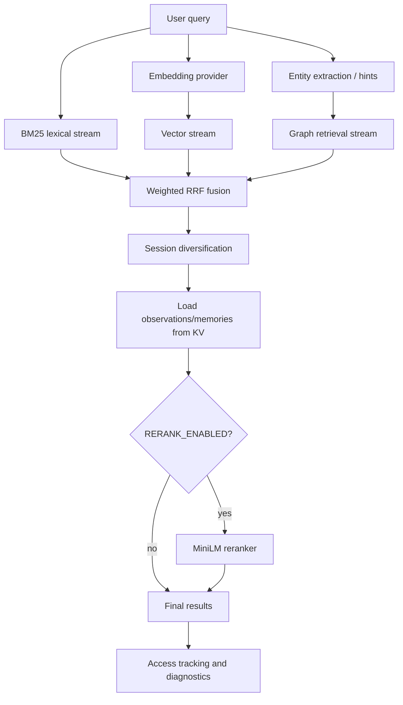

# AgentMemory Ranking and Retrieval

## Retrieval Pipeline Diagram



## BM25

Implemented in `src/state/search-index.ts`.

BM25 is the lexical retrieval stream. Documents are composed from compressed observation and memory fields: title, subtitle, narrative/content, facts, concepts, files, and type.

Behavior:
- Text is normalized to lowercase.
- Code/path-like tokens are preserved where possible.
- CJK segmentation has a separate path.
- Non-CJK terms are stemmed.
- Query expansion adds synonyms with lower weight.
- Prefix matching contributes a partial score through a sorted term list.
- Core formula uses `k1 = 1.2` and `b = 0.75`.

Why it exists: BM25 is strong for file paths, symbols, exact wording, tool names, and explicit concepts.

Performance optimizations: inverted index, persisted index projection, sorted terms for prefix lookup, compact document statistics, and rebuild-on-demand behavior.

## Vector Search

Implemented in `src/state/vector-index.ts`.

Vector search retrieves semantically similar observations/memories by cosine similarity.

Behavior:
- Embeddings are stored by observation or memory id.
- Each vector row carries enough metadata to map back to session or memory.
- Search computes cosine similarity against stored vectors.
- Dimension mismatch returns zero at scoring time or is handled as a stale persisted index at boot.
- Float32Array values are serialized as base64 with careful byte offset/length handling.

Why it exists: vector search finds conceptually similar memories even when lexical overlap is low.

Performance optimizations: compact Float32Array storage, top-k insertion instead of sorting every candidate, optional batch embedding when a provider supports it, and persisted index loading.

## Graph Search

Implemented in `src/functions/graph-retrieval.ts`; graph extraction/storage lives in `src/functions/graph.ts`.

Behavior:
- Query entities or hints are matched to graph node names.
- Traversal uses weighted shortest paths with edge cost `1 / weight`.
- Direct source-observation hits receive strong scores.
- Expansion from top vector observation ids finds nearby graph context.
- Empty or broad graph queries use `GraphSnapshot` when possible.

Why it exists: graph retrieval captures relationships such as dependency, cause, fix, preference, rejection, and decision context that plain text ranking cannot model directly.

Performance optimizations: graph name index, edge key index, node degree cache, snapshot fast path, traversal depth caps, heap-based Dijkstra, and fallback to snapshot when live enumeration is too expensive.

## Hybrid Search

Implemented in `src/state/hybrid-search.ts`.

Pipeline:
1. BM25 returns lexical candidates.
2. Vector search returns semantic candidates when embeddings are available.
3. Graph search returns entity/path candidates and vector-neighborhood expansion.
4. Active streams are fused with reciprocal rank fusion.
5. Results are diversified by session.
6. KV enrichment loads observations or memory fallbacks.
7. Optional reranking refines the top slice.

Compatibility behavior: hybrid search can run with only BM25, with BM25 plus vector, or with all streams. Missing stream weights are normalized away rather than treated as zero-result failure.

## RRF

RRF means Reciprocal Rank Fusion. AgentMemory uses rank position instead of raw score magnitude because BM25 scores, cosine similarity, and graph scores are not naturally comparable.

Effective formula:

```text
combined = sum(normalizedWeight(stream) * 1 / (60 + rankInStream))
```

The constant `60` dampens very small rank differences and keeps fusion stable.

## Reranker

Implemented in `src/state/reranker.ts`; enabled only when `RERANK_ENABLED=true`.

Behavior:
- Lazily imports `@xenova/transformers`.
- Uses `Xenova/ms-marco-MiniLM-L-6-v2`.
- Reranks a limited top candidate set by scoring query-result pairs.
- If the model is unavailable or scoring fails, the original hybrid score remains the fallback.

Why it exists: RRF produces robust broad candidates, while a cross-encoder can improve final ordering for the top results.

Performance impact: model load and inference are expensive, so the path is opt-in and top-k limited.

## Importance

`CompressedObservation.importance` is produced by compression. Synthetic compression assigns heuristic importance; LLM compression can assign richer salience.

It affects:
- context block ordering,
- consolidation eligibility,
- display/prioritization,
- which observations are likely to become long-lived memories.

## Confidence

Confidence appears on compressed observations, semantic memories, lessons, insights, and graph edge context.

It affects:
- lesson recall filtering,
- semantic memory salience,
- trust in generated facts or summaries,
- interpretation of synthetic versus LLM-derived compression.

## Access Count

Access information is kept in access logs and, for semantic compatibility, inside `SemanticMemory.accessCount` and `SemanticMemory.lastAccessedAt`.

It affects:
- retention reinforcement,
- diagnostics,
- decay resistance,
- compatibility with older semantic memory rows that predate access-log support.

## Decay

Implemented mainly in `src/functions/retention.ts`, with separate lesson decay in `src/functions/lessons.ts`.

Retention scoring combines:
- salience from memory type or semantic confidence,
- temporal decay: `exp(-lambda * ageInDays)`,
- reinforcement boost from recent access timestamps scaled by `sigma`,
- capped final score.

Default decay config:
- `lambda = 0.01`
- `sigma = 0.3`
- hot threshold `0.7`
- warm threshold `0.4`
- cold threshold `0.15`

Lesson decay is weekly and simpler: confidence is reduced by `decayRate`; unreinforced lessons at or below `0.1` confidence are soft-deleted.
